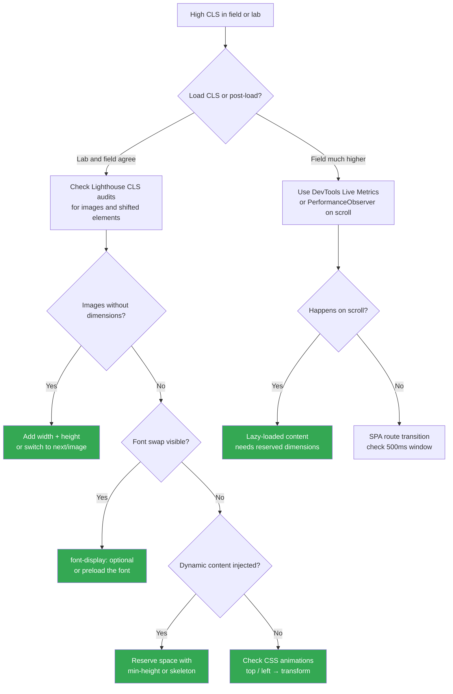

This is part 5 and the final article of the Lighthouse Performance series. [Part 4](./how-to-improve-tbt)
covered TBT and ended with a promise about this metric. Time to deliver.

CLS is the metric that measures visual stability: how much your page jumps around while it loads.
You click a button and a banner appears above it right before your tap lands. You're reading a
paragraph and it shifts down mid-sentence. That is CLS doing its damage.

What makes it tricky is that your Lighthouse score and your real-user score often disagree by a
wide margin. Lighthouse runs a single page load in a controlled environment. CLS in the field is
measured over the full lifetime of the page: every scroll, every lazy-loaded image, every font
swap. A lab score of 0.05 with a field score of 0.35 is not unusual, and it means most of the
shifting happens after the initial load.

To provide a good user experience, **pages should target a CLS of 0.1 or less for at least 75%
of page visits.** ([web.dev](https://web.dev/articles/optimize-cls))

## What CLS actually measures

The score is not a time value. It is a unitless number calculated from two fractions per shift:

- **Impact fraction:** the proportion of the viewport occupied by the shifting element (union
  of its position before and after the shift)
- **Distance fraction:** how far the element moved, as a proportion of the viewport height

```
shift score = impact fraction × distance fraction

Example:
  Element covers 75% of the viewport (before + after combined)
  Element moves down by 25% of the viewport height

  shift score = 0.75 × 0.25 = 0.1875  → "Needs improvement"
```

The final CLS score is the sum of shift scores within the worst **session window**: a 5-second
window that maximizes the total. Shifts caused by user input within 500ms are excluded.

## Find your shifts before fixing them

Do not guess. The DevTools Performance panel is the right starting point for load CLS. Open it,
record a page load, then look at the **Layout Shifts** track: purple bars grouped into clusters,
with diamonds for individual shifts. Click a diamond to see an animation of the shift and the
elements involved.

For post-load CLS (the kind that shows up in field data but not in Lighthouse), the **Live
Metrics** view in the Performance panel is more useful. It lets you interact with the page while
watching the CLS score update in real time.

You can also observe shifts programmatically and send them to your analytics:

```ts
// Run in browser console or add to your vitals tracking
new PerformanceObserver((list) => {
  list.getEntries().forEach((entry) => {
    // hadRecentInput filters out user-initiated shifts
    if (!entry.hadRecentInput) {
      console.log(
        `Layout shift: score=${entry.value.toFixed(4)}`,
        entry.sources,
      );
    }
  });
}).observe({ type: "layout-shift", buffered: true });
```

The `sources` array on each entry points to the elements that shifted. That is what you want:
not just "there was a shift" but "this specific element caused it."



## Fix 1: Images and media without dimensions

This is the most common cause, and it has been fixable since the early days of the web. When the
browser does not know an image's dimensions before it loads, it reserves zero space for it. The
image arrives, takes up space, and everything below it shifts down.

The fix: always declare `width` and `height` on `` elements. Modern browsers use these
attributes to compute an `aspect-ratio` before the image loads, so the correct space is reserved
automatically. ([web.dev](https://web.dev/articles/optimize-cls#images-without-dimensions))

```html
<!-- ❌ No dimensions: browser reserves 0px, content shifts when image loads -->


<!-- ✅ Dimensions declared: browser reserves the right space immediately -->

```

The corresponding CSS to make this work responsively:

```css
img {
  width: 100%;
  height: auto; /* preserves the aspect-ratio calculated from width/height attributes */
}
```

#### In Next.js: use `next/image`

`next/image` handles all of this automatically. It requires `width` and `height` props, generates
`srcset` for responsive images, and applies lazy loading by default. For above-the-fold images,
add `priority` to disable lazy loading and preload the image:

```tsx
// src/components/HeroImage.tsx
import Image from "next/image";

// ✅ Dimensions required: next/image sets aspect-ratio and srcset automatically
export function HeroImage() {
  return (
    <Image
      src="/hero.jpg"
      alt="Hero image"
      width={1200}
      height={630}
      priority // preloads the image, good for LCP elements
    />
  );
}
```

For images with unknown dimensions at build time (user-generated content, CMS images), use `fill`
with a positioned container:

```tsx
// Container controls the space, Image fills it — no layout shift
<div className="relative aspect-video w-full">
  <Image src={src} alt={alt} fill className="object-cover" />
</div>
```

## Fix 2: Dynamic content and skeleton placeholders

Content injected after load is the second biggest source of CLS. The pattern is always the same:
something loads, takes up space, and pushes existing content down. Ads, banners, cookie notices,
"recommended articles" sections pulled from an API — they all do this if you let them.

The rule: **if you know something will appear, reserve its space before it arrives.**

#### Reserving space for known-size content

Use `min-height` or `aspect-ratio` to hold the slot open while the content loads:

```tsx
// src/components/AdSlot.tsx

// ❌ Content appears from nowhere, shifts everything below it
export function AdSlot() {
  const [ad, setAd] = useState(null);
  useEffect(() => {
    fetchAd().then(setAd);
  }, []);
  return ad ? <div>{ad}</div> : null;
}

// ✅ Space is reserved regardless of whether the ad loads
export function AdSlot() {
  const [ad, setAd] = useState(null);
  useEffect(() => {
    fetchAd().then(setAd);
  }, []);
  return (
    <div style={{ minHeight: "250px" }}>
      {ad ?? <div className="animate-pulse bg-muted rounded" />}
    </div>
  );
}
```

This connects directly to what I mentioned in the TBT article: the `loading` prop in
`next/dynamic` serves the same purpose. When a heavy component is split into its own chunk,
the `loading` placeholder keeps the space consistent while the chunk downloads:

```tsx
// src/components/SomeHeavyFeature.tsx
import dynamic from "next/dynamic";

const HeavyFeatureImpl = dynamic(() => import("./HeavyFeatureImpl"), {
  // This skeleton holds the exact space the component will occupy
  // Without it: the component mounts and pushes content → CLS
  loading: () => <div className="animate-pulse bg-muted rounded-xl h-48" />,
});
```

#### Dynamic content without interaction

Avoid injecting new content into the viewport without a user action. Banners that appear at the
top of the page after load are a classic offender. If you cannot reserve space for them, position
them as overlays (`position: fixed` or `absolute`) so they do not push other content.

For "load more" patterns: prefer letting the user trigger the load explicitly. Shifts that occur
within 500ms of a user interaction are excluded from the CLS score, which means a button click
followed by new content appearing is fine. Silent infinite scroll that injects content above the
current scroll position is not. ([web.dev](https://web.dev/articles/optimize-cls#avoid-inserting-new-content-without-a-user-interaction))

## Fix 3: Web fonts

Web fonts cause CLS in one of two ways:

- **FOUT (Flash of Unstyled Text):** the fallback font renders first, then swaps to the web font.
  If the two fonts have different metrics (line height, character width, etc.), the text block
  changes size and shifts surrounding content.
- **FOIT (Flash of Invisible Text):** text is hidden until the web font loads. Invisible text
  still occupies space using the fallback font metrics, so the shift still happens on swap.

([web.dev](https://web.dev/articles/optimize-cls#web-fonts))

#### `font-display: optional` — the zero-shift option

`font-display: optional` tells the browser to use the web font only if it is already available
from cache on the first render. If it is not, the fallback is used permanently for that page
load. No swap, no shift:

```css
@font-face {
  font-family: "Inter";
  src: url("/fonts/inter.woff2") format("woff2");
  font-display: optional; /* no FOUT, no layout shift */
}
```

The trade-off: on the first visit, the user might see the fallback font. On subsequent visits
(once the font is cached), they see Inter. For most use cases this is acceptable.

#### Preloading to win the race

If you want the web font on first load without shifting, preload it so it is available before the
first paint:

```tsx
// src/app/layout.tsx
export default function RootLayout({
  children,
}: {
  children: React.ReactNode;
}) {
  return (
    <html lang="en">
      <head>
        <link
          rel="preload"
          href="/fonts/inter.woff2"
          as="font"
          type="font/woff2"
          crossOrigin="anonymous"
        />
      </head>
      <body>{children}</body>
    </html>
  );
}
```

With `font-display: swap` and a preloaded font, the web font usually wins the first paint race
and no swap occurs. This is less guaranteed than `optional`, but gives you the web font on first
visit.

#### Minimize fallback metrics mismatch

When a swap is unavoidable, `size-adjust`, `ascent-override`, and `descent-override` let you
tune the fallback font to match the web font's metrics as closely as possible, so the text block
barely changes size when the swap happens:

```css
/* Adjusted fallback: tweak percentages until the layout jump is imperceptible */
@font-face {
  font-family: "Inter-fallback";
  src: local("Arial");
  size-adjust: 107%;
  ascent-override: 90%;
  descent-override: 22%;
}

body {
  font-family: "Inter", "Inter-fallback", sans-serif;
}
```

Finding the right values takes some trial and error in DevTools. The [Improved font fallbacks](https://developer.chrome.com/blog/font-fallbacks)
post from the Chrome team has a calculator approach that speeds this up.

## Fix 4: Animations that cause layout shifts

Not all shifts come from content loading. CSS animations that move elements using properties that
trigger layout recalculation also contribute to CLS.

The culprits are any properties that affect document flow: `top`, `left`, `right`, `bottom`,
`width`, `height`, `margin`, `padding`. When these change, the browser has to recalculate layout
for the affected element and potentially reflow the rest of the page.

The fix is to use **composited properties** instead. Composited animations run on the GPU and
skip layout and paint entirely:

```css
/* ❌ Triggers layout recalculation on every frame — contributes to CLS */
.notification {
  position: relative;
  top: 0;
  transition: top 0.3s ease;
}
.notification.hidden {
  top: -100px;
}

/* ✅ Composited: no layout recalc, no CLS contribution */
.notification {
  transition: transform 0.3s ease;
}
.notification.hidden {
  transform: translateY(-100px);
}
```

| Property                         | Triggers layout | Use instead              |
| :------------------------------- | :-------------- | :----------------------- |
| `top`, `left`, `right`, `bottom` | Yes             | `transform: translate()` |
| `width`, `height`                | Yes             | `transform: scale()`     |
| `margin`, `padding`              | Yes             | `transform: translate()` |
| `opacity`                        | No              | (already composited)     |
| `transform`                      | No              | (already composited)     |
| `filter`                         | No (usually)    | (already composited)     |

([web.dev](https://web.dev/articles/animations-guide))

The key principle: if an animation moves or resizes an element without affecting the space it
occupies in the document flow, it cannot cause a layout shift.

## One more thing: the bfcache

The back/forward cache (bfcache) is a browser optimization that keeps pages in memory when you
navigate away. When the user hits the back button, the page is restored instantly from memory
rather than reloaded from scratch. No reloading means no layout shifts from that reload.

In January 2022, when Chrome rolled out bfcache more broadly, the Chrome UX Report recorded
**noticeable improvements in CLS scores** across the web without any code changes from site
owners. ([Chrome CrUX release notes, Jan 2022](https://developer.chrome.com/docs/crux/release-notes#202201))

Most pages are bfcache-eligible by default. A few things can disqualify yours:

- `unload` event listeners (replace with `pagehide`)
- `Cache-Control: no-store` headers
- Certain patterns with `SharedArrayBuffer` or `opener` references

You can test eligibility directly in DevTools: Application tab → Back/forward cache → Test.
If your page is ineligible, DevTools will list the exact reasons.

## Thresholds and what to expect

| CLS        | Assessment        |
| :--------- | :---------------- |
| 0 – 0.1    | Green             |
| 0.1 – 0.25 | Needs improvement |
| Over 0.25  | Poor              |

A note on prioritization: images without dimensions and font swaps are the fastest fixes and
often the highest-impact ones. Dynamic content and animation fixes require more code changes but
are worth it if your field data shows post-load shifts.

Check both Lighthouse and PageSpeed Insights when validating. If they disagree significantly
after your fixes, you still have post-load CLS to hunt down.

---

That is the series. Four metrics, four articles: FCP, LCP, TBT, and now CLS.
Each one has a different root cause, and fixing one without understanding the others often moves
the problem around rather than solving it.

If you have applied these fixes and still see a stubborn field score, the answer is almost always
in the real-user data: which pages, which devices, which interactions. The `web-vitals` library
with attribution data is the right tool for that next step.
