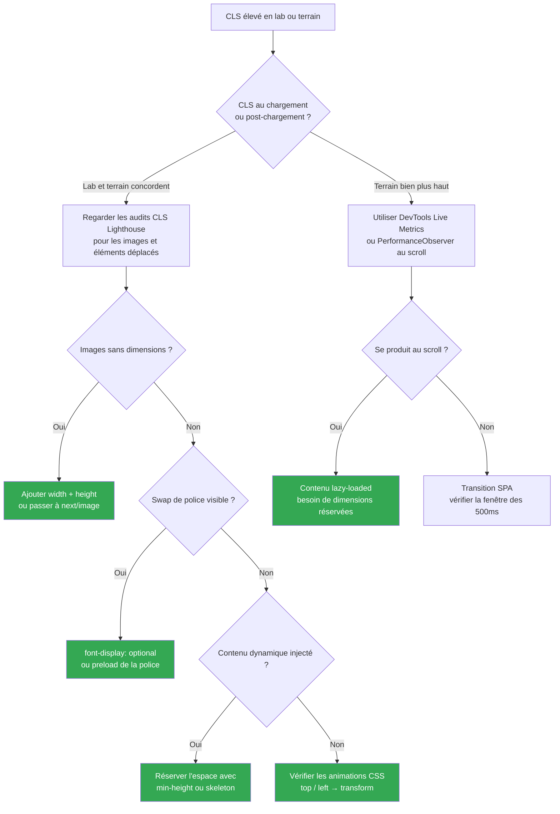

Cet article est la partie 5 et le dernier de la série Lighthouse Performance. La
[partie 4](./how-to-improve-tbt) couvrait le TBT et se terminait sur une promesse à propos
de cette métrique. C'est l'heure de la tenir.

Le CLS mesure la stabilité visuelle: dans quelle mesure ta page saute pendant son chargement.
Tu cliques sur un bouton et une bannière apparaît juste au-dessus avant que ton tap ne se
termine. Tu lis un paragraphe et il descend d'un coup. C'est le CLS qui fait des dégâts.

Ce qui le rend tordu: ton score Lighthouse et ton score terrain divergent souvent de façon
significative. Lighthouse fait un seul chargement de page dans un environnement contrôlé.
Le CLS en field se mesure sur toute la durée de vie de la page: chaque scroll, chaque image
chargée en lazy, chaque swap de police. Un score lab à 0.05 avec un score terrain à 0.35,
c'est courant, et ça signifie que la majorité des sauts se produisent après le chargement
initial.

Pour offrir une bonne expérience utilisateur, **les pages devraient viser un CLS de 0.1 ou
moins pour au moins 75% des visites.** ([web.dev](https://web.dev/articles/optimize-cls))

## Ce que le CLS mesure vraiment

Le score n'est pas une durée. C'est un nombre sans unité calculé à partir de deux fractions
par saut:

- **Impact fraction:** la proportion du viewport occupée par l'élément qui se déplace (union
  de sa position avant et après le saut)
- **Distance fraction:** la distance parcourue par l'élément, en proportion de la hauteur du
  viewport

```
score du saut = impact fraction × distance fraction

Exemple:
  Un élément occupe 75% du viewport (avant + après combinés)
  L'élément descend de 25% de la hauteur du viewport

  score = 0.75 × 0.25 = 0.1875  → "Amélioration nécessaire"
```

Le score CLS final est la somme des scores de sauts dans la pire **fenêtre de session**: une
fenêtre de 5 secondes qui maximise le total. Les sauts causés par une interaction utilisateur
dans les 500ms qui suivent sont exclus.

## Trouver tes sauts avant de les corriger

Ne devine pas. Le panneau Performance des DevTools est le bon point de départ pour le CLS au
chargement. Ouvre-le, enregistre un chargement de page, puis regarde la piste **Layout Shifts**:
des barres violettes regroupées en clusters, avec des losanges pour les sauts individuels.
Clique sur un losange pour voir une animation du saut et les éléments concernés.

Pour le CLS post-chargement (celui qui apparaît dans les données terrain mais pas dans
Lighthouse), la vue **Live Metrics** du panneau Performance est plus utile. Elle te laisse
interagir avec la page pendant que le score CLS se met à jour en temps réel.

Tu peux aussi observer les sauts par code et les envoyer à ton analytics:

```ts
// À coller dans la console ou à intégrer à ton tracking de vitals
new PerformanceObserver((list) => {
  list.getEntries().forEach((entry) => {
    // hadRecentInput filtre les sauts initiés par l'utilisateur
    if (!entry.hadRecentInput) {
      console.log(
        `Layout shift: score=${entry.value.toFixed(4)}`,
        entry.sources,
      );
    }
  });
}).observe({ type: "layout-shift", buffered: true });
```

Le tableau `sources` sur chaque entrée pointe vers les éléments qui ont bougé. C'est ça qui
compte: pas juste "il y a eu un saut" mais "cet élément précis en est la cause."



## Correction 1 : Images et médias sans dimensions

C'est la cause la plus fréquente, et elle se corrige simplement. Quand le navigateur ne
connaît pas les dimensions d'une image avant qu'elle se charge, il lui réserve zéro espace.
L'image arrive, prend de la place, et tout ce qui est en dessous descend.

La correction: toujours déclarer `width` et `height` sur les éléments ``. Les navigateurs
modernes utilisent ces attributs pour calculer un `aspect-ratio` avant le chargement, donc le
bon espace est réservé immédiatement. ([web.dev](https://web.dev/articles/optimize-cls#images-without-dimensions))

```html
<!-- ❌ Pas de dimensions: le navigateur réserve 0px, le contenu saute au chargement -->


<!-- ✅ Dimensions déclarées: le navigateur réserve le bon espace immédiatement -->

```

Le CSS correspondant pour que ça fonctionne en responsive:

```css
img {
  width: 100%;
  height: auto; /* préserve le aspect-ratio calculé depuis les attributs width/height */
}
```

#### Avec Next.js: utilise `next/image`

`next/image` gère tout ça automatiquement. Il requiert les props `width` et `height`, génère
le `srcset` pour les images responsive, et applique le lazy loading par défaut. Pour les images
au-dessus de la fold, ajoute `priority` pour désactiver le lazy loading et précharger l'image:

```tsx
// src/components/HeroImage.tsx
import Image from "next/image";

// ✅ Dimensions requises: next/image applique aspect-ratio et srcset automatiquement
export function HeroImage() {
  return (
    <Image
      src="/hero.jpg"
      alt="Image hero"
      width={1200}
      height={630}
      priority // précharge l'image, utile pour les éléments LCP
    />
  );
}
```

Pour les images dont les dimensions sont inconnues au build (contenu utilisateur, images CMS),
utilise `fill` avec un conteneur positionné:

```tsx
// Le conteneur contrôle l'espace, Image le remplit — pas de layout shift
<div className="relative aspect-video w-full">
  <Image src={src} alt={alt} fill className="object-cover" />
</div>
```

## Correction 2 : Contenu dynamique et placeholders skeleton

Le contenu injecté après le chargement est la deuxième plus grande source de CLS. Le pattern
est toujours le même: quelque chose se charge, prend de la place, et pousse le contenu existant
vers le bas. Pubs, bannières, notices de cookies, sections "articles recommandés" tirées d'une
API — elles font toutes ça si tu les laisses faire.

La règle: **si tu sais que quelque chose va apparaître, réserve son espace avant qu'il arrive.**

#### Réserver l'espace pour du contenu à taille connue

Utilise `min-height` ou `aspect-ratio` pour maintenir le slot ouvert pendant le chargement:

```tsx
// src/components/AdSlot.tsx

// ❌ Le contenu apparaît de nulle part et décale tout ce qui est en dessous
export function AdSlot() {
  const [ad, setAd] = useState(null);
  useEffect(() => {
    fetchAd().then(setAd);
  }, []);
  return ad ? <div>{ad}</div> : null;
}

// ✅ L'espace est réservé que la pub se charge ou non
export function AdSlot() {
  const [ad, setAd] = useState(null);
  useEffect(() => {
    fetchAd().then(setAd);
  }, []);
  return (
    <div style={{ minHeight: "250px" }}>
      {ad ?? <div className="animate-pulse bg-muted rounded" />}
    </div>
  );
}
```

Ça rejoint directement ce que j'évoquais dans l'article TBT: la prop `loading` dans
`next/dynamic` sert exactement à ça. Quand un composant lourd est splitté dans son propre
chunk, le placeholder maintient l'espace pendant le téléchargement:

```tsx
// src/components/SomethingHeavy.tsx
import dynamic from "next/dynamic";

const HeavyFeatureImpl = dynamic(() => import("./HeavyFeatureImpl"), {
  // Ce skeleton maintient l'espace exact qu'occupera le composant
  // Sans lui: le composant se monte et pousse le contenu → CLS
  loading: () => <div className="animate-pulse bg-muted rounded-xl h-48" />,
});
```

#### Contenu dynamique sans interaction

Évite d'injecter du nouveau contenu dans le viewport sans action utilisateur. Les bannières
qui apparaissent en haut de page après le chargement sont un classique. Si tu ne peux pas
réserver leur espace, positionne-les en overlay (`position: fixed` ou `absolute`) pour qu'elles
ne poussent pas le reste.

Pour les patterns "charger plus": laisse l'utilisateur déclencher le chargement explicitement.
Les sauts qui surviennent dans les 500ms qui suivent une interaction sont exclus du score CLS,
ce qui veut dire qu'un clic suivi de nouveau contenu, c'est acceptable. Le scroll infini
silencieux qui injecte du contenu au-dessus de la position de scroll actuelle, non.
([web.dev](https://web.dev/articles/optimize-cls#avoid-inserting-new-content-without-a-user-interaction))

## Correction 3 : Polices web

Les polices web causent du CLS de deux façons:

- **FOUT (Flash of Unstyled Text):** la police de substitution s'affiche en premier, puis
  est remplacée par la police web. Si les métriques des deux polices diffèrent (hauteur de
  ligne, largeur des caractères), le bloc de texte change de taille et décale le contenu
  autour.
- **FOIT (Flash of Invisible Text):** le texte est invisible jusqu'à ce que la police web
  se charge. Le texte invisible occupe quand même de l'espace avec les métriques de la police
  de substitution, donc le saut se produit quand même au swap.

([web.dev](https://web.dev/articles/optimize-cls#web-fonts))

#### `font-display: optional` — l'option zéro saut

`font-display: optional` dit au navigateur d'utiliser la police web uniquement si elle est
déjà disponible en cache au premier rendu. Sinon, la substitution est utilisée définitivement
pour ce chargement. Pas de swap, pas de saut:

```css
@font-face {
  font-family: "Inter";
  src: url("/fonts/inter.woff2") format("woff2");
  font-display: optional; /* pas de FOUT, pas de layout shift */
}
```

Le compromis: à la première visite, l'utilisateur peut voir la police de substitution. Aux
visites suivantes (une fois la police en cache), il voit Inter. Pour la plupart des cas
d'usage, c'est acceptable.

#### Le préchargement pour gagner la course

Si tu veux la police web dès la première visite sans provoquer de saut, précharge-la pour
qu'elle soit disponible avant le premier paint:

```tsx
// src/app/layout.tsx
export default function RootLayout({
  children,
}: {
  children: React.ReactNode;
}) {
  return (
    <html lang="fr">
      <head>
        <link
          rel="preload"
          href="/fonts/inter.woff2"
          as="font"
          type="font/woff2"
          crossOrigin="anonymous"
        />
      </head>
      <body>{children}</body>
    </html>
  );
}
```

Avec `font-display: swap` et un préchargement, la police web gagne généralement la course du
premier paint et aucun swap ne se produit. C'est moins garanti qu'`optional`, mais ça donne
la police web dès la première visite.

#### Minimiser l'écart de métriques entre les polices

Quand un swap est inévitable, `size-adjust`, `ascent-override` et `descent-override` permettent
d'ajuster la police de substitution pour qu'elle corresponde au mieux à la police web, de sorte
que le bloc de texte change à peine de taille au moment du swap:

```css
/* Substitution ajustée: tweaker les pourcentages jusqu'à ce que le saut soit imperceptible */
@font-face {
  font-family: "Inter-fallback";
  src: local("Arial");
  size-adjust: 107%;
  ascent-override: 90%;
  descent-override: 22%;
}

body {
  font-family: "Inter", "Inter-fallback", sans-serif;
}
```

Trouver les bonnes valeurs demande un peu de tâtonnement dans les DevTools. Le post
[Improved font fallbacks](https://developer.chrome.com/blog/font-fallbacks) de l'équipe Chrome
propose une approche calculatoire qui accélère le processus.

## Correction 4 : Animations qui causent des sauts

Tous les sauts ne viennent pas du chargement de contenu. Les animations CSS qui déplacent des
éléments via des propriétés qui déclenchent un recalcul de layout contribuent aussi au CLS.

Les coupables: toutes les propriétés qui affectent le flux du document, `top`, `left`, `right`,
`bottom`, `width`, `height`, `margin`, `padding`. Quand elles changent, le navigateur doit
recalculer le layout de l'élément et potentiellement refaire le reflow de toute la page.

La correction: utiliser des **propriétés composited** à la place. Les animations composited
tournent sur le GPU et court-circuitent entièrement le layout et le paint:

```css
/* ❌ Déclenche un recalcul de layout à chaque frame — contribue au CLS */
.notification {
  position: relative;
  top: 0;
  transition: top 0.3s ease;
}
.notification.hidden {
  top: -100px;
}

/* ✅ Composited: pas de recalcul layout, pas de contribution au CLS */
.notification {
  transition: transform 0.3s ease;
}
.notification.hidden {
  transform: translateY(-100px);
}
```

| Propriété                        | Déclenche layout | Utiliser à la place      |
| :------------------------------- | :--------------- | :----------------------- |
| `top`, `left`, `right`, `bottom` | Oui              | `transform: translate()` |
| `width`, `height`                | Oui              | `transform: scale()`     |
| `margin`, `padding`              | Oui              | `transform: translate()` |
| `opacity`                        | Non              | (déjà composited)        |
| `transform`                      | Non              | (déjà composited)        |
| `filter`                         | Non (en général) | (déjà composited)        |

([web.dev](https://web.dev/articles/animations-guide))

Le principe clé: si une animation déplace ou redimensionne un élément sans affecter l'espace
qu'il occupe dans le flux du document, elle ne peut pas causer de layout shift.

## En bonus : le bfcache

Le back/forward cache (bfcache) est une optimisation navigateur qui garde les pages en mémoire
quand tu navigues vers une autre page. Quand l'utilisateur appuie sur le bouton retour, la page
est restaurée instantanément depuis la mémoire plutôt que rechargée. Pas de rechargement,
pas de sauts.

En janvier 2022, quand Chrome a déployé le bfcache plus largement, le Chrome UX Report a
enregistré des **améliorations significatives des scores CLS** à l'échelle du web sans aucun
changement de code de la part des propriétaires de sites. ([CrUX release notes, jan. 2022](https://developer.chrome.com/docs/crux/release-notes#202201))

La plupart des pages sont éligibles au bfcache par défaut. Quelques éléments peuvent
disqualifier la tienne:

- Des listeners sur l'événement `unload` (remplace par `pagehide`)
- Des headers `Cache-Control: no-store`
- Certains patterns avec `SharedArrayBuffer` ou des références `opener`

Tu peux tester l'éligibilité directement dans les DevTools: onglet Application → Back/forward
cache → Test. Si ta page n'est pas éligible, les DevTools listent les raisons exactes.

## Seuils et ce à quoi s'attendre

| CLS          | Évaluation              |
| :----------- | :---------------------- |
| 0 – 0.1      | Vert                    |
| 0.1 – 0.25   | Amélioration nécessaire |
| Plus de 0.25 | Mauvais                 |

Une note sur la priorisation: les images sans dimensions et les swaps de polices sont les
corrections les plus rapides et souvent les plus impactantes. Le contenu dynamique et les
animations demandent plus de travail mais valent l'effort si tes données terrain montrent du
CLS post-chargement.

Valide avec Lighthouse et PageSpeed Insights. S'ils divergent de façon significative après
tes corrections, il te reste du CLS post-chargement à chasser.

---

C'est la fin de la série. Quatre métriques, quatre articles: FCP, LCP, Speed Index, TBT, et
maintenant CLS. Chacune a une cause différente, et corriger l'une sans comprendre les autres
déplace souvent le problème plutôt que de le résoudre.

Si tu as appliqué ces corrections et que tu vois encore un score terrain récalcitrant, la
réponse est presque toujours dans les données utilisateurs réels: quelles pages, quels
appareils, quelles interactions. La librairie `web-vitals` avec les données d'attribution
est le bon outil pour cette prochaine étape.
