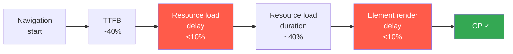

This is part 3 of the Lighthouse Performance series. [Part 2](./how-to-improve-fcp) covered FCP
and the critical rendering path. This one picks up where it ended.

FCP tells you the page is alive. LCP tells you the page is useful. It fires when the largest
visible element finishes rendering: typically your hero section, a big heading, or a key image.
At 25% of your Lighthouse score, it carries more weight than any other single metric.

The tricky part: there is no single fix for LCP. Unlike FCP where removing a few render-blocking
resources moves the needle, LCP depends on a chain of steps. Miss one, and you shift the time
rather than remove it.

## Step 0: Find your LCP element

Before fixing anything, you need to know what your LCP element actually is. It is not always
an image. On a blog post page, it is often a text block, which changes what you need to fix.

Run this in your browser console:

```ts
new PerformanceObserver((list) => {
  const entries = list.getEntries();
  const last = entries[entries.length - 1];
  console.log("LCP element:", last.element);
  console.log("LCP time:", Math.round(last.startTime) + "ms");
}).observe({ type: "largest-contentful-paint", buffered: true });
```

Reload the page. The last entry logged is your LCP element: the exact DOM node Chrome identified
as the largest visible element at load time.

For a structured breakdown, run Lighthouse and open the **LCP breakdown** diagnostic. It shows
the element and how much time was spent in each loading phase:

| LCP subpart                | What it measures                                              |
| :------------------------- | :------------------------------------------------------------ |
| **TTFB**                   | From navigation start to first byte of HTML                   |
| **Resource load delay**    | From TTFB to when the browser starts loading the LCP resource |
| **Resource load duration** | How long the LCP resource itself takes to download            |
| **Element render delay**   | From resource loaded to element painted on screen             |

For a **text LCP element** (headings, paragraphs), resource load delay and duration are both 0.
There is no resource to fetch. The only phases that matter are TTFB and element render delay.

Here is what this looks like on one of my blog post pages:

```
LCP element:  <p>All front-end devs have seen this score…</p>
TTFB:                 210 ms   ✓
Resource load delay:    0 ms   (text — no resource to fetch)
Resource load duration: 0 ms   (text — no resource to fetch)
Element render delay:  240 ms  ⚠
Total LCP:            ~450 ms  ✓ (well under 2.5s)
```

The score is perfect (25/25) because 450ms is fast. But render delay is 240ms out of 450ms
total — 53% of LCP spent in a phase that should be under 10%. Lighthouse also flags
render-blocking requests as a separate warning, which is the direct cause here.

## The 4-subpart model

This is the mental model that makes LCP optimization tractable. Instead of guessing, you
measure each phase and address the one that is out of proportion.



The two red phases are the "delay" phases: you want these close to zero. TTFB and resource
load duration involve network time so they will never be zero, but they should be proportionally
small.

| LCP subpart            | Target share |
| :--------------------- | :----------- |
| TTFB                   | ~40%         |
| Resource load delay    | < 10%        |
| Resource load duration | ~40%         |
| Element render delay   | < 10%        |

**The key insight:** reducing resource load duration without fixing resource load delay does
not improve LCP. If your image is hidden until JavaScript runs, compressing it just shifts
time from one bucket to another. You need to address all four phases.

## Fix 1: Eliminate element render delay

For text LCP, this is the only phase you can meaningfully control. Three things usually cause it.

**Render-blocking CSS.** If your stylesheet takes longer to download than the time between
TTFB and when the LCP element should appear, it delays rendering. With Tailwind this is
rarely an issue since the output is lean. But third-party stylesheets loaded via CDN (icon
fonts, UI libraries) can add real blocking time. Check the Network tab: look for CSS files
that finish loading after the first visible paint.

**Render-blocking scripts.** Any `<script>` in the `<head>` without `async` or `defer` blocks
parsing until it downloads and executes. Use `next/script` with the right strategy:

```tsx
// src/app/[locale]/layout.tsx
import Script from "next/script";

export default async function LocaleLayout({ children, params }: Props) {
  return (
    <html lang={locale}>
      <body>
        {children}
        {/* Loads after hydration — does not block LCP */}
        <Script
          src="https://www.googletagmanager.com/gtm.js?id=GTM-XXXXXXX"
          strategy="afterInteractive"
        />
      </body>
    </html>
  );
}
```

**Long tasks on the main thread.** Browsers render text and images on the main thread. A large
JavaScript bundle that parses and executes at load time can delay rendering even without
blocking the HTML parser. Open the Performance panel in DevTools and look for long tasks (red
bars in the flame chart) that overlap with the LCP timestamp.

## Fix 2: Make your LCP image discoverable early

If your LCP element is an image (common on landing and hero pages), the bottleneck shifts to
**resource load delay**. The browser has a preload scanner that reads the initial HTML before
it finishes parsing the full document. If the image is in that initial HTML, the scanner picks
it up immediately and starts fetching it in parallel.

If the image is not in the initial HTML (because it is managed by JavaScript, loaded via CSS,
or behind a `dynamic()` import), the browser has to wait before it even knows the image exists.

**The most common mistake in Next.js: wrapping your hero in `dynamic()`.**

```tsx
// src/app/[locale]/page.tsx

// ❌ Hero is not in the initial HTML.
// Browser downloads JS bundle first, then discovers the LCP image.
const Hero = dynamic(() => import("@/components/landing/Hero"));

// ✅ Import directly. Hero renders server-side and lands in the initial HTML.
import { Hero } from "@/components/landing/Hero";
```

If your hero contains an image, add the `priority` prop to `next/image`:

```tsx
// src/components/landing/Hero.tsx
import Image from "next/image";

export function Hero() {
  return (
    <section>
      <Image
        src="/images/profile.webp"
        alt="Profile photo"
        width={400}
        height={400}
        priority
        // Sets fetchpriority="high" on the 
        // Injects <link rel="preload"> in <head> — visible to the preload scanner
      />
    </section>
  );
}
```

Without `priority`, `next/image` applies lazy loading by default, which defers the request
until layout confirms the image is in the viewport. On a hero, that can be hundreds of
milliseconds into the load.

**CSS background images** are invisible to the preload scanner. Add an explicit preload:

```tsx
// src/app/[locale]/layout.tsx
export default async function LocaleLayout({ children, params }: Props) {
  return (
    <html lang={locale}>
      <head>
        <link
          rel="preload"
          as="image"
          href="/images/hero-bg.webp"
          type="image/webp"
          // @ts-expect-error — fetchpriority not in React types yet
          fetchpriority="high"
        />
      </head>
      <body>{children}</body>
    </html>
  );
}
```

## Fix 3: Send the right image size

Once the image is discoverable, file size determines how fast it downloads. `next/image`
handles format conversion automatically (WebP or AVIF based on browser support), but the
`sizes` prop is where most projects leave performance on the table.

Without `sizes`, Next.js assumes the image fills 100vw and generates a version wide enough
for the largest viewport. A 400px profile photo can end up served at 3x the size it needs.

```tsx
// src/components/landing/Hero.tsx

// ❌ No sizes: Next.js serves an image much larger than needed on desktop
<Image src="/images/profile.webp" alt="Profile" width={400} height={400} priority />

// ✅ With sizes: Next.js serves an image close to the actual rendered width
<Image
  src="/images/profile.webp"
  alt="Profile"
  width={400}
  height={400}
  sizes="(max-width: 768px) 100vw, 400px"
  priority
/>
```

The file size difference can be 5x or more. This is the most consistently underused
optimization I find when auditing Next.js projects.

## Fix 4: Reduce TTFB

TTFB is the foundation. Every millisecond of server response time delays all four phases.
I covered this in the [FCP article](./how-to-improve-fcp): static generation, ISR, compression,
and eliminating redirect chains.

One point specific to LCP: if you fetch data inside the component that renders your LCP element,
that fetch blocks the page response. Move slow fetches to a cached layer:

```tsx
// src/app/[locale]/page.tsx

// ❌ Fetch blocks response. TTFB includes this API call.
export default async function HomePage() {
  const hero = await fetch("https://api.example.com/hero").then((r) =>
    r.json(),
  );
  return <Hero data={hero} />;
}

// ✅ Cached at the edge. First visitor after cache expiry pays the cost, everyone else does not.
export const revalidate = 3600;

export default async function HomePage() {
  const hero = await fetch("https://api.example.com/hero", {
    next: { revalidate: 3600 },
  }).then((r) => r.json());
  return <Hero data={hero} />;
}
```

## Measuring LCP by subpart

Total LCP tells you if you have a problem. The subpart breakdown tells you what to fix.
The `web-vitals` attribution build exposes all four phases from real user sessions:

```ts
// src/lib/vitals.ts
import { onLCP } from "web-vitals/attribution";

onLCP((metric) => {
  const { value, attribution } = metric;

  console.log("LCP total:", Math.round(value) + "ms");
  console.log("LCP element:", attribution.lcpEntry?.element);

  console.log("TTFB:", Math.round(attribution.timeToFirstByte) + "ms");
  console.log(
    "Resource delay:",
    Math.round(attribution.resourceLoadDelay) + "ms",
  );
  console.log(
    "Resource duration:",
    Math.round(attribution.resourceLoadDuration) + "ms",
  );
  console.log(
    "Render delay:",
    Math.round(attribution.elementRenderDelay) + "ms",
  );
});
```

If resource delay and resource duration are both 0, your LCP element is text. If render
delay is large, something is blocking the main thread after the resource finishes loading.

Wire this into your layout with the built-in hook:

```tsx
// src/app/web-vitals.tsx
"use client";

import { useReportWebVitals } from "next/web-vitals";

export function WebVitals() {
  useReportWebVitals((metric) => {
    if (metric.name === "LCP") {
      console.log(`LCP: ${metric.value}ms`);
    }
  });
  return null;
}
```

The hook gives you the total. Import from `web-vitals/attribution` directly if you want
the subpart breakdown from field data.

## What's coming next

With FCP and LCP covered, the next article addresses TBT (Total Blocking Time), which
carries 30% of the Lighthouse score. It measures how long the main thread is blocked after
the page starts rendering, and it connects directly to the element render delay we looked
at here.
