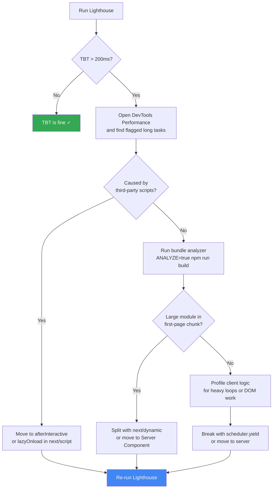

This is part 4 of the Lighthouse Performance series. [Part 3](./how-to-improve-lcp) covered
LCP and introduced long tasks as a cause of element render delay. This article is about that
specific problem.

TBT carries 30% of your Lighthouse score, more than any other single metric. It measures how
much time the main thread was blocked between FCP and TTI, unable to respond to user input.
The page looks loaded but clicks do nothing. That gap between "looks ready" and "actually
ready" is what TBT captures.

The reason it is hard to fix: TBT has no single cause. It is the sum of every long task that
runs at startup, from your own code to third-party scripts you did not write.

## The connection to element render delay

In the LCP article, I measured 240ms of render delay on one of my blog pages and flagged it
as "something blocking the main thread." That 240ms is TBT in disguise. The browser finished
downloading the LCP element but could not paint it because the main thread was busy running
JavaScript.

A long task is any task that runs on the main thread for more than 50ms. The browser cannot
interrupt it mid-execution, so any user interaction that lands during a long task gets queued
and ignored until the task finishes. TBT is the sum of all the time spent above that 50ms
threshold across every long task between FCP and TTI.

```
Task A: 250ms → blocking portion = 200ms
Task B:  90ms → blocking portion =  40ms
Task C:  35ms → blocking portion =   0ms (under 50ms threshold)
Task D: 155ms → blocking portion = 105ms
                               TBT = 345ms
```

Fix TBT and you fix render delay as a side effect. The root is the same: too much JavaScript
executing at load time.

## Step 0: Find your long tasks

Before touching any code, you need to know which tasks are actually long. Run this in the
browser console on any page you want to diagnose:

```ts
// Run in browser console
let tbt = 0;

new PerformanceObserver((list) => {
  list.getEntries().forEach((entry) => {
    const blocking = entry.duration - 50;
    if (blocking > 0) {
      tbt += blocking;
      console.log(
        `Long task: ${Math.round(entry.duration)}ms (blocks ${Math.round(blocking)}ms)`,
        entry,
      );
    }
  });
  console.log(`TBT so far: ${Math.round(tbt)}ms`);
}).observe({ type: "longtask", buffered: true });
```

Reload the page. Every task over 50ms gets logged with its blocking contribution. Click any
entry to inspect the full `PerformanceLongTaskTiming` object, which includes an
`attribution` array pointing to the frame or worker that triggered the task.

For the visual breakdown, open the **Performance panel** in Chrome DevTools and record a
page load. Long tasks are marked with a red flag in the top-right corner of their bar on the
main thread. Click any flagged task, then switch to **Bottom-Up** grouped by **Activity** in
the panel below. That view tells you exactly which function call caused the task and how much
time it consumed.

What you will usually find: a large script being parsed and compiled at startup, or a cascade
of DOM queries triggered during React hydration.

## Step 1: Audit your JS bundle

Long tasks from first-party code usually trace back to bundle size. The browser has to parse
and compile every kilobyte before executing it, and that parse/compile time shows up as a
long task before your application logic even starts. A 500KB JS bundle on a mid-range mobile
device can produce 300-500ms of blocking time from parse alone.

Next.js gives you two ways to inspect your bundles.

**Option 1: the Turbopack Bundle Analyzer** (experimental, Next.js 16.1+). No setup needed,
just run:

```bash
npx next experimental-analyze
```

This opens an interactive module graph in your browser where you can filter by route, trace
import chains, and see exactly which file pulls in a heavy dependency. If you want a
shareable output to compare before/after an optimization:

```bash
npx next experimental-analyze --output
# writes to .next/diagnostics/analyze
```

**Option 2: `@next/bundle-analyzer`** for Webpack-based builds:

```bash
npm install --save-dev @next/bundle-analyzer
```

```js
// next.config.js
const withBundleAnalyzer = require("@next/bundle-analyzer")({
  enabled: process.env.ANALYZE === "true",
});

module.exports = withBundleAnalyzer({
  // your existing config
});
```

```bash
ANALYZE=true npm run build
```

Both tools produce a treemap. You are looking for large modules that land in your first-page
chunk but are only used conditionally or below the fold.

Common culprits in Next.js projects:

| Module                                | Typical parsed size | Problem                                                       |
| :------------------------------------ | :------------------ | :------------------------------------------------------------ |
| `framer-motion`                       | ~150KB              | Pulled in by a single animated component in the layout        |
| `date-fns` (full import)              | ~500KB              | `import { format } from 'date-fns'` pulls more than you think |
| `recharts` / `chart.js`               | 200–400KB           | Included in a top-level component instead of split per page   |
| Icon libraries (`lucide-react`, etc.) | varies              | Every icon imported even if only 5 are used                   |

For packages with hundreds of named exports (icon sets, utility libraries), Next.js has a
built-in option that only loads what you actually use:

```js
// next.config.js
module.exports = {
  experimental: {
    optimizePackageImports: ["lucide-react", "date-fns"],
  },
};
```

This is cheaper than manually splitting imports and does not require changing your import
statements:

```ts
// Without optimizePackageImports: you have to write subpath imports yourself
import { ArrowRight } from "lucide-react/dist/esm/icons/arrow-right";

// With optimizePackageImports: imports stay clean, Next.js optimizes internally
import { ArrowRight } from "lucide-react";
```

Once you identify a heavier problem (a large component or library in the wrong chunk), the
fix is usually a dynamic import.

## Step 2: Code split heavy components

This is where `next/dynamic` does its job. This is a deliberate contrast to the LCP article,
where I warned against wrapping your hero in `dynamic()` because it hides the LCP element
from the initial HTML. Here we are doing the opposite: using `dynamic()` to intentionally
push components that are not visible in the first viewport out of the initial bundle.

The rule: if a component is not visible above the fold on most devices at load time, it has
no business being in the initial JS bundle.

A typical case is any heavy interactive component that only appears below the fold: a chart,
a rich text editor, a complex modal. The pattern is always the same:

```tsx
// src/components/SomeHeavyFeature.tsx
import dynamic from "next/dynamic";

// ❌ Heavy library is in the main bundle even though it is only needed on interaction
// import { HeavyFeatureImpl } from "./HeavyFeatureImpl";

// ✅ Library is in its own chunk, only fetched when the component mounts
const HeavyFeatureImpl = dynamic(() => import("./HeavyFeatureImpl"), {
  loading: () => <div className="animate-pulse bg-muted rounded-xl h-48" />,
});

export function SomeHeavyFeature(props: Props) {
  return <HeavyFeatureImpl {...props} />;
}
```

The `loading` prop matters. Without it, the user sees a layout jump when the component
mounts. A skeleton placeholder holds the space and keeps CLS clean.

Use `ssr: false` for components that rely on browser APIs or that add no value when
server-rendered (client-only interactive widgets). Keep the default `ssr: true` for
components that need to produce markup for SEO or initial paint.

For heavy rendering work that does not need browser APIs at all (syntax highlighting, markdown
parsing, data formatting), the better fix is moving to a Server Component entirely. The Next.js
docs show this exact pattern: move a client-side highlighter to a server component and the
library never ships to the browser at all. Zero dynamic import needed, zero client JS.

## Step 3: Defer non-critical third-party scripts

Third-party scripts are the most consistent source of long tasks you did not write and
cannot optimize directly. Analytics, tag managers, chat widgets, A/B testing tools: all of
them execute JavaScript on the main thread at load time if you let them.

The LCP article already covered this pattern with GTM:

```tsx
// src/app/[locale]/layout.tsx
import Script from "next/script";

export default async function LocaleLayout({ children, params }: Props) {
  return (
    <html lang={locale}>
      <body>
        {children}
        {/* Loads after hydration, outside the TBT window */}
        <Script
          src="https://www.googletagmanager.com/gtm.js?id=GTM-XXXXXXX"
          strategy="afterInteractive"
        />
      </body>
    </html>
  );
}
```

`afterInteractive` fires after hydration completes, which puts it past the TBT measurement
window. For scripts that are truly non-essential (social embeds, feedback widgets), use
`lazyOnload` which defers until the browser is idle:

```tsx
// Loads only when the browser has nothing better to do
<Script src="https://embed.example.com/widget.js" strategy="lazyOnload" />
```

| Strategy            | When it loads    | Use for                                          |
| :------------------ | :--------------- | :----------------------------------------------- |
| `beforeInteractive` | Before hydration | Critical polyfills only                          |
| `afterInteractive`  | After hydration  | Analytics, tag managers, heatmaps                |
| `lazyOnload`        | Browser idle     | Chat widgets, social embeds, non-essential tools |

One thing worth auditing: how many `afterInteractive` scripts are you loading? Five
analytics tools each loading separately can add up even if none of them individually is
the problem. Consolidating them behind a single tag manager usually helps.

## Step 4: Move work off the main thread

Sometimes the long task is not a library but your own application logic: processing data for
a list, building a search index, parsing a large response. Two approaches work well in
Next.js.

**React Server Components.** If a component's job is to transform data and produce HTML, it
should run on the server. Server-side work never touches the client main thread and
contributes zero to TBT.

```tsx
// src/components/PostContent.tsx

// ❌ Client Component: the processing logic runs on the client at render time
"use client";
import { processContent } from "@/lib/content";

export function PostContent({ raw }: { raw: string }) {
  const content = processContent(raw); // potentially a long task
  return <div>{content}</div>;
}

// ✅ Server Component: same work, zero client JS, zero TBT contribution
import { processContent } from "@/lib/content";

export async function PostContent({ raw }: { raw: string }) {
  const content = await processContent(raw); // runs on the server
  return <div>{content}</div>;
}
```

This is not always an option. Components that use `useState`, `useEffect`, or any browser
API have to stay client-side. But if a component only transforms data and renders markup,
make it a Server Component by default.

**`scheduler.yield()` for unavoidable client work.** When heavy work genuinely has to run
on the client (indexing a large dataset for local search, processing a file the user
uploaded), you can break it into smaller pieces that yield control back to the browser
between iterations:

```ts
// src/lib/search.ts

export async function buildSearchIndex(posts: Post[]) {
  const index: SearchEntry[] = [];

  for (const post of posts) {
    // Yield between iterations so the browser can process input events
    if (globalThis.scheduler?.yield) {
      await scheduler.yield();
    } else {
      // Fallback: less precise but works everywhere
      await new Promise<void>((resolve) => setTimeout(resolve, 0));
    }

    index.push({
      title: post.title,
      content: post.content.slice(0, 500),
      slug: post.slug,
    });
  }

  return index;
}
```

`scheduler.yield()` is currently Chrome and Edge only (not yet Baseline). The
`setTimeout(resolve, 0)` fallback works cross-browser but gives the browser only a hint,
not a guarantee, that input events will be processed first. Either way, the loop no longer
runs as one monolithic long task. It becomes many short tasks that can be interrupted.

## Measuring long tasks from real users

TBT is a lab metric. The spec explicitly notes that user interactions during load can affect
it, so field measurements of TBT directly have too much variance to be reliable. What you
can track from real sessions is long task frequency and duration using the Long Tasks API,
which gives you a field proxy for TBT:

```ts
// src/lib/vitals.ts
export function observeLongTasks(
  onLongTask: (entry: {
    duration: number;
    blocking: number;
    startTime: number;
  }) => void,
) {
  if (!("PerformanceObserver" in window)) return;

  try {
    const observer = new PerformanceObserver((list) => {
      list.getEntries().forEach((entry) => {
        const blocking = entry.duration - 50;
        if (blocking > 0) {
          onLongTask({
            duration: Math.round(entry.duration),
            blocking: Math.round(blocking),
            startTime: Math.round(entry.startTime),
          });
        }
      });
    });

    observer.observe({ type: "longtask", buffered: true });
  } catch {
    // Long Tasks API not supported in this browser
  }
}
```

```tsx
// src/app/web-vitals.tsx
"use client";

import { useEffect } from "react";
import { observeLongTasks } from "@/lib/vitals";

export function WebVitals() {
  useEffect(() => {
    observeLongTasks((entry) => {
      // Send to your analytics platform
      console.log("Long task from field:", entry);
    });
  }, []);

  return null;
}
```

This tells you which pages generate the most long task activity in production, so you know
where to focus next. Pages with consistently high long task counts after you have applied the
fixes above usually have a third-party script or an eager client-side import you have not
found yet.

For the Lighthouse score, the thresholds on mobile are:

| TBT         | Score  |
| :---------- | :----- |
| 0–200 ms    | Green  |
| 200–600 ms  | Orange |
| Over 600 ms | Red    |

## What to fix first

The order matters because third-party scripts are fast to fix and often account for more
than half of TBT on a real site. One strategy change in `next/script` can cut hundreds of
milliseconds immediately. Bundle splitting and Server Components are more impactful long-term
but require more work per fix.



The series finishes with Cumulative Layout Shift (CLS), the metric that measures visual
stability: how much your page jumps around as fonts, images, and dynamic content load.
