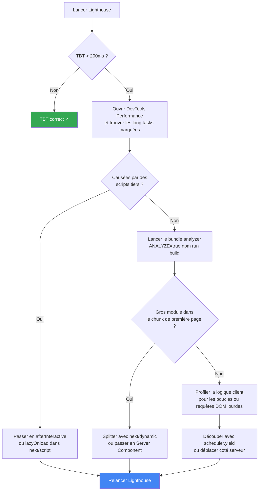

Cet article est la partie 4 de la série Lighthouse Performance. La [partie 3](./how-to-improve-lcp)
couvrait le LCP et introduisait les long tasks comme cause du render delay. Cet article traite
exactement de ce problème.

Le TBT représente 30% du score Lighthouse, plus que n'importe quelle autre métrique. Il mesure
le temps pendant lequel le main thread était bloqué entre le FCP et le TTI, incapable de
répondre aux interactions utilisateur. La page a l'air chargée mais les clics ne font rien.
Cet écart entre "ça ressemble à prêt" et "c'est vraiment prêt", c'est ce que capture le TBT.

Ce qui le rend difficile à corriger: il n'a pas une seule cause. C'est la somme de toutes les
long tasks qui s'exécutent au démarrage, depuis ton propre code jusqu'aux scripts tiers que
tu n'as pas écrits.

## Le lien avec l'element render delay

Dans l'article LCP, j'avais mesuré 240ms de render delay sur une de mes pages de blog et
l'avais signalé comme "quelque chose qui bloque le main thread." Ces 240ms, c'est du TBT
déguisé. Le navigateur avait fini de télécharger l'élément LCP mais ne pouvait pas le peindre
parce que le main thread était occupé à exécuter du JavaScript.

Une long task, c'est n'importe quelle tâche qui tourne sur le main thread pendant plus de
50ms. Le navigateur ne peut pas l'interrompre en cours d'exécution, donc toute interaction
utilisateur qui survient pendant une long task est mise en file d'attente et ignorée jusqu'à
la fin de la tâche. Le TBT est la somme de tout le temps passé au-dessus de ce seuil de
50ms, sur l'ensemble des long tasks entre le FCP et le TTI.

```
Tâche A: 250ms → portion bloquante = 200ms
Tâche B:  90ms → portion bloquante =  40ms
Tâche C:  35ms → portion bloquante =   0ms (sous le seuil de 50ms)
Tâche D: 155ms → portion bloquante = 105ms
                               TBT = 345ms
```

Corriger le TBT corrige le render delay par effet de bord. La racine est la même: trop de
JavaScript qui s'exécute au chargement.

## Étape 0 : Trouver tes long tasks

Avant de toucher au code, tu dois savoir quelles tâches sont réellement longues. Lance ça
dans la console du navigateur sur n'importe quelle page à diagnostiquer:

```ts
// À coller dans la console du navigateur
let tbt = 0;

new PerformanceObserver((list) => {
  list.getEntries().forEach((entry) => {
    const blocking = entry.duration - 50;
    if (blocking > 0) {
      tbt += blocking;
      console.log(
        `Long task: ${Math.round(entry.duration)}ms (bloque ${Math.round(blocking)}ms)`,
        entry,
      );
    }
  });
  console.log(`TBT jusqu'ici: ${Math.round(tbt)}ms`);
}).observe({ type: "longtask", buffered: true });
```

Recharge la page. Chaque tâche au-dessus de 50ms est loguée avec sa contribution bloquante.
Clique sur une entrée pour inspecter l'objet `PerformanceLongTaskTiming` complet, qui contient
un tableau `attribution` pointant vers le frame ou le worker responsable.

Pour la visualisation, ouvre le **panneau Performance** dans les DevTools Chrome et enregistre
un chargement de page. Les long tasks sont marquées d'un drapeau rouge dans le coin supérieur
droit de leur barre sur le main thread. Clique sur une tâche marquée, puis passe en vue
**Bottom-Up** groupée par **Activity** dans le panneau du bas. Cette vue te dit exactement
quel appel de fonction a causé la tâche et combien de temps il a consommé.

Ce qu'on trouve en général: un gros script en train d'être parsé et compilé au démarrage, ou
une cascade de requêtes DOM déclenchées pendant l'hydratation React.

## Étape 1 : Auditer ton bundle JS

Les long tasks issues du code first-party remontent presque toujours à la taille du bundle.
Le navigateur doit parser et compiler chaque kilooctet avant de l'exécuter, et ce temps de
parse/compilation apparaît comme une long task avant même que ta logique applicative commence.
Un bundle de 500Ko sur un mobile entrée de gamme peut produire 300 à 500ms de blocking time
rien qu'au parse.

Next.js propose deux outils pour inspecter tes bundles.

**Option 1: le Turbopack Bundle Analyzer** (expérimental, Next.js 16.1+). Pas de setup, juste:

```bash
npx next experimental-analyze
```

Ça ouvre un graphe de modules interactif dans le navigateur où tu peux filtrer par route,
remonter les chaînes d'imports et voir exactement quel fichier tire une dépendance lourde.
Pour obtenir un output shareable et comparer avant/après une optimisation:

```bash
npx next experimental-analyze --output
# écrit dans .next/diagnostics/analyze
```

**Option 2: `@next/bundle-analyzer`** pour les builds Webpack:

```bash
npm install --save-dev @next/bundle-analyzer
```

```js
// next.config.js
const withBundleAnalyzer = require("@next/bundle-analyzer")({
  enabled: process.env.ANALYZE === "true",
});

module.exports = withBundleAnalyzer({
  // ta config existante
});
```

```bash
ANALYZE=true npm run build
```

Les deux outils produisent une treemap. Tu cherches les modules volumineux qui atterrissent
dans ton chunk de première page mais qui ne sont utilisés que conditionnellement ou sous la fold.

Coupables fréquents dans les projets Next.js:

| Module                                     | Taille parsée typique | Problème                                                           |
| :----------------------------------------- | :-------------------- | :----------------------------------------------------------------- |
| `framer-motion`                            | ~150Ko                | Tiré par un seul composant animé dans le layout                    |
| `date-fns` (import complet)                | ~500Ko                | `import { format } from 'date-fns'` importe plus que prévu         |
| `recharts` / `chart.js`                    | 200–400Ko             | Inclus dans un composant de layout au lieu d'être splitté par page |
| Librairies d'icônes (`lucide-react`, etc.) | variable              | Toutes les icônes importées même si seulement 5 sont utilisées     |

Pour les packages avec des centaines d'exports nommés (sets d'icônes, librairies utilitaires),
Next.js a une option intégrée qui ne charge que ce que tu utilises vraiment:

```js
// next.config.js
module.exports = {
  experimental: {
    optimizePackageImports: ["lucide-react", "date-fns"],
  },
};
```

C'est moins coûteux que de splitter les imports manuellement et ça ne nécessite pas de
changer tes imports existants:

```ts
// Sans optimizePackageImports: tu dois écrire les imports par sous-chemin toi-même
import { ArrowRight } from "lucide-react/dist/esm/icons/arrow-right";

// Avec optimizePackageImports: tes imports restent propres, Next.js optimise en interne
import { ArrowRight } from "lucide-react";
```

Pour les problèmes plus lourds (un composant ou une librairie dans le mauvais chunk), la
correction est en général un import dynamique.

## Étape 2 : Code splitting des composants lourds

C'est là que `next/dynamic` fait son travail. C'est un contraste intentionnel avec l'article
LCP, où je déconseillais de wrapper ton hero dans `dynamic()` parce que ça cache l'élément
LCP du HTML initial. Ici on fait l'inverse: on utilise `dynamic()` pour pousser délibérément
les composants non visibles au premier viewport hors du bundle initial.

La règle: si un composant n'est pas visible au-dessus de la fold sur la plupart des appareils
au chargement, il n'a aucune raison d'être dans le bundle initial.

Le cas typique: n'importe quel composant interactif lourd qui n'apparaît qu'en bas de page,
un graphique, un éditeur de texte riche, une modale complexe. Le pattern est toujours le même:

```tsx
// src/components/SomethingHeavy.tsx
import dynamic from "next/dynamic";

// ❌ La librairie lourde est dans le bundle principal même si elle n'est utile qu'à l'interaction
// import { HeavyFeatureImpl } from "./HeavyFeatureImpl";

// ✅ La librairie est dans son propre chunk, fetchée seulement quand le composant se monte
const HeavyFeatureImpl = dynamic(() => import("./HeavyFeatureImpl"), {
  loading: () => <div className="animate-pulse bg-muted rounded-xl h-48" />,
});

export function SomethingHeavy(props: Props) {
  return <HeavyFeatureImpl {...props} />;
}
```

La prop `loading` est importante. Sans elle, l'utilisateur voit un saut de layout quand le
composant se monte. Un placeholder skeleton maintient l'espace et garde le CLS propre.

Utilise `ssr: false` pour les composants qui dépendent d'APIs navigateur ou qui n'apportent
rien côté serveur. Garde le `ssr: true` par défaut pour les composants qui doivent produire
du markup pour le SEO ou le premier affichage.

Pour le travail de rendu lourd qui n'a pas besoin d'APIs navigateur (coloration syntaxique,
parsing Markdown, formatage de données), la meilleure correction est de passer en Server
Component. La librairie ne descend plus jamais dans le bundle client. Zéro import dynamique
nécessaire, zéro JS client.

## Étape 3 : Différer les scripts tiers non critiques

Les scripts tiers sont la source la plus constante de long tasks que tu n'as pas écrits et
ne peux pas optimiser directement. Analytics, tag managers, widgets de chat, outils d'A/B
testing: tous exécutent du JavaScript sur le main thread au chargement si tu les laisses
faire.

L'article LCP couvrait déjà ce pattern avec GTM:

```tsx
// src/app/[locale]/layout.tsx
import Script from "next/script";

export default async function LocaleLayout({ children, params }: Props) {
  return (
    <html lang={locale}>
      <body>
        {children}
        {/* Se charge après l'hydratation, hors de la fenêtre TBT */}
        <Script
          src="https://www.googletagmanager.com/gtm.js?id=GTM-XXXXXXX"
          strategy="afterInteractive"
        />
      </body>
    </html>
  );
}
```

`afterInteractive` se déclenche après la fin de l'hydratation, ce qui le place après la
fenêtre de mesure du TBT. Pour les scripts vraiment non essentiels (embeds sociaux, widgets
de feedback), utilise `lazyOnload` qui diffère jusqu'à ce que le navigateur soit idle:

```tsx
// Se charge seulement quand le navigateur n'a rien de mieux à faire
<Script src="https://embed.example.com/widget.js" strategy="lazyOnload" />
```

| Stratégie           | Quand ça charge     | Pour quoi                                              |
| :------------------ | :------------------ | :----------------------------------------------------- |
| `beforeInteractive` | Avant l'hydratation | Polyfills critiques uniquement                         |
| `afterInteractive`  | Après l'hydratation | Analytics, tag managers, heatmaps                      |
| `lazyOnload`        | Navigateur idle     | Widgets de chat, embeds sociaux, outils non essentiels |

Un audit qui vaut la peine: combien de scripts `afterInteractive` charges-tu ? Cinq outils
analytics qui se chargent séparément s'accumulent même si aucun n'est individuellement
problématique. Les consolider derrière un seul tag manager aide en général.

## Étape 4 : Déplacer le travail hors du main thread

Parfois la long task n'est pas une librairie mais ta propre logique applicative: traitement
de données pour une liste, construction d'un index de recherche, parsing d'une grosse
réponse. Deux approches fonctionnent bien dans Next.js.

**React Server Components.** Si le rôle d'un composant est de transformer des données et
produire du HTML, il devrait tourner sur le serveur. Le travail côté serveur ne touche
jamais le main thread client et contribue zéro au TBT.

```tsx
// src/components/PostContent.tsx

// ❌ Client Component: la logique de traitement tourne sur le client au moment du rendu
"use client";
import { processContent } from "@/lib/content";

export function PostContent({ raw }: { raw: string }) {
  const content = processContent(raw); // potentiellement une long task
  return <div>{content}</div>;
}

// ✅ Server Component: même travail, zéro JS client, zéro contribution au TBT
import { processContent } from "@/lib/content";

export async function PostContent({ raw }: { raw: string }) {
  const content = await processContent(raw); // tourne sur le serveur
  return <div>{content}</div>;
}
```

Ce n'est pas toujours possible. Les composants qui utilisent `useState`, `useEffect` ou
une API navigateur doivent rester côté client. Mais si un composant se contente de
transformer des données et de rendre du markup, c'est un Server Component par défaut.

**`scheduler.yield()` pour le travail client inévitable.** Quand du travail lourd doit
vraiment tourner côté client (indexer un gros dataset pour la recherche locale, traiter
un fichier uploadé par l'utilisateur), tu peux le découper en petits morceaux qui rendent
le contrôle au navigateur entre chaque itération:

```ts
// src/lib/search.ts

export async function buildSearchIndex(posts: Post[]) {
  const index: SearchEntry[] = [];

  for (const post of posts) {
    // On cède entre chaque itération pour que le navigateur puisse traiter les events
    if (globalThis.scheduler?.yield) {
      await scheduler.yield();
    } else {
      // Fallback: moins précis mais cross-browser
      await new Promise<void>((resolve) => setTimeout(resolve, 0));
    }

    index.push({
      title: post.title,
      content: post.content.slice(0, 500),
      slug: post.slug,
    });
  }

  return index;
}
```

`scheduler.yield()` n'est disponible que sur Chrome et Edge pour l'instant (pas encore
Baseline). Le fallback `setTimeout(resolve, 0)` fonctionne partout mais donne au navigateur
seulement un indice, pas une garantie, que les events seront traités en priorité. Dans les
deux cas, la boucle ne tourne plus comme une seule long task monolithique: elle devient
beaucoup de petites tâches interruptibles.

## Mesurer les long tasks depuis les vrais utilisateurs

Le TBT est une métrique de lab. La spec précise explicitement que les interactions
utilisateur pendant le chargement peuvent l'affecter, donc les mesures terrain de TBT direct
ont trop de variance pour être fiables. Ce qu'on peut tracker depuis les vraies sessions, c'est
la fréquence et la durée des long tasks via la Long Tasks API, un proxy terrain pour le TBT:

```ts
// src/lib/vitals.ts
export function observeLongTasks(
  onLongTask: (entry: {
    duration: number;
    blocking: number;
    startTime: number;
  }) => void,
) {
  if (!("PerformanceObserver" in window)) return;

  try {
    const observer = new PerformanceObserver((list) => {
      list.getEntries().forEach((entry) => {
        const blocking = entry.duration - 50;
        if (blocking > 0) {
          onLongTask({
            duration: Math.round(entry.duration),
            blocking: Math.round(blocking),
            startTime: Math.round(entry.startTime),
          });
        }
      });
    });

    observer.observe({ type: "longtask", buffered: true });
  } catch {
    // Long Tasks API non supportée dans ce navigateur
  }
}
```

```tsx
// src/app/web-vitals.tsx
"use client";

import { useEffect } from "react";
import { observeLongTasks } from "@/lib/vitals";

export function WebVitals() {
  useEffect(() => {
    observeLongTasks((entry) => {
      // Envoie à ta plateforme analytics
      console.log("Long task depuis le terrain:", entry);
    });
  }, []);

  return null;
}
```

Ces données te disent quelles pages génèrent le plus d'activité de long tasks en production,
pour savoir où concentrer l'effort. Les pages avec beaucoup de long tasks après avoir appliqué
les corrections ci-dessus ont en général un script tiers ou un import client eager que tu n'as
pas encore trouvé.

Pour le score Lighthouse, les seuils sur mobile:

| TBT            | Score  |
| :------------- | :----- |
| 0–200 ms       | Vert   |
| 200–600 ms     | Orange |
| Plus de 600 ms | Rouge  |

## Par où commencer

L'ordre compte, parce que les scripts tiers sont rapides à corriger et représentent souvent
plus de la moitié du TBT sur un site réel. Un seul changement de stratégie dans `next/script`
peut couper plusieurs centaines de millisecondes immédiatement. Le bundle splitting et les
Server Components ont plus d'impact sur la durée mais demandent plus de travail par correction.



La série se termine avec le Cumulative Layout Shift (CLS), la métrique qui mesure la stabilité
visuelle: dans quelle mesure ta page saute quand les polices, les images et le contenu dynamique
se chargent.
