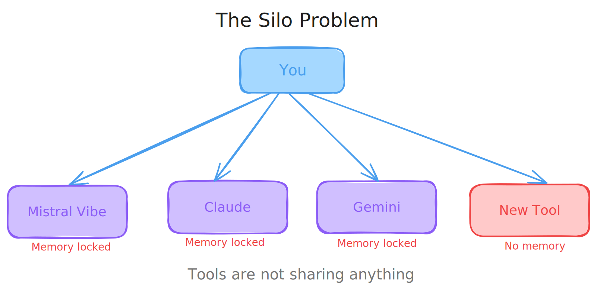
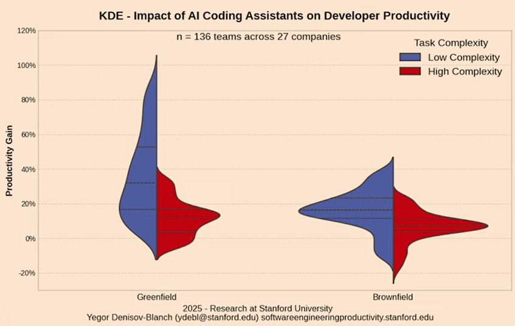
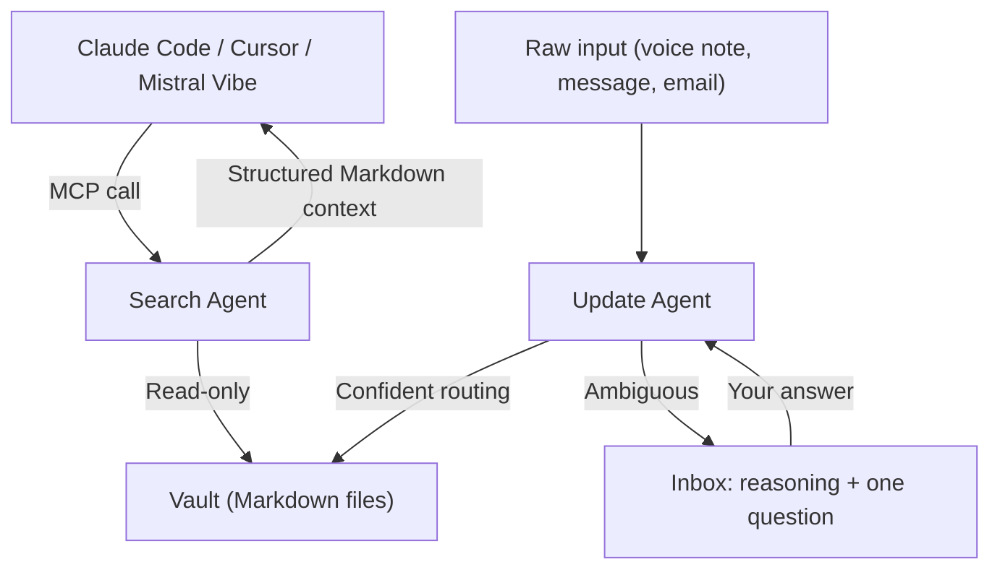

Last weekend, my teammates [Yvan](https://github.com/YvanoffP) and [Eddie](https://github.com/widium) and I shipped Knower at the [Mistral Online Hackathon](https://worldwide-hackathon.mistral.ai/). 48 hours. One problem we had all hit personally. One opinionated solution.

We did not make the finals. A project called Distral took a similar angle but went further on the product side, with a polished terminal UI. Fair call, congratulations to them!

👉 **[github.com/Birium/mistral-hackathon](https://github.com/Birium/mistral-hackathon)**

## The Problem: Your Memory is Trapped

You open Mistral. You explain your project: the stack, the constraints, the decisions from two weeks ago, the thing you tried and abandoned. Then you open Claude to debug something. You explain it all again. Then Cursor. Again.



This is not a minor annoyance. It is the daily workflow of anyone using more than one AI tool. Every session starts from zero, because every tool owns its own memory and shares none of it.

There is a second problem that compounds the first. Even when you try to fix this yourself, by writing context into a file or a `.cursorrules`, it rots. Three sprints later it is 200 lines. Half outdated, half contradicting decisions made since. Nobody has time to maintain it. So it stays broken and quietly misleads every agent that reads it.

And then there is a third problem, which is more subtle. When an agent searches its own memory using file reads and grep calls, all that exploration lives inside its context window. Fill it with search results, and there is less room left to actually think.

Three independent research efforts found the same thing:

| Research                        | Finding                                                                                     |
| ------------------------------- | ------------------------------------------------------------------------------------------- |
| **Stanford 2025** (n=136 teams) | AI productivity drops sharply on complex tasks. Context saturation is the central cause.    |
| **NoLiMa Benchmark**            | Performance degrades with context length, especially when relevant info is buried in noise. |
| **Needle-in-Haystack**          | Retrieval accuracy collapses at large context depths, even on 200K token models.            |



The smarter the task, the more memory loading hurts it. This is the exact reason Knower runs as a **separate process**.

## What We Built

Knower is a local, portable memory service. You run it once. Any AI tool that supports MCP or REST can call it. The vault is the single source of truth. The client is irrelevant.


`MCP  →  Claude Code, Cursor, Mistral Vibe, any MCP-compatible client`

`API  →  any script or custom agent (POST /update, POST /search)`

`CLI  →  you, directly, no intermediary`

The vault is just Markdown files with a predictable structure. An `overview.md` is always the map. A `changelog.md` is always newest-first. A `state.md` is always a volatile snapshot. An agent that knows this structure does not discover it each session. It knows it from the first call, because the structure is defined once in the system prompt.

Two agents handle everything, both running `mistral-large-2512` via OpenRouter in an agentic tool-calling loop:

| Agent      | Role                                  | Write access |
| ---------- | ------------------------------------- | ------------ |
| **Update** | Routes new information into the vault | Yes          |
| **Search** | Read-only context retrieval           | No           |

The search agent is architecturally read-only. That is a guarantee, not a convention. It can run in parallel with ongoing updates without any write conflict risk.

When the update agent cannot route something with confidence, it does not guess. It creates an inbox item with its full reasoning exposed: what it searched, what it found, what it proposes, and one precise question for you. When you answer, the agent reads the existing reasoning and picks up exactly where it left off.



Search runs locally with [QMD](https://github.com/tobilu/qmd): BM25 keyword match + vector embeddings + LLM reranker. No cloud. No external API. About 2 GB of models, downloaded once.


## The Stack

| Layer            | Technology                                             |
| ---------------- | ------------------------------------------------------ |
| **Core**         | Python, FastAPI, asyncio queue                         |
| **Agents**       | `mistral-large-2512` via OpenRouter, tool-calling loop |
| **Search**       | QMD (BM25 + vector + LLM reranker, fully local)        |
| **Frontend**     | React + Vite + Shadcn/UI + Tailwind                    |
| **Storage**      | Plain Markdown with YAML frontmatter                   |
| **Connectivity** | MCP (SSE + Streamable HTTP), REST, CLI                 |

## Try It

```bash
git clone git@github.com:Birium/mistral-hackathon.git && cd knower
./install.sh       # ~2 GB model download, one-time
knower start       # Launch the Knower Core
knower web         # http://localhost:8000
```

The demo below shows the full flow: dropping raw input, watching it get routed into the vault in real time, and querying context from a different tool.

👉 **[Watch the demo](https://www.youtube.com/watch?v=RxcAzLkbr3Y&feature=youtu.be)**

Full install guide, MCP configuration for Claude Code and Mistral Vibe, and the CLI reference are in **[INSTALL.md](https://github.com/Birium/mistral-hackathon/blob/main/INSTALL.md)**.

If the idea resonates, a ⭐ on GitHub is the best way to tell us it is worth continuing. There is a lot left to build. Like smarter token budgeting, richer UI, and why not propose hosting as well.
