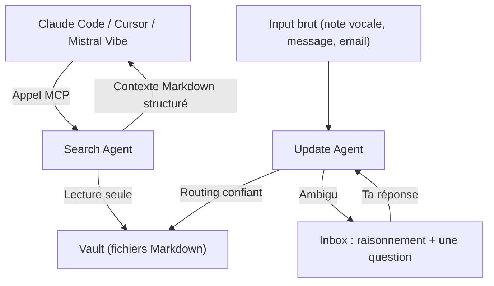

Le week-end dernier, avec mes coéquipiers [Yvan](https://github.com/YvanoffP) et [Eddie](https://github.com/widium), on a sorti Knower au [Mistral Online Hackathon](https://worldwide-hackathon.mistral.ai/). 48 heures. Un problème qu'on avait tous les trois rencontré personnellement. Une solution opinionated.

On n'a pas été sélectionnés pour les finales. Un projet appelé Distral avait une approche similaire, mais est allé plus loin côté produit avec une interface terminal très soignée, dans le style Claude Code. Choix légitime, bravo à eux !

👉 **[github.com/Birium/mistral-hackathon](https://github.com/Birium/mistral-hackathon)**

## Le problème : ta mémoire est prisonnière

Tu ouvres Mistral. Tu expliques ton projet : la stack, les contraintes, les décisions prises il y a deux semaines, la piste abandonnée en cours de route. Puis tu ouvres Claude pour déboguer quelque chose. Tu ré-expliques tout. Puis Cursor. Encore.


Ce n'est pas une légère friction. C'est le quotidien de quiconque utilise plus d'un outil IA. Chaque session repart de zéro, parce que chaque outil possède sa propre mémoire et n'en partage rien.

Il y a un deuxième problème qui s'ajoute au premier. Même quand tu essaies de régler ça toi-même, en écrivant du contexte dans un fichier ou un `.cursorrules`, ça se dégrade. Trois sprints plus tard, c'est 200 lignes. La moitié obsolète, l'autre moitié qui contredit des décisions prises depuis. Personne n'a le temps de le maintenir. Donc ça reste cassé, et ça induit silencieusement en erreur chaque agent qui le lit.

Et il y a un troisième problème, plus subtil. Quand un agent cherche dans sa propre mémoire via des lectures de fichiers et des appels grep, toute cette exploration vit dans sa fenêtre de contexte. Remplis-la de résultats de recherche, et il reste moins de place pour vraiment réfléchir.

Trois études indépendantes ont trouvé la même chose :

| Étude                             | Résultat                                                                                                             |
| --------------------------------- | -------------------------------------------------------------------------------------------------------------------- |
| **Stanford 2025** (n=136 équipes) | La productivité IA chute fortement sur les tâches complexes. La saturation de contexte en est la cause principale.   |
| **NoLiMa Benchmark**              | Les performances se dégradent avec la longueur du contexte, surtout quand l'info pertinente est noyée dans du bruit. |
| **Needle-in-Haystack**            | La précision de récupération s'effondre en profondeur de contexte, même sur des modèles 200K tokens.                 |


Plus la tâche est complexe, plus le chargement de mémoire nuit à la qualité. C'est exactement pour ça que Knower tourne comme un **processus séparé**.

## Ce qu'on a construit

Knower est un service de mémoire local et portable. Tu le lances une fois. N'importe quel outil IA compatible MCP ou REST peut l'appeler. Le vault est la source de vérité unique. Le client est sans importance.


`MCP  →  Claude Code, Cursor, Mistral Vibe, tout client compatible MCP`

`API → n'importe quel script ou agent custom (POST /update, POST /search)`

`CLI → toi, directement, sans intermédiaire`

Le vault, c'est simplement des fichiers Markdown avec une structure prévisible. Un `overview.md` est toujours la carte du territoire. Un `changelog.md` est toujours trié par date décroissante. Un `state.md` est toujours un snapshot volatile. Un agent qui connaît cette structure ne la redécouvre pas à chaque session. Il la connaît dès le premier appel, parce qu'elle est définie une fois dans le system prompt.

Deux agents gèrent tout, tous les deux tournant sur `mistral-large-2512` via OpenRouter dans une boucle outil-calling agentique :

| Agent      | Rôle                                           | Accès en écriture |
| ---------- | ---------------------------------------------- | ----------------- |
| **Update** | Route les nouvelles informations dans le vault | Oui               |
| **Search** | Récupération de contexte en lecture seule      | Non               |

Le search agent est architecturalement en lecture seule. C'est une garantie, pas une convention. Il peut tourner en parallèle d'updates en cours sans aucun risque de conflit d'écriture.

Quand l'update agent ne peut pas router quelque chose avec certitude, il ne devine pas. Il crée un item dans l'inbox avec tout son raisonnement exposé : ce qu'il a cherché, ce qu'il a trouvé, ce qu'il propose, et une seule question précise pour toi. Quand tu réponds, l'agent relit le raisonnement existant et reprend exactement où il s'était arrêté.



La recherche tourne localement avec [QMD](https://github.com/tobilu/qmd) : match BM25 par mots-clés + embeddings vectoriels + reranker LLM. Pas de cloud. Pas d'API externe. Environ 2 Go de modèles, téléchargés une seule fois.


## La stack

| Couche           | Technologie                                              |
| ---------------- | -------------------------------------------------------- |
| **Core**         | Python, FastAPI, asyncio queue                           |
| **Agents**       | `mistral-large-2512` via OpenRouter, boucle tool-calling |
| **Recherche**    | QMD (BM25 + vectoriel + reranker LLM, 100% local)        |
| **Frontend**     | React + Vite + Shadcn/UI + Tailwind                      |
| **Stockage**     | Markdown brut avec frontmatter YAML                      |
| **Connectivité** | MCP (SSE + Streamable HTTP), REST, CLI                   |

## Essaye-le

```bash
git clone git@github.com:Birium/mistral-hackathon.git && cd knower
./install.sh       # ~2 Go de modèles à télécharger, une seule fois
knower start       # Lance le Knower Core
knower web         # http://localhost:8000
```

La démo ci-dessous montre le flux complet : déposer un input brut, le voir se router dans le vault en temps réel, et interroger le contexte depuis un outil différent.

👉 **[Voir la démo](https://www.youtube.com/watch?v=RxcAzLkbr3Y&feature=youtu.be)**

Le guide d'installation complet, la configuration MCP pour Claude Code et Mistral Vibe, et la référence CLI sont dans **[INSTALL.md](https://github.com/Birium/mistral-hackathon/blob/main/INSTALL.md)**.

Si l'idée te parle, une ⭐ sur GitHub est la meilleure façon de nous dire que ça vaut la peine de continuer ! Il reste beaucoup à construire. Par exemple une gestion plus fine du budget de tokens, une UI plus riche, pourquoi pas proposer de hoster également.
