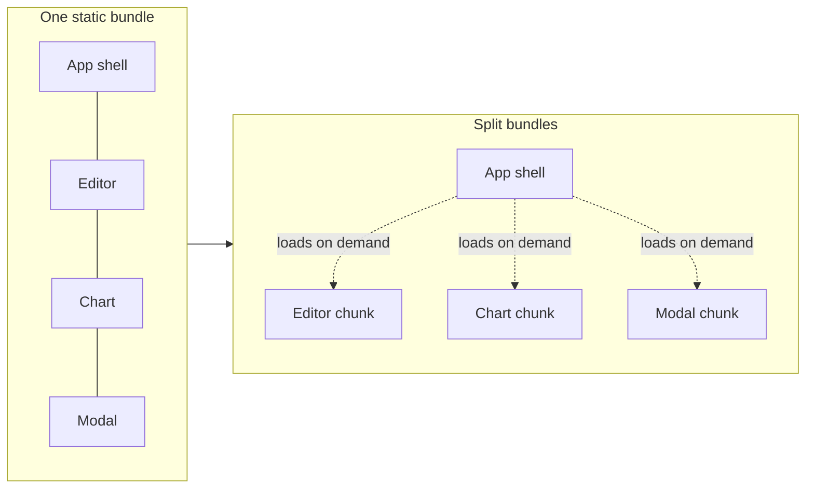
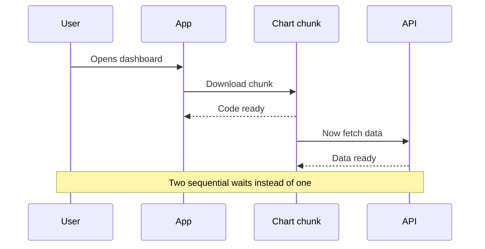

Every React app starts small. Then you add a router, a date library, a chart, a rich text
editor, and one day the first thing a user does on your site is download a few hundred
kilobytes of JavaScript before anything becomes interactive.

The part that always bothered me: most of that code is for features the user may never touch.
You ship the entire rich text editor to someone who only came to read the article. The browser
still has to download it, parse it, and compile it before the page responds to a click.

Code splitting is how you stop doing that. The idea is simple: break the app into smaller
bundles and load each one only when it is actually needed. In React the tools for this are a
dynamic `import()`, `React.lazy`, and `Suspense`. This article is about how they fit together,
and the mistakes that turn a "performance win" into a worse experience.

## What code splitting actually is

A normal import is static. The bundler sees it, follows it, and pulls that code into the same
file it ships on first load:

```tsx
// src/pages/ArticlePage.tsx
import { Editor } from "./Editor"; // bundled into the main chunk, always
```

A dynamic import is a function call that returns a Promise. The bundler treats it as a split
point: the imported code goes into its own chunk and is only fetched when the call runs.

```tsx
// Returns a Promise, resolved when the chunk is downloaded
const editorModule = await import("./Editor");
```

That single difference is the whole mechanism. One bundle becomes several, and the browser
only pays for what it loads.



Build tools handle the splitting for you. Vite, Parcel and Rsbuild all create a separate chunk
the moment they see a dynamic `import()`. You decide _where_ the split happens; the bundler
does the packaging.

## React.lazy: the missing half

There is a catch. A dynamic `import()` gives you a Promise, not a component. You cannot put a
Promise inside your JSX. So if you want to split a component, you need something that knows how
to wait for that Promise and then render what comes back.

That is exactly what `React.lazy` does. You give it a function that returns a dynamic import,
and it gives you back a normal component you can render like any other.

```tsx
// src/pages/ArticlePage.tsx
import { lazy } from "react";

// ❌ Static: Editor is in the main bundle even for readers who never edit
// import { Editor } from "./Editor";

// ✅ Lazy: Editor lives in its own chunk, fetched only when rendered
const Editor = lazy(() => import("./Editor"));
```

One detail that trips people up: `React.lazy` expects the module to have a `default` export.
If your component is a named export, point the import at it explicitly:

```tsx
const Editor = lazy(() =>
  import("./Editor").then((module) => ({ default: module.Editor })),
);
```

## Suspense: what the user sees while it loads

A lazy component is not on the page yet. The chunk has to download first, and during that gap
React needs something to show. That is the job of `Suspense` and its `fallback` prop.

```tsx
// src/pages/ArticlePage.tsx
import { lazy, Suspense } from "react";

const Editor = lazy(() => import("./Editor"));

export function ArticlePage({ article }: { article: Article }) {
  return (
    <article>
      <h1>{article.title}</h1>
      <ArticleBody content={article.body} />

      <Suspense fallback={<EditorSkeleton />}>
        <Editor articleId={article.id} />
      </Suspense>
    </article>
  );
}
```

When `Editor` suspends (because its chunk is still downloading), React shows the closest
`Suspense` fallback above it. When the chunk arrives, React swaps the fallback for the real
component. You do not manage any loading state yourself, no `isLoading` flag, no manual
spinner toggling. The boundary handles it.

The fallback is not a detail to skip. Without it you get a blank gap where the component will
be, and when it pops in, everything below jumps down. That is a layout shift, and it hurts
both the feel of the page and your CLS score (I wrote about that in
[How to fix CLS](./how-to-fix-cls)). A good fallback reserves the same space the real component
will occupy:

```tsx
// src/pages/EditorSkeleton.tsx
export function EditorSkeleton() {
  // Same height as the real editor, so nothing jumps when it loads
  return <div className="h-96 w-full animate-pulse rounded-xl bg-muted" />;
}
```

The React docs give one rule worth repeating: do not wrap every component in its own boundary.
A `Suspense` boundary defines a loading state the user experiences, so place boundaries where a
loading state makes sense in the UI, not mechanically around each lazy import.

## Where to split (and where not to)

Splitting everything is a mistake. Each split is a separate network request, and a request that
blocks an interaction the user is waiting on can feel slower than just shipping the code. The
goal is to move code that is _not needed for the first meaningful render_ out of the initial
bundle.

Two splits give you almost all the value.

**Route-level splitting** is the biggest single win. A user landing on your homepage has no
reason to download the code for your settings page or your admin dashboard. With a router you
split each route, and the bundle for a page is fetched only when the user navigates to it.

```tsx
// src/App.tsx
import { lazy, Suspense } from "react";
import { Routes, Route } from "react-router-dom";

const HomePage = lazy(() => import("./pages/HomePage"));
const DashboardPage = lazy(() => import("./pages/DashboardPage"));
const SettingsPage = lazy(() => import("./pages/SettingsPage"));

export function App() {
  return (
    <Suspense fallback={<PageSkeleton />}>
      <Routes>
        <Route path="/" element={<HomePage />} />
        <Route path="/dashboard" element={<DashboardPage />} />
        <Route path="/settings" element={<SettingsPage />} />
      </Routes>
    </Suspense>
  );
}
```

**Component-level splitting** targets the heavy thing that only some users open. This is the
case I hit constantly. When I was building the LLM Panel, the heaviest part of the page was a
component most visitors never interacted with on load. Same story with a rich text editor: a
library like PlateJS pulls in the editor core, its plugins, and serializers, easily one of the
biggest dependencies on the page. But on an article page, most people are there to read, not to
write. There is no reason to make every reader pay the editor's download cost up front.

So you split it and load it on demand, for example when the user clicks "Edit":

```tsx
// src/pages/ArticlePage.tsx
import { lazy, Suspense, useState } from "react";

const Editor = lazy(() => import("./Editor"));

export function ArticlePage({ article }: { article: Article }) {
  const [isEditing, setIsEditing] = useState(false);

  return (
    <article>
      <ArticleBody content={article.body} />
      <button onClick={() => setIsEditing(true)}>Edit</button>

      {isEditing && (
        <Suspense fallback={<EditorSkeleton />}>
          <Editor articleId={article.id} />
        </Suspense>
      )}
    </article>
  );
}
```

The reader gets a page that renders fast and is interactive quickly, because the editor was
never in their bundle. The writer clicks "Edit", waits a moment for the chunk while a skeleton
holds the space, and gets the full editor. Two different needs, served well, instead of one
compromise that punishes the majority.

Here is how I decide:

| Good candidate to split           | Why                                       |
| :-------------------------------- | :---------------------------------------- |
| Routes the user may never visit   | Whole pages of code behind navigation     |
| Rich text editor, code editor     | Large, used by a minority, on interaction |
| Charting / data-viz libraries     | Heavy, often below the fold or on a tab   |
| Modals, dialogs, complex forms    | Hidden until the user opens them          |
| Anything gated behind a click/tab | Not needed for first paint                |

| Bad candidate to split             | Why                                  |
| :--------------------------------- | :----------------------------------- |
| Above-the-fold content             | Splitting delays the first paint     |
| Small components (a button, badge) | The request costs more than the code |
| Something used on every page       | No saving, just an extra round trip  |

## The waterfall trap

This is the mistake that looks like a win until you measure it. You lazy-load a component, and
that component fetches its own data _after_ it mounts. Now the user waits twice in sequence:
first for the component's code to download, then for its data to load. You turned one wait into
two.



The fix is to not let the two waits stack. Start fetching the data as early as you can, so it
loads in parallel with the chunk instead of after it. With a router, fetch in a route loader.
Otherwise, kick off the request before or alongside the dynamic import rather than inside a
`useEffect` that only runs once the component has mounted. The component should arrive to find
its data already on the way, not start the clock from zero.

## Failed chunk loads need an Error Boundary

`Suspense` handles the loading state. It does not handle failure. And lazy chunks fail more
often than you would think: the user's network drops mid-download, or, the classic one, you
deploy a new version while someone has the old page open. Their browser asks for a chunk hash
that no longer exists on your server, and the import rejects.

Without handling, that rejected Promise bubbles up and can take down the whole tree. The fix is
an Error Boundary around the lazy part, with a way to recover:

```tsx
// src/components/ChunkErrorBoundary.tsx
import { Component, type ReactNode } from "react";

export class ChunkErrorBoundary extends Component<
  { children: ReactNode; fallback: ReactNode },
  { hasError: boolean }
> {
  state = { hasError: false };

  static getDerivedStateFromError() {
    return { hasError: true };
  }

  render() {
    if (this.state.hasError) return this.props.fallback;
    return this.props.children;
  }
}
```

```tsx
// src/pages/ArticlePage.tsx
<ChunkErrorBoundary
  fallback={
    <button onClick={() => window.location.reload()}>
      Failed to load. Reload
    </button>
  }
>
  <Suspense fallback={<EditorSkeleton />}>
    <Editor articleId={article.id} />
  </Suspense>
</ChunkErrorBoundary>
```

For the deploy-mismatch case specifically, reloading the page is usually the right recovery: it
pulls the fresh HTML pointing at the new chunk hashes. The point is that a failed split should
degrade into a recoverable message, not a white screen.

## Why this matters for the product

It is easy to treat code splitting as a bundle-size metric. The real point is the user's first
few seconds.

When you cut code out of the initial bundle, the browser has less to download, parse, and
compile before the page can respond. That shows up directly in the metrics that describe how a
page _feels_: less main-thread work at startup (the kind that drives
[Total Blocking Time](./how-to-improve-tbt)), and a faster path to the content the user came for.
A page that "looks ready" but ignores clicks is a page that shipped too much JavaScript up
front. Splitting is one of the most direct ways to close that gap between looks-ready and
is-ready.

The mental model I keep: the initial bundle is what every single user pays for, on every visit,
including the slow phone on a train. Everything else can be loaded when, and if, it is needed.
Your job is to be honest about which is which.

If you are doing this in your own app, start with route-level splitting, because it is the
highest ratio of payoff to effort, then look for the one or two heavy components most of your
users never open. Measure before and after with a bundle analyzer and a Lighthouse run, not by
feel.
