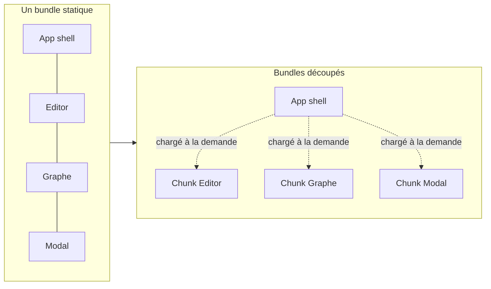
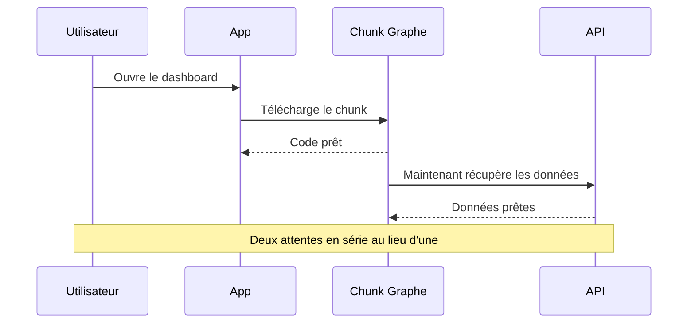

Chaque app React commence petite. Puis tu ajoutes un router, une librairie de dates, un graphe,
un éditeur de texte riche, et un jour la première chose qu'un utilisateur fait sur ton site,
c'est télécharger quelques centaines de kilo-octets de JavaScript avant que quoi que ce soit ne
devienne interactif.

Ce qui m'a toujours dérangé : la plupart de ce code sert à des fonctionnalités que l'utilisateur
ne touchera peut-être jamais. Tu envoies l'éditeur de texte riche complet à quelqu'un qui venait
juste lire l'article. Le navigateur doit quand même tout télécharger, parser et compiler avant
que la page ne réponde à un clic.

Le code splitting, c'est comment on arrête de faire ça. L'idée est simple : découper l'app en
bundles plus petits et charger chacun seulement quand il est vraiment nécessaire. En React, les
outils pour ça sont l'`import()` dynamique, `React.lazy` et `Suspense`. Cet article explique
comment ils s'assemblent, et les erreurs qui transforment un "gain de perf" en pire expérience.

## Ce qu'est vraiment le code splitting

Un import classique est statique. Le bundler le voit, le suit, et tire ce code dans le même
fichier qu'il envoie au premier chargement :

```tsx
// src/pages/ArticlePage.tsx
import { Editor } from "./Editor"; // dans le bundle principal, toujours
```

Un import dynamique est un appel de fonction qui retourne une Promise. Le bundler le traite comme
un point de découpe : le code importé part dans son propre chunk, et n'est récupéré que quand
l'appel s'exécute.

```tsx
// Retourne une Promise, résolue quand le chunk est téléchargé
const editorModule = await import("./Editor");
```

Cette seule différence, c'est tout le mécanisme. Un bundle devient plusieurs, et le navigateur ne
paie que ce qu'il charge.



Les build tools gèrent la découpe pour toi. Vite, Parcel et Rsbuild créent tous un chunk séparé
dès qu'ils voient un `import()` dynamique. Tu décides _où_ se fait la découpe ; le bundler
s'occupe de l'empaquetage.

## React.lazy : la moitié manquante

Il y a un piège. Un `import()` dynamique te donne une Promise, pas un composant. Tu ne peux pas
mettre une Promise dans ton JSX. Donc si tu veux découper un composant, il te faut quelque chose
qui sait attendre cette Promise puis afficher ce qui revient.

C'est exactement ce que fait `React.lazy`. Tu lui donnes une fonction qui retourne un import
dynamique, et il te rend un composant normal que tu affiches comme n'importe quel autre.

```tsx
// src/pages/ArticlePage.tsx
import { lazy } from "react";

// ❌ Statique : Editor est dans le bundle principal même pour les lecteurs qui n'éditent pas
// import { Editor } from "./Editor";

// ✅ Lazy : Editor vit dans son propre chunk, récupéré seulement quand on l'affiche
const Editor = lazy(() => import("./Editor"));
```

Un détail qui pose souvent problème : `React.lazy` attend un export `default` dans le module. Si
ton composant est un export nommé, pointe l'import dessus explicitement :

```tsx
const Editor = lazy(() =>
  import("./Editor").then((module) => ({ default: module.Editor })),
);
```

## Suspense : ce que voit l'utilisateur pendant le chargement

Un composant lazy n'est pas encore sur la page. Le chunk doit d'abord se télécharger, et pendant
ce trou React a besoin d'afficher quelque chose. C'est le rôle de `Suspense` et de sa prop
`fallback`.

```tsx
// src/pages/ArticlePage.tsx
import { lazy, Suspense } from "react";

const Editor = lazy(() => import("./Editor"));

export function ArticlePage({ article }: { article: Article }) {
  return (
    <article>
      <h1>{article.title}</h1>
      <ArticleBody content={article.body} />

      <Suspense fallback={<EditorSkeleton />}>
        <Editor articleId={article.id} />
      </Suspense>
    </article>
  );
}
```

Quand `Editor` suspend (parce que son chunk télécharge encore), React affiche le fallback du
`Suspense` le plus proche au-dessus. Quand le chunk arrive, React remplace le fallback par le
vrai composant. Tu ne gères aucun état de chargement toi-même : pas de flag `isLoading`, pas de
spinner à activer à la main. La boundary s'en occupe.

Le fallback n'est pas un détail à zapper. Sans lui, tu as un trou vide à l'endroit du composant,
et quand il apparaît, tout ce qui est en dessous saute vers le bas. C'est un layout shift, et ça
abîme à la fois le ressenti de la page et ton score CLS (j'en parle dans
[Comment corriger le CLS](./how-to-fix-cls)). Un bon fallback réserve l'espace que le vrai
composant occupera :

```tsx
// src/pages/EditorSkeleton.tsx
export function EditorSkeleton() {
  // Même hauteur que le vrai éditeur, pour que rien ne saute au chargement
  return <div className="h-96 w-full animate-pulse rounded-xl bg-muted" />;
}
```

La doc React donne une règle qui mérite d'être répétée : n'enveloppe pas chaque composant dans sa
propre boundary. Une boundary `Suspense` définit un état de chargement que l'utilisateur vit,
donc place les boundaries là où un état de chargement a du sens dans l'UI, pas mécaniquement
autour de chaque import lazy.

## Où découper (et où ne pas le faire)

Tout découper est une erreur. Chaque découpe est une requête réseau séparée, et une requête qui
bloque une interaction que l'utilisateur attend peut sembler plus lente que d'envoyer le code
directement. Le but est de sortir du bundle initial le code qui _n'est pas nécessaire au premier
rendu utile_.

Deux découpes te donnent presque toute la valeur.

**Le découpage par route** est le plus gros gain à lui seul. Un utilisateur qui arrive sur ta
page d'accueil n'a aucune raison de télécharger le code de ta page de réglages ou de ton
dashboard admin. Avec un router, tu découpes chaque route, et le bundle d'une page n'est récupéré
que quand l'utilisateur y navigue.

```tsx
// src/App.tsx
import { lazy, Suspense } from "react";
import { Routes, Route } from "react-router-dom";

const HomePage = lazy(() => import("./pages/HomePage"));
const DashboardPage = lazy(() => import("./pages/DashboardPage"));
const SettingsPage = lazy(() => import("./pages/SettingsPage"));

export function App() {
  return (
    <Suspense fallback={<PageSkeleton />}>
      <Routes>
        <Route path="/" element={<HomePage />} />
        <Route path="/dashboard" element={<DashboardPage />} />
        <Route path="/settings" element={<SettingsPage />} />
      </Routes>
    </Suspense>
  );
}
```

**Le découpage par composant** vise la chose lourde que seuls certains utilisateurs ouvrent.
C'est le cas que je rencontre tout le temps. Quand je construisais le LLM Panel, la partie la plus
lourde de la page était un composant avec lequel la plupart des visiteurs n'interagissaient jamais
au chargement. Même histoire avec un éditeur de texte riche : une librairie comme PlateJS tire le
cœur de l'éditeur, ses plugins et ses serializers, facilement l'une des plus grosses dépendances
de la page. Mais sur une page d'article, la plupart des gens viennent lire, pas écrire. Aucune
raison de faire payer à chaque lecteur le coût de téléchargement de l'éditeur à l'avance.

Donc tu le découpes et tu le charges à la demande, par exemple quand l'utilisateur clique sur
"Éditer" :

```tsx
// src/pages/ArticlePage.tsx
import { lazy, Suspense, useState } from "react";

const Editor = lazy(() => import("./Editor"));

export function ArticlePage({ article }: { article: Article }) {
  const [isEditing, setIsEditing] = useState(false);

  return (
    <article>
      <ArticleBody content={article.body} />
      <button onClick={() => setIsEditing(true)}>Éditer</button>

      {isEditing && (
        <Suspense fallback={<EditorSkeleton />}>
          <Editor articleId={article.id} />
        </Suspense>
      )}
    </article>
  );
}
```

Le lecteur obtient une page qui s'affiche vite et devient interactive rapidement, parce que
l'éditeur n'a jamais été dans son bundle. Le rédacteur clique sur "Éditer", attend un instant le
chunk pendant qu'un skeleton tient l'espace, et obtient l'éditeur complet. Deux besoins
différents, bien servis, au lieu d'un compromis qui pénalise la majorité.

Voici comment je décide :

| Bon candidat à découper                      | Pourquoi                                                      |
| :------------------------------------------- | :------------------------------------------------------------ |
| Routes que l'utilisateur peut ne jamais voir | Des pages entières de code derrière la navigation             |
| Éditeur de texte riche, éditeur de code      | Lourd, utilisé par une minorité, sur interaction              |
| Librairies de graphes / data-viz             | Lourdes, souvent sous la ligne de flottaison ou sur un onglet |
| Modales, dialogues, formulaires complexes    | Cachés jusqu'à ce que l'utilisateur les ouvre                 |
| Tout ce qui est derrière un clic/onglet      | Pas nécessaire au premier rendu                               |

| Mauvais candidat à découper                 | Pourquoi                                       |
| :------------------------------------------ | :--------------------------------------------- |
| Contenu au-dessus de la ligne de flottaison | La découpe retarde le premier rendu            |
| Petits composants (un bouton, un badge)     | La requête coûte plus cher que le code         |
| Quelque chose utilisé sur chaque page       | Aucune économie, juste un aller-retour de plus |

## Le piège du waterfall

C'est l'erreur qui ressemble à un gain jusqu'à ce que tu la mesures. Tu charges un composant en
lazy, et ce composant va chercher ses propres données _après_ son montage. Maintenant
l'utilisateur attend deux fois, l'une après l'autre : d'abord le code du composant qui se
télécharge, puis ses données qui se chargent. Tu as transformé une attente en deux.



Le correctif est de ne pas laisser les deux attentes s'empiler. Lance la récupération des données
le plus tôt possible, pour qu'elles chargent en parallèle du chunk plutôt qu'après lui. Avec un
router, fetch dans un loader de route. Sinon, déclenche la requête avant ou en parallèle de
l'import dynamique, plutôt que dans un `useEffect` qui ne s'exécute qu'une fois le composant
monté. Le composant doit arriver et trouver ses données déjà en chemin, pas démarrer le chrono à
zéro.

## Les chunks qui échouent ont besoin d'une Error Boundary

`Suspense` gère l'état de chargement. Il ne gère pas l'échec. Et les chunks lazy échouent plus
souvent qu'on ne le croit : le réseau de l'utilisateur tombe en plein téléchargement, ou, le cas
classique, tu déploies une nouvelle version pendant que quelqu'un a l'ancienne page ouverte. Son
navigateur demande un hash de chunk qui n'existe plus sur ton serveur, et l'import rejette.

Sans gestion, cette Promise rejetée remonte et peut faire tomber tout l'arbre. Le correctif est
une Error Boundary autour de la partie lazy, avec un moyen de récupérer :

```tsx
// src/components/ChunkErrorBoundary.tsx
import { Component, type ReactNode } from "react";

export class ChunkErrorBoundary extends Component<
  { children: ReactNode; fallback: ReactNode },
  { hasError: boolean }
> {
  state = { hasError: false };

  static getDerivedStateFromError() {
    return { hasError: true };
  }

  render() {
    if (this.state.hasError) return this.props.fallback;
    return this.props.children;
  }
}
```

```tsx
// src/pages/ArticlePage.tsx
<ChunkErrorBoundary
  fallback={
    <button onClick={() => window.location.reload()}>
      Échec du chargement. Recharger
    </button>
  }
>
  <Suspense fallback={<EditorSkeleton />}>
    <Editor articleId={article.id} />
  </Suspense>
</ChunkErrorBoundary>
```

Pour le cas précis du mismatch de déploiement, recharger la page est en général la bonne
récupération : ça tire le HTML frais qui pointe vers les nouveaux hash de chunks. L'idée est qu'un
split qui échoue doit se dégrader en un message récupérable, pas en un écran blanc.

## Pourquoi ça compte pour le produit

C'est facile de traiter le code splitting comme une métrique de taille de bundle. Le vrai sujet,
ce sont les premières secondes de l'utilisateur.

Quand tu retires du code du bundle initial, le navigateur a moins à télécharger, parser et
compiler avant que la page puisse répondre. Ça se voit directement dans les métriques qui
décrivent ce que la page _donne comme ressenti_ : moins de travail sur le thread principal au
démarrage (celui qui fait grimper le [Total Blocking Time](./how-to-improve-tbt)), et un chemin
plus court vers le contenu pour lequel l'utilisateur est venu. Une page qui "a l'air prête" mais
qui ignore les clics est une page qui a envoyé trop de JavaScript d'entrée. La découpe est l'un des
moyens les plus directs de fermer cet écart entre l'air-prêt et le vraiment-prêt.

Le modèle mental que je garde : le bundle initial, c'est ce que chaque utilisateur paie, à chaque
visite, y compris le téléphone lent dans un train. Tout le reste peut être chargé quand, et si,
c'est nécessaire. Ton boulot est d'être honnête sur ce qui est quoi.

Si tu fais ça dans ta propre app, commence par le découpage par route, parce que c'est le meilleur
ratio gain/effort, puis cherche le ou les deux composants lourds que la plupart de tes
utilisateurs n'ouvrent jamais. Mesure avant et après avec un bundle analyzer et un run Lighthouse,
pas au feeling.
