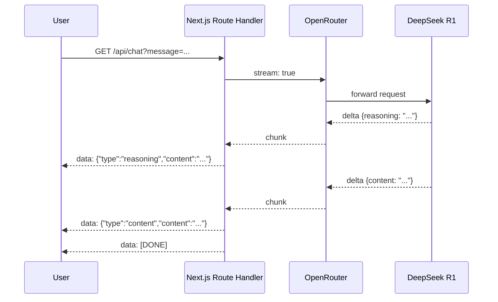

AI is getting embedded into everything. Chat interfaces, copilots, autonomous agents that run multi-step tasks in the background. If you are building any of these, at some point you need your UI to react to a model in real time, not just display a response after a 5-second freeze.

The primitive that makes this possible is SSE: Server-Sent Events. It is the foundation of any interface that needs to stay in sync with what a model or agent is doing. Before you add tool calls, streaming structured data, or live agent status updates, you need to get this part right.

SSE is not new or complex. It is HTTP with a specific content-type and a read loop on each end. But knowing how to wire it correctly in a Next.js App Router project, and understanding what you can build on top of it, is what this article is about.

This walks through a working implementation: a Next.js 16 App Router app that streams responses from [OpenRouter](https://openrouter.ai) using the OpenAI SDK, and then shows how to extend the pattern toward structured streaming output.

---

## Why SSE and not WebSockets

WebSockets give you a persistent, bidirectional connection. That is powerful, but it also means more complexity: you manage connections, handle reconnections, and deal with a different protocol layer.

SSE is one-directional (server to client), built on regular HTTP, and supported natively in every modern browser. The mental model is: open a connection, push text frames, close it.

|              | SSE                                  | WebSockets                                   |
| ------------ | ------------------------------------ | -------------------------------------------- |
| Direction    | Server → Client                      | Bidirectional                                |
| Protocol     | HTTP                                 | WS / WSS                                     |
| Reconnection | Automatic (native)                   | Manual                                       |
| Use case     | Streaming text, feeds, notifications | Real-time chat, games, collaborative editing |

For AI streaming, where the server pushes tokens and the client only sends a single initial request, SSE is more than enough.

---

## The server side: a Route Handler as an SSE endpoint

In Next.js App Router, a route handler is just a file at `app/api/[route]/route.ts` that exports named HTTP method functions.

To return an SSE stream, you return a `Response` with a `ReadableStream` body and the right headers.

```ts
// app/api/chat/route.ts
import OpenAI from "openai";

const client = new OpenAI({
  baseURL: "https://openrouter.ai/api/v1",
  apiKey: process.env.OPENROUTER_API_KEY,
});

const SYSTEM_PROMPT =
  "You are a concise, thoughtful assistant. Reason carefully before answering.";

export async function GET(request: Request) {
  const { searchParams } = new URL(request.url);
  const message = searchParams.get("message") ?? "";

  const stream = new ReadableStream({
    async start(controller) {
      const encoder = new TextEncoder();

      const completion = await client.chat.completions.create({
        model: "deepseek/deepseek-r1",
        messages: [
          { role: "system", content: SYSTEM_PROMPT },
          { role: "user", content: message },
        ],
        stream: true,
      });

      for await (const chunk of completion) {
        const delta = chunk.choices[0]?.delta as {
          content?: string;
          reasoning?: string;
        };

        if (delta?.reasoning) {
          controller.enqueue(
            encoder.encode(
              `data: ${JSON.stringify({ type: "reasoning", content: delta.reasoning })}\n\n`,
            ),
          );
        }

        if (delta?.content) {
          controller.enqueue(
            encoder.encode(
              `data: ${JSON.stringify({ type: "content", content: delta.content })}\n\n`,
            ),
          );
        }
      }

      controller.enqueue(encoder.encode("data: [DONE]\n\n"));
      controller.close();
    },
  });

  return new Response(stream, {
    headers: {
      "Content-Type": "text/event-stream",
      "Cache-Control": "no-cache",
      Connection: "keep-alive",
    },
  });
}
```

A few things worth noting here.

OpenRouter exposes an OpenAI-compatible API, so you can use the `openai` npm package as-is and just point `baseURL` at `https://openrouter.ai/api/v1`. That means you get the full OpenAI SDK typing and streaming interface, with access to every model on OpenRouter.

The SSE wire format is simple: each event is `data: <payload>\n\n`. That double newline is the delimiter that tells the browser (or the client `ReadableStream` reader) where one event ends and the next begins. I wrap each delta in JSON to carry a `type` field alongside the content, which makes it easy to route on the client side.

The three response headers are mandatory:

- `Content-Type: text/event-stream` tells the browser this is an SSE response,
- `Cache-Control: no-cache` prevents any proxy from buffering the stream, and
- `Connection: keep-alive` keeps the TCP connection open.

---

## The client side: reading the stream

You might reach for `EventSource` here. It is the browser's native SSE API. But `EventSource` only supports GET requests with no custom headers, and it does not give you fine-grained control over the read loop. For our use case, `fetch` + `ReadableStream` is cleaner.

```tsx
// app/page.tsx (the relevant part)
async function handleSubmit(e: React.FormEvent) {
  e.preventDefault();

  setReasoning("");
  setResponse("");
  setLoading(true);

  const res = await fetch(`/api/chat?message=${encodeURIComponent(input)}`);
  const reader = res.body!.getReader();
  const decoder = new TextDecoder();

  while (true) {
    const { done, value } = await reader.read();
    if (done) break;

    const text = decoder.decode(value, { stream: true });
    for (const line of text.split("\n")) {
      if (!line.startsWith("data: ")) continue;
      const data = line.slice(6);
      if (data === "[DONE]") break;
      const parsed = JSON.parse(data) as {
        type: "reasoning" | "content";
        content: string;
      };
      if (parsed.type === "reasoning") {
        setReasoning((prev) => prev + parsed.content);
      } else {
        setResponse((prev) => prev + parsed.content);
      }
    }
  }

  setLoading(false);
}
```

The read loop is a `while(true)` that pulls chunks from the stream. Each chunk is decoded to a string, split on newlines, and each line that starts with `data: ` is parsed as JSON.

One thing to keep in mind: chunks do not always align to event boundaries. A single `read()` call may return part of an event, or multiple events concatenated. For this demo the naive `split("\n")` approach works fine, but in production you would want a proper SSE parser that buffers incomplete lines across chunks.

---

## Dual streams: reasoning models

Today, many models can reason. Before it writes the final answer, it runs an internal chain-of-thought. OpenRouter surfaces this chain-of-thought as a separate `reasoning` field in the delta, distinct from `content`.

That is why the server emits two event types. On the client, `reasoning` tokens accumulate in one state variable and `content` tokens in another. The UI shows both, and you get something like this:



Showing the reasoning live does something interesting for perceived performance. The user sees activity immediately, even before the actual answer starts. That 2-second silence becomes a visible "thinking" phase. It changes the UX from "is this broken?" to "it is working on it."

---

## Going further: structured streaming output with Zod

Plain text streaming covers a lot of ground. But the real power for AI SaaS comes when you stream _structured data_ and update your UI incrementally as the structure fills in.

OpenRouter supports `response_format: json_schema` on compatible models (GPT-4o, Gemini, Anthropic, most open-source). You pass a JSON Schema, and the model outputs valid JSON matching that schema. Combined with streaming, you get partial JSON arriving chunk by chunk.

Here is what that looks like on the server side:

```ts
// app/api/analyze/route.ts (sketch)
import { z } from "zod";
import { zodToJsonSchema } from "zod-to-json-schema";

const ProductSchema = z.object({
  name: z.string(),
  summary: z.string(),
  strengths: z.array(z.string()),
  weaknesses: z.array(z.string()),
  verdict: z.enum(["buy", "skip", "wait"]),
});

export async function POST(request: Request) {
  const { url } = await request.json();

  const stream = new ReadableStream({
    async start(controller) {
      const encoder = new TextEncoder();

      const completion = await client.chat.completions.create({
        model: "openai/gpt-4o",
        messages: [{ role: "user", content: `Analyze this product: ${url}` }],
        response_format: {
          type: "json_schema",
          json_schema: {
            name: "product_analysis",
            strict: true,
            schema: zodToJsonSchema(ProductSchema),
          },
        },
        stream: true,
      });

      let accumulated = "";
      for await (const chunk of completion) {
        const delta = chunk.choices[0]?.delta?.content ?? "";
        accumulated += delta;
        controller.enqueue(
          encoder.encode(
            `data: ${JSON.stringify({ partial: accumulated })}\n\n`,
          ),
        );
      }

      controller.enqueue(encoder.encode("data: [DONE]\n\n"));
      controller.close();
    },
  });

  return new Response(stream, {
    headers: {
      "Content-Type": "text/event-stream",
      "Cache-Control": "no-cache",
      Connection: "keep-alive",
    },
  });
}
```

On the client, you accumulate the partial JSON string. You try to parse it at every update. If it fails (the JSON is not complete yet), you keep showing a loading skeleton for that field. When it parses, you validate with Zod and update the UI.

```ts
// client-side sketch
let accumulated = "";

// on each SSE event:
accumulated = parsed.partial;

try {
  const result = ProductSchema.parse(JSON.parse(accumulated));
  // update UI with validated data
} catch {
  // still streaming, show skeleton
}
```

The result is a UI where each field appears as soon as the model has generated enough JSON to close that field. `name` appears first, then `summary`, then the `strengths` array fills in one item at a time. It feels fast because it _is_ fast: you are not waiting for the full response.

Libraries like [`partial-json`](https://www.npmjs.com/package/partial-json) or [`jstream-py`](https://github.com/Bima42/jstream-py) for Python make partial parsing more robust if you want to extract already-complete fields from an incomplete JSON string.

---

## When not to use structured output

Structured output is not free. A few things to keep in mind before you reach for it everywhere.

**JSON scaffolding adds tokens.** Keys, brackets, quotes: none of that carries meaning, but you generate and pay for it anyway. On long responses with many fields, it adds up.

**It can degrade generation quality.** Constraining the model's output space to a strict schema reduces its freedom of formulation. On capable models like GPT-4o this is barely noticeable. On smaller or less instruction-tuned models, it can produce noticeably worse reasoning or content, because the model is "thinking" about JSON structure at the same time as the actual answer.

**Failures are recoverable, but at a cost.** If a model drifts from the schema, you can retry or fall back to partial parsing with Zod/Pydantic. But retries mean more tokens, more latency, and more complexity in your error handling. With plain text, an imperfect response is still usable. With a broken schema, you are spending tokens to fix a problem that only exists because you added a constraint.

A rough rule: use structured output when you need to populate specific UI fields, extract data for downstream processing, or feed structured data to another system. For narrative, explanatory, or conversational content, plain text streaming is faster, cheaper, and more resilient.

---

## What this unlocks

A streaming AI endpoint in Next.js is about 60 lines of code. What it enables is qualitatively different from a standard REST call:

- **Perceived performance**: users see output in under 500ms instead of waiting 3-8 seconds for a complete response
- **Progressive UIs**: with structured streaming, individual UI sections appear as data becomes available, like a skeleton that fills in from top to bottom
- **Reasoning transparency**: for models that expose chain-of-thought, you can show the reasoning process and build trust with the user
- **Lower abandonment**: in user testing, streaming consistently reduces the "is it broken?" moment that causes users to refresh or leave

With this foundation, you can then build highly modern and dynamic interfaces!
