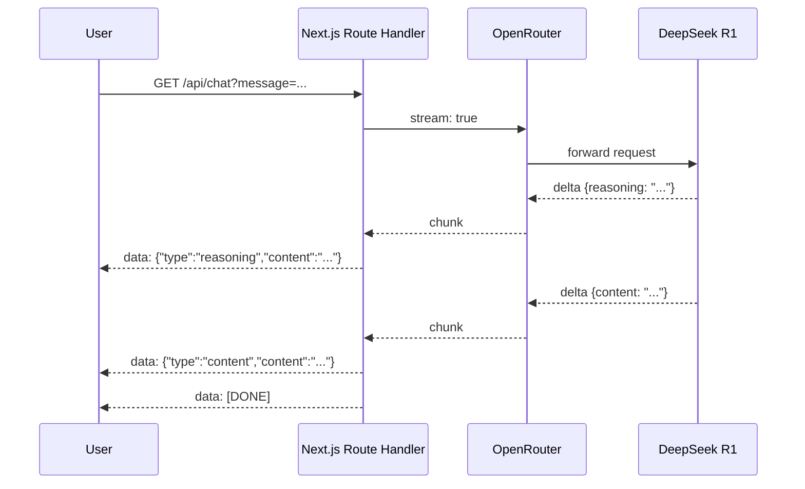

L'IA s'intègre partout. Interfaces de chat, copilots, agents autonomes qui enchaînent des tâches en arrière-plan. Si tu construis l'un de ces produits, tu vas rapidement avoir besoin que ton UI réagisse à un modèle en temps réel, pas qu'elle affiche une réponse après 5 secondes de blanc.

La brique qui rend ça possible, c'est SSE : Server-Sent Events. C'est la base de toute interface qui doit rester synchronisée avec ce qu'un modèle ou un agent est en train de faire. Avant d'ajouter des tool calls, du streaming de données structurées, ou des mises à jour de statut d'agent en direct, il faut maîtriser cette partie.

SSE n'est ni nouveau ni complexe. C'est du HTTP avec un content-type spécifique et une boucle de lecture de chaque côté. Mais savoir le câbler correctement dans un projet Next.js App Router, et comprendre ce qu'on peut construire dessus, c'est l'objet de cet article.

On va partir d'une implémentation concrète : une app Next.js 16 App Router qui streame des réponses depuis [OpenRouter](https://openrouter.ai) via le SDK OpenAI, et on verra ensuite comment étendre le pattern vers du streaming de données structurées.

---

## Pourquoi SSE plutôt que WebSockets

Les WebSockets donnent une connexion persistante et bidirectionnelle. C'est puissant, mais ça implique plus de complexité : gérer les connexions, les reconnexions, et un protocole différent.

SSE est unidirectionnel (serveur vers client), construit sur du HTTP standard, et supporté nativement dans tous les navigateurs modernes. Le modèle mental : ouvrir une connexion, envoyer des frames texte, fermer.

|             | SSE                                   | WebSockets                                   |
| ----------- | ------------------------------------- | -------------------------------------------- |
| Direction   | Serveur → Client                      | Bidirectionnel                               |
| Protocole   | HTTP                                  | WS / WSS                                     |
| Reconnexion | Automatique (natif)                   | Manuelle                                     |
| Usage       | Streaming texte, feeds, notifications | Chat temps réel, jeux, édition collaborative |

Pour du streaming IA, où le serveur pousse des tokens et le client n'envoie qu'une seule requête initiale, SSE est largement suffisant.

---

## Côté serveur : un Route Handler comme endpoint SSE

Dans Next.js App Router, un route handler, c'est juste un fichier `app/api/[route]/route.ts` qui exporte des fonctions nommées par méthode HTTP.

Pour retourner un stream SSE, on retourne une `Response` avec un `ReadableStream` en body et les bons headers.

```ts
// app/api/chat/route.ts
import OpenAI from "openai";

const client = new OpenAI({
  baseURL: "https://openrouter.ai/api/v1",
  apiKey: process.env.OPENROUTER_API_KEY,
});

const SYSTEM_PROMPT =
  "You are a concise, thoughtful assistant. Reason carefully before answering.";

export async function GET(request: Request) {
  const { searchParams } = new URL(request.url);
  const message = searchParams.get("message") ?? "";

  const stream = new ReadableStream({
    async start(controller) {
      const encoder = new TextEncoder();

      const completion = await client.chat.completions.create({
        model: "deepseek/deepseek-r1",
        messages: [
          { role: "system", content: SYSTEM_PROMPT },
          { role: "user", content: message },
        ],
        stream: true,
      });

      for await (const chunk of completion) {
        const delta = chunk.choices[0]?.delta as {
          content?: string;
          reasoning?: string;
        };

        if (delta?.reasoning) {
          controller.enqueue(
            encoder.encode(
              `data: ${JSON.stringify({ type: "reasoning", content: delta.reasoning })}\n\n`,
            ),
          );
        }

        if (delta?.content) {
          controller.enqueue(
            encoder.encode(
              `data: ${JSON.stringify({ type: "content", content: delta.content })}\n\n`,
            ),
          );
        }
      }

      controller.enqueue(encoder.encode("data: [DONE]\n\n"));
      controller.close();
    },
  });

  return new Response(stream, {
    headers: {
      "Content-Type": "text/event-stream",
      "Cache-Control": "no-cache",
      Connection: "keep-alive",
    },
  });
}
```

Quelques points à noter.

OpenRouter expose une API compatible OpenAI, donc on utilise le package `openai` tel quel, en pointant `baseURL` vers `https://openrouter.ai/api/v1`. On garde tout le typage et l'interface de streaming du SDK OpenAI, avec accès à tous les modèles disponibles sur OpenRouter.

Le format SSE est simple : chaque event est `data: <payload>\n\n`. Ce double saut de ligne est le délimiteur qui indique au navigateur (ou au lecteur `ReadableStream` côté client) où un event se termine et où le suivant commence. J'encapsule chaque delta en JSON pour transporter un champ `type` avec le contenu, ce qui permet de router facilement côté client.

Les trois headers sont obligatoires :

- `Content-Type: text/event-stream` indique que c'est une réponse SSE,
- `Cache-Control: no-cache` empêche tout proxy de bufferiser le stream, et
- `Connection: keep-alive` maintient la connexion TCP ouverte.

---

## Côté client : lire le stream

On pourrait utiliser `EventSource`, l'API SSE native du navigateur. Mais `EventSource` ne supporte que les requêtes GET sans headers custom, et ne donne pas de contrôle fin sur la boucle de lecture. Pour notre cas, `fetch` + `ReadableStream` est plus propre.

```tsx
// app/page.tsx (la partie qui compte)
async function handleSubmit(e: React.FormEvent) {
  e.preventDefault();

  setReasoning("");
  setResponse("");
  setLoading(true);

  const res = await fetch(`/api/chat?message=${encodeURIComponent(input)}`);
  const reader = res.body!.getReader();
  const decoder = new TextDecoder();

  while (true) {
    const { done, value } = await reader.read();
    if (done) break;

    const text = decoder.decode(value, { stream: true });
    for (const line of text.split("\n")) {
      if (!line.startsWith("data: ")) continue;
      const data = line.slice(6);
      if (data === "[DONE]") break;
      const parsed = JSON.parse(data) as {
        type: "reasoning" | "content";
        content: string;
      };
      if (parsed.type === "reasoning") {
        setReasoning((prev) => prev + parsed.content);
      } else {
        setResponse((prev) => prev + parsed.content);
      }
    }
  }

  setLoading(false);
}
```

La boucle de lecture est un `while(true)` qui tire des chunks du stream. Chaque chunk est décodé en string, découpé sur les sauts de ligne, et chaque ligne qui commence par `data: ` est parsée en JSON.

Un point à garder en tête : les chunks ne s'alignent pas forcément sur les limites des events. Un seul appel à `read()` peut retourner une partie d'un event, ou plusieurs events concatenés. Pour cette démo, l'approche naïve avec `split("\n")` fonctionne, mais en production il faudrait un parser SSE qui bufferise les lignes incomplètes entre les chunks.

---

## Double stream : les modèles de raisonnement

Aujourd'hui, beaucoup de modèles peuvent raisonner. Avant d'écrire la réponse finale, il produit une chaîne de pensée interne. OpenRouter expose cette chaîne de pensée dans un champ `reasoning` du delta, distinct de `content`.

C'est pour ça que le serveur émet deux types d'events. Côté client, les tokens `reasoning` s'accumulent dans une variable de state, et les tokens `content` dans une autre. L'UI affiche les deux, et le flux ressemble à ça :



Afficher le raisonnement en direct change quelque chose sur la performance perçue. L'utilisateur voit de l'activité immédiatement, avant même que la réponse ne commence. Le silence de 2 secondes devient une phase de "réflexion" visible. Le ressenti passe de "c'est cassé ?" à "il est en train de traiter."

---

## Aller plus loin : structured streaming output avec Zod

Le streaming de texte brut couvre beaucoup de cas. Mais la vraie puissance pour un produit IA arrive quand on streame des _données structurées_ et qu'on met à jour l'UI de façon incrémentale à mesure que la structure se remplit.

OpenRouter supporte `response_format: json_schema` sur les modèles compatibles (GPT-4o, Gemini, Anthropic, la plupart des open-source). On passe un JSON Schema, le modèle retourne du JSON valide qui respecte ce schema. Combiné au streaming, on reçoit du JSON partiel chunk par chunk.

Côté serveur, ça ressemble à ça :

```ts
// app/api/analyze/route.ts (sketch)
import { z } from "zod";
import { zodToJsonSchema } from "zod-to-json-schema";

const ProductSchema = z.object({
  name: z.string(),
  summary: z.string(),
  strengths: z.array(z.string()),
  weaknesses: z.array(z.string()),
  verdict: z.enum(["buy", "skip", "wait"]),
});

export async function POST(request: Request) {
  const { url } = await request.json();

  const stream = new ReadableStream({
    async start(controller) {
      const encoder = new TextEncoder();

      const completion = await client.chat.completions.create({
        model: "openai/gpt-4o",
        messages: [{ role: "user", content: `Analyze this product: ${url}` }],
        response_format: {
          type: "json_schema",
          json_schema: {
            name: "product_analysis",
            strict: true,
            schema: zodToJsonSchema(ProductSchema),
          },
        },
        stream: true,
      });

      let accumulated = "";
      for await (const chunk of completion) {
        const delta = chunk.choices[0]?.delta?.content ?? "";
        accumulated += delta;
        controller.enqueue(
          encoder.encode(
            `data: ${JSON.stringify({ partial: accumulated })}\n\n`,
          ),
        );
      }

      controller.enqueue(encoder.encode("data: [DONE]\n\n"));
      controller.close();
    },
  });

  return new Response(stream, {
    headers: {
      "Content-Type": "text/event-stream",
      "Cache-Control": "no-cache",
      Connection: "keep-alive",
    },
  });
}
```

Côté client, on accumule la string JSON partielle. À chaque update, on essaie de la parser. Si ça échoue (le JSON n'est pas encore complet), on garde un skeleton de chargement pour ce champ. Quand ça passe, on valide avec Zod et on met à jour l'UI.

```ts
// sketch côté client
let accumulated = "";

// à chaque event SSE :
accumulated = parsed.partial;

try {
  const result = ProductSchema.parse(JSON.parse(accumulated));
  // mise à jour de l'UI avec les données validées
} catch {
  // encore en cours de streaming, afficher le skeleton
}
```

Le résultat : une UI où chaque champ apparaît dès que le modèle a généré assez de JSON pour le fermer. `name` apparaît en premier, puis `summary`, puis les éléments du tableau `strengths` s'ajoutent un par un. Ça se sent rapide parce que ça _est_ rapide : on n'attend pas la réponse complète.

La lib [`partial-json`](https://www.npmjs.com/package/partial-json) ou [`jstream-py`](https://github.com/Bima42/jstream-py) pour Python rend le parsing partiel plus robuste si on veut extraire les champs déjà complets d'une string JSON incomplète.

---

## Quand ne pas utiliser le structured output

Le structured output n'est pas gratuit. Quelques points à garder en tête avant de l'utiliser partout.

**Le scaffolding JSON ajoute des tokens.** Clés, accolades, guillemets : ça ne transporte aucune information, mais le modèle le génère et tu le paies quand même. Sur des réponses longues avec beaucoup de champs, ça s'accumule.

**Ça peut dégrader la qualité de génération.** Contraindre l'espace de sortie du modèle à un schema strict réduit sa liberté de formulation. Sur des modèles capables comme GPT-4o, c'est à peine perceptible. Sur des modèles plus petits ou moins bien instruction-tunés, ça peut produire du contenu de qualité nettement inférieure, parce que le modèle "réfléchit" à la structure JSON en même temps qu'à la réponse.

**Les erreurs sont récupérables, mais à un coût.** Si le modèle dévie du schema, on peut relancer la requête ou tomber en fallback sur du parsing partiel avec Zod ou Pydantic. Mais les retries, c'est plus de tokens, plus de latence, et plus de complexité dans la gestion d'erreur. Avec du texte brut, une réponse imparfaite reste exploitable. Avec un schema cassé, on dépense des tokens pour corriger un problème qui n'existe que parce qu'on a ajouté une contrainte.

Une règle approximative : utiliser le structured output quand on a besoin de peupler des champs UI précis, d'extraire des données pour un traitement downstream, ou d'alimenter un autre système. Pour du contenu narratif, explicatif ou conversationnel, le streaming de texte brut est plus rapide, moins coûteux et plus résilient.

---

## Ce que ça débloque

Un endpoint IA streaming dans Next.js, c'est une soixantaine de lignes de code. Ce que ça permet est qualitativement différent d'un appel REST classique :

- **Performance perçue** : l'utilisateur voit du contenu en moins de 500ms au lieu d'attendre 3 à 8 secondes pour une réponse complète
- **UIs progressives** : avec du structured streaming, chaque section de l'UI apparaît dès que la donnée est disponible, comme un skeleton qui se remplit de haut en bas
- **Transparence du raisonnement** : pour les modèles qui exposent leur chain-of-thought, on peut montrer le processus de réflexion et construire de la confiance avec l'utilisateur
- **Base extensible** : tool calls, statut d'agent en direct, multiple streams en parallèle... tout ça se construit sur le même pattern

Avec cette base, vous pouvez ensuite construire des interfaces très modernes et dynamiques !
