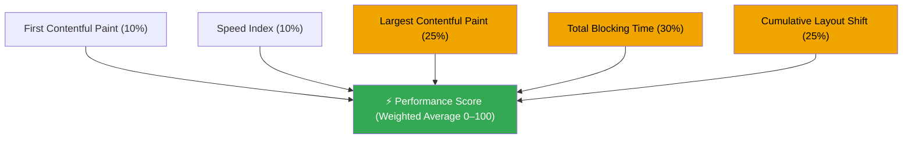

Every front-end developer has seen it. A number between 0 and 100, sometimes green, sometimes red, after running an audit on a page you thought was fine. And then the question: where do I even start?

I run Lighthouse on basically every project I touch. And for a while, I was treating that score like a black box. I knew it was bad, I knew _something_ was slow, but I did not really understand what was being measured or which problem to fix first.

This article breaks the black box open. Not to cover everything, but to give you a clear mental model before we go deeper in the next articles in this series.

## The Score is Synthetic. That Matters.

Before anything else, this is the most important thing to understand: **the Lighthouse Performance score is lab data, not real-user data.**

When you run Lighthouse, it simulates a page load in a controlled environment: specific network conditions, a throttled CPU, no cache.
Every run is reproducible by design. But it does not reflect what your actual users experience on their actual devices.

This does not make the score useless. It makes it a useful proxy. A low score tells you there are real problems to fix. A high score does not guarantee a perfect experience for everyone.

Google itself uses a separate set of real-user data called CrUX (Chrome User Experience Report) to measure Core Web Vitals in the field. Lighthouse is the lab equivalent. Both matter. They are not the same thing.

## The 5 Metrics Behind the Score

The Lighthouse Performance score is a **weighted average** of 5 metrics. Each metric measures a
specific part of the user experience during page load.

| Metric                             | Weight (Lighthouse 10) | Good Threshold | What It Measures                                          |
| :--------------------------------- | :--------------------: | :------------: | :-------------------------------------------------------- |
| **First Contentful Paint (FCP)**   |          10%           |     ≤ 1.8s     | Time until the first text or image appears on screen      |
| **Speed Index (SI)**               |          10%           |     ≤ 3.4s     | How quickly content is visually populated during load     |
| **Largest Contentful Paint (LCP)** |          25%           |     ≤ 2.5s     | Time until the main content element is visible            |
| **Total Blocking Time (TBT)**      |          30%           |    ≤ 200ms     | How long the main thread was blocked after FCP            |
| **Cumulative Layout Shift (CLS)**  |          25%           |     ≤ 0.1      | How much elements shift position unexpectedly during load |

Three of these (LCP, TBT, CLS) are part of what Google calls **Core Web Vitals**: the official
metrics used to evaluate page experience for Search ranking. They also represent 80% of your
Lighthouse score. That is where the leverage is.

Let me give you a one-line mental model for each.

### First Contentful Paint (FCP)

FCP marks the moment the user sees _something_ on screen, anything: a text node, an image, a
canvas element. According to Google, good sites target **1.8 seconds or less**.

The key word is "first." FCP fires early. It does not tell you if the important content loaded,
only that the page stopped being blank.

### Speed Index (SI)

Speed Index measures how progressively content fills the screen during load. A lower value means
content appears more evenly and quickly across the viewport, rather than in one big late burst.

It carries 10% of the score and is the hardest metric to act on directly. Most improvements to
FCP, LCP, or render-blocking resources will improve it as a side effect. We will not dedicate a
full article to it in this series for that reason.

### Largest Contentful Paint (LCP)

LCP measures the time until the **largest visible element** in the viewport is rendered. That is
usually the hero image, a big heading, or a featured video. Google targets **2.5 seconds or less**.

This is the metric users actually notice. When LCP is slow, the page _feels_ slow, even if
everything else is fine. It carries 25% of the score.

### Total Blocking Time (TBT)

TBT adds up all the time the main thread was blocked for more than 50ms between FCP and Time to
Interactive (TTI). A blocked main thread means the browser cannot respond to user input: clicks,
taps, keyboard events. The target is **200 milliseconds or less** on average mobile hardware.

This is the heaviest metric at **30% of the score**. Heavy JavaScript bundles are almost always
the cause.

### Cumulative Layout Shift (CLS)

CLS measures visual instability. Every time an element moves unexpectedly during load (an image
pushes text down, an ad shifts a button you were about to click), it contributes to the CLS score.
Google targets a score of **0.1 or less**.

CLS is the metric that causes real frustration for users. You go to click something, a banner
loads, the button moves, you click the wrong thing. That is a CLS problem.

## How the Score is Actually Calculated

The five metric values are each converted to a score between 0 and 100 using a **log-normal
distribution** calibrated against real-world data from HTTP Archive. This means the curve is not
linear: going from a score of 50 to 70 is much easier than going from 90 to 95.

Then, each metric score is multiplied by its weight, and the results are summed.

The color coding matters: LCP, TBT, and CLS together account for **80% of your score**. Fix those
three and you move the needle. The other two (FCP, SI) will often improve as a byproduct.

Google describes the scoring ranges like this:

- **0 to 49** (red): Poor
- **50 to 89** (orange): Needs Improvement
- **90 to 100** (green): Good

Getting to 90 is realistic for most projects with proper work. Getting to 100 is harder and
not the goal. As Google notes in their own docs, going from 99 to 100 requires as much improvement
as going from 90 to 94. Do not chase perfection, chase the 90+ green.

## The First Three Things to Check in Next.js

Before deep-diving into each metric, there are a few things that show up constantly on projects I
audit. These are not the full fix, but they are the cheapest wins.

**1. Are you using `next/image`?**

If you have images on the page (and almost every page does), Next.js's `Image` component handles
format optimization, lazy loading, and size hints automatically. Not using it is almost always
visible in the LCP score.

**2. Are you using `next/font`?**

Custom fonts that load without a `font-display` strategy block rendering. Next.js's `Font`
component handles this by default and eliminates layout shifts caused by font swapping.

**3. Are you loading heavy libraries on the client that could be server-side?**

In Next.js App Router, every component is a Server Component by default. If you add `"use client"`
without thinking, you push JavaScript to the browser that could stay on the server. That JavaScript
blocks the main thread and directly impacts TBT.

These three checks alone will often move a score from red to orange. But they are just the
beginning.

## What's Next in This Series

The next few articles will take a closer look at each of the areas that can be improved, we'll use Next.js to create a few examples.

If you want to follow along, run Lighthouse on one of your pages right now (Chrome DevTools,
Cmd+Shift+P, then "Generate Lighthouse report"). Look at which of LCP, TBT, or CLS is flagged red
or orange. That is your starting point.
