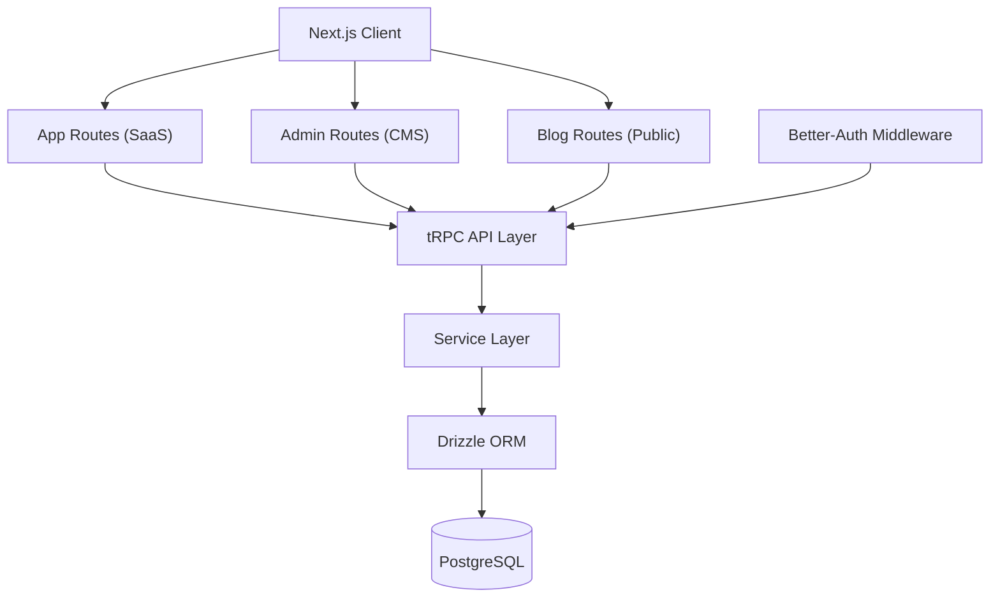
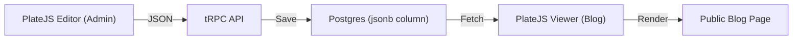

Every time I started a new project, I spent time at the begining doing the same thing: setting up authentication, configuring the database, wiring up an admin panel, adding a blog, integrating payments.

After three years of building products (for clients, for myself, for fun), I realized something obvious: 80% of the foundation was identical across all many projects. The only thing that changed was the business logic.

So I stopped copy-pasting, and I built a boilerplate. Not "the ultimate starter kit." Just a solid, opinionated foundation that reflects how I actually build things. It is open source, and you can use it right now.

👉 **[github.com/Bima42/saas-boilerplate](https://github.com/Bima42/saas-boilerplate)**

## The Problem (Why This Exists)

I have shipped several products over the past few years. Some for clients, some personal. Every single time, I found myself:

1. **Setting up auth** (sessions, middleware, protected routes)
2. **Configuring the database** (schema, migrations, ORM)
3. **Building an admin dashboard** (CRUD for content, user management)
4. **Adding a blog** (rich text editor, SEO, public routes)
5. **Integrating Stripe** (subscriptions, webhooks)
6. **Dockerizing everything** (consistent environments)

This boilerplate is built for **builders**, people who want to validate an idea fast, ship an MVP, and see if it gains traction. Not for people who want to optimize for 100k concurrent users on day one.

## The Stack (What I Chose and Why)

Every technology in this stack was chosen because I tested alternatives in real projects and kept what worked best, for this usecase.

| Layer | Technology | Why |
|:------|:-----------|:----|
| **Framework** | Next.js 15 | App Router, Server Actions, React 19. The ecosystem is unmatched. |
| **API** | tRPC v11 | End-to-end type safety. No API docs to maintain. |
| **Database** | PostgreSQL + Drizzle ORM | SQL-first, readable migrations, no ORM magic. |
| **Auth** | Better-Auth | Clean middleware approach, native Drizzle integration. |
| **Editor** | PlateJS | Built on Shadcn/UI, lightweight, complete. |
| **Styling** | Tailwind CSS v4 + Shadcn/UI | Fast to build, consistent design system. |
| **Payments** | Stripe | Industry standard. Pre-wired webhooks. |
| **Deploy** | Docker Compose | Same environment everywhere. Dev = Prod. |

### A Note on the Editor Journey

This choice deserves context because I went through a real evolution.

On my first project (Voltaire), I used **TipTap** and **Lexical**. Both are powerful, but the setup cost was high, and integrating them into a consistent design system took too much effort.

For the first version of this boilerplate, I tried **Payload CMS**. It is a great tool, but it felt like overkill for what I needed: a simple, fast content editor for blog posts and pages. It added complexity without enough return.

Then I found **PlateJS**. It is built on top of Shadcn/UI, which means it shares the same design system as the rest of the app. It stores content as JSON. It is lightweight but complete (headings, images, code blocks, links, everything you need). It just fits.

### Why Better-Auth Over NextAuth?

I tested NextAuth in earlier projects. It works, but the configuration is verbose, and the DX around middleware and session handling always felt clunky to me.

Better-Auth sits in the sweet spot: simple API, middleware-based, and it integrates directly with Drizzle. One schema, one database, everything in one place.

## The Architecture (Monolith by Design)

This boilerplate is a **unified monolith**. The Admin Dashboard, the main SaaS application, and the public Blog all run within a single Next.js instance.

I know monoliths are not trendy. Microservices, edge functions, serverless: the industry keeps pushing for distributed architectures. But for an MVP, a monolith is the right call.

Here is why:
- **One repo, one deploy.** No orchestration complexity.
- **Shared database and types.** No API contracts between services.
- **Easy to reason about.** New developers can understand the entire system in an afternoon.
- You can always split later.



### Project Structure

Here is how the code is organized:

```text
src/
├── app/
│   ├── (admin)/            # Admin Dashboard (protected)
│   ├── (app)/              # Main SaaS Application
│   ├── api/                # tRPC, Webhooks, Auth endpoints
│   └── blog/               # Public Blog (SEO optimized)
├── components/
│   ├── admin/              # Admin-specific UI
│   ├── blog/               # Blog cards, viewers
│   └── editor/             # PlateJS config & plugins
├── lib/                    # Singleton clients (S3, Stripe, Auth)
├── server/
│   ├── api/                # tRPC Routers
│   ├── db/                 # Drizzle Schema & Connection
│   └── services/           # Business Logic
└── types/                  # Shared Zod schemas & TS types
```

The `(admin)`, `(app)`, and `blog` route groups are just Next.js conventions. They share the same `server/` backend. No duplication.

## Key Patterns I Reuse in Every Project

After building multiple products on this stack, a few patterns have become non-negotiable for me.

### Pattern 1: The Service Layer

This is the single most important architectural decision in this boilerplate. The rule is simple: **API routers never touch the database directly.**

Routers are thin controllers. They validate input, check auth, and call a service. That is it.

**The wrong way (what I used to do):**

```typescript
// ❌ src/server/api/routers/post-router.ts
// DB logic mixed with API logic. Hard to test, hard to reuse.
export const postRouter = router({
  getBySlug: publicProcedure
    .input(z.object({ slug: z.string() }))
    .query(async ({ input }) => {
      return db.select().from(posts).where(eq(posts.slug, input.slug));
    }),
});
```

**The right way (what I do now):**

```typescript
// ✅ src/server/services/post.ts
// Business logic is isolated, testable, reusable.
export const postService = {
  getBySlug: async (slug: string) => {
    return db.query.posts.findFirst({
      where: eq(posts.slug, slug),
      with: { author: true, tags: true },
    });
  },

  incrementViews: async (id: number) => {
    await db
      .update(posts)
      .set({ views: sql`${posts.views} + 1` })
      .where(eq(posts.id, id));
  },
};
```

```typescript
// ✅ src/server/api/routers/post-router.ts
// The router is a thin controller. Clean and readable.
export const postRouter = router({
  getBySlug: publicProcedure
    .input(z.object({ slug: z.string() }))
    .query(({ input }) => postService.getBySlug(input.slug)),

  incrementViews: publicProcedure
    .input(z.object({ id: z.number() }))
    .mutation(({ input }) => postService.incrementViews(input.id)),
});
```

### Pattern 2: tRPC for Type Safety

tRPC removes an entire category of bugs. The types flow from your database schema, through your service layer, to your frontend components. If you rename a field in your schema, TypeScript will yell at you everywhere that field is used.

```typescript
// src/app/(app)/dashboard/page.tsx
'use client';

import { api } from '@/lib/trpc/react';

export default function Dashboard() {
  const { data: posts } = api.post.getAll.useQuery();
  //    ^? { id: number; title: string; slug: string; views: number; ... }[]

  return (
    <ul>
      {posts?.map((post) => (
        <li key={post.id}>{post.title} ({post.views} views)</li>
      ))}
    </ul>
  );
}
```

If the code compiles, the API contract is correct.

### Pattern 3: Drizzle Migrations

I need to trust my database migrations. Drizzle generates plain SQL files that I can read, review, and version control.

```typescript
// src/server/db/schema/post-schema.ts
export const posts = pgTable("posts", {
  id: serial("id").primaryKey(),
  slug: text("slug").notNull().unique(),
  title: text("title").notNull(),
  content: jsonb("content"),
  views: integer("views").default(0),
  createdAt: timestamp("created_at").defaultNow(),
});
```

```bash
# Generate a migration file from schema changes
npm run db:generate

# Apply the migration to the database
npm run db:migrate

# Dev shortcut: sync schema directly (no migration file)
npm run db:push
```

The workflow is always the same: change the schema, generate, migrate. No surprises.

## The Custom CMS (Why I Stopped Using External Tools)

Most SaaS apps need some form of content management: blog posts, changelogs, documentation pages. I used to reach for external tools like Payload CMS or even headless CMSes like Sanity.

The problem? They add complexity. Another service to deploy, another API to integrate, another set of credentials to manage. I like owning the content as well. For a blog with 50 posts, that overhead is not worth it.

My solution: **PlateJS + Postgres**.



Content is stored as JSON directly in the `content` column of the `posts` table. No external service. No webhooks. No sync issues.

## Deployment (Docker Compose + Self-Hosting)

The entire boilerplate is Dockerized. One `docker-compose.yml` runs the Next.js app and the PostgreSQL database.

```yaml
# docker-compose.yml (simplified)
services:
  app:
    build: .
    ports:
      - "3000:3000"
    environment:
      DATABASE_URL: postgres://user:pass@db:5432/saas
    depends_on:
      - db

  db:
    image: postgres:16
    volumes:
      - postgres-data:/var/lib/postgresql/data
    environment:
      POSTGRES_USER: user
      POSTGRES_PASSWORD: pass
      POSTGRES_DB: saas

volumes:
  postgres-data:
```

### Where to Host

I personally use **[Dokploy](https://dokploy.com/)**, a self-hosted PaaS that gives you the Vercel/Heroku experience on your own VPS. I wrote a full guide on how to deploy a Docker Compose stack with Dokploy:

👉 **[How to deploy a Compose stack with Dokploy](https://tanguypauvret.me/blog/deploy-a-compose-with-dokploy)**

If you prefer managed hosting, **[Railway](https://railway.app/)** is also a solid choice. But I like owning my infrastructure: no surprise bills, no vendor lock-in, full control.

## Get Started

The boilerplate is **MIT licensed** and available on GitHub:

👉 **[github.com/Bima42/saas-boilerplate](https://github.com/Bima42/saas-boilerplate)**

```bash
git clone https://github.com/Bima42/saas-boilerplate
cd saas-boilerplate
cp .env.example .env
docker compose up -d --build
```

Open `http://localhost:3000`. You are live.

I also wrote detailed documentation for humans and LLMs:
- **[docs/LLM.md](https://github.com/Bima42/saas-boilerplate/blob/main/docs/LLM.md)**: Architecture, patterns, and coding rules (feed this to Cursor or Windsurf)
- **[docs/API.md](https://github.com/Bima42/saas-boilerplate/blob/main/docs/API.md)**: tRPC endpoints and auth logic
- **[docs/DB.md](https://github.com/Bima42/saas-boilerplate/blob/main/docs/DB.md)**: Schema, Drizzle usage, and migration workflows

If you use this boilerplate, find a bug, or want a feature, open an issue or a PR. I maintain this because I use it myself in production. Every improvement benefits my own projects too.

If you find it useful, a ⭐ on GitHub helps me know this work matters to the community.