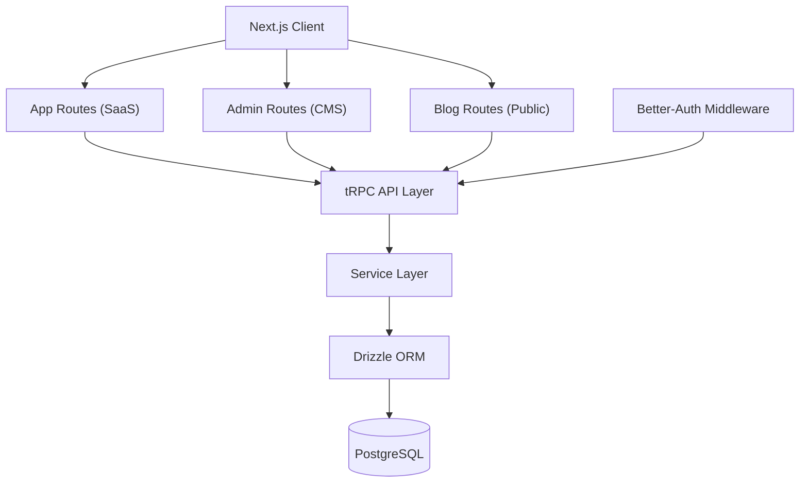
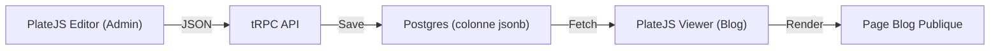

À chaque nouveau projet, je passais les deux premières semaines à faire la même chose : configurer l'authentification, brancher la base de données, monter un panel admin, ajouter un blog, intégrer les paiements.

Après un peu plus de trois ans à construire des produits (pour des clients, pour moi, pour le fun), j'ai réalisé un truc évident : 80% de la base était identique d'un projet à l'autre. Le seul truc qui changeait, c'était la logique métier.

Alors j'ai arrêté de copier-coller, et j'ai construit un boilerplate. Pas "le starter kit ultime." Juste une fondation solide et opinée qui reflète comment je construis réellement les choses. C'est open source, et vous pouvez l'utiliser maintenant.

👉 **[github.com/Bima42/saas-boilerplate](https://github.com/Bima42/saas-boilerplate)**

## Le Problème (Pourquoi ça existe)

J'ai shippé plusieurs produits ces dernières années. Certains pour des clients, d'autres personnels. À chaque fois, je me retrouvais à :

1. **Setup l'auth** (sessions, middleware, routes protégées)
2. **Configurer la base de données** (schema, migrations, ORM)
3. **Construire un admin dashboard** (CRUD de contenu, gestion des users)
4. **Ajouter un blog** (éditeur rich text, SEO, routes publiques)
5. **Intégrer Stripe** (subscriptions, webhooks)
6. **Dockeriser le tout** (environnements consistants)

Ce boilerplate est fait pour les **builders**, ceux qui veulent valider une idée vite, shipper un MVP, et voir si ça prend. Pas pour ceux qui veulent optimiser pour 100k utilisateurs simultanés dès le premier jour.

## La Stack (Ce que j'ai choisi et pourquoi)

Chaque technologie dans cette stack a été choisie parce que j'ai testé les alternatives dans des vrais projets, et j'ai gardé ce qui marchait le mieux.

| Layer | Technologie | Pourquoi |
|:------|:-----------|:----|
| **Framework** | Next.js 15 | App Router, Server Actions, React 19. L'écosystème est imbattable. |
| **API** | tRPC v11 | Type safety de bout en bout. Zéro doc d'API à maintenir. |
| **Base de données** | PostgreSQL + Drizzle ORM | SQL-first, migrations lisibles, pas de magie ORM. |
| **Auth** | Better-Auth | Rien de plus simple à setup, rien de plus efficace. |
| **Éditeur** | PlateJS | Construit sur Shadcn/UI, léger, complet. |
| **Styling** | Tailwind CSS v4 + Shadcn/UI | Rapide à construire, design system consistant. |
| **Paiements** | Stripe | Standard de l'industrie. Webhooks pré-câblés. |
| **Deploy** | Docker Compose | Même environnement partout. Dev = Prod. |

### Le parcours de l'éditeur

Ce choix mérite du contexte parce que j'ai traversé une vraie évolution.

Sur mon premier projet (Voltaire), j'ai utilisé **TipTap** et **Lexical**. Les deux sont puissants, mais le coût de setup était élevé, et les intégrer dans un design system consistant prenait trop de temps.

Pour la première version de ce boilerplate, j'ai essayé **Payload CMS**. C'est un super outil, mais c'était overkill pour ce dont j'avais besoin : un éditeur de contenu simple et rapide pour des articles de blog. Ça ajoutait de la complexité sans assez de retour.

Puis j'ai trouvé **PlateJS**. Il est construit sur Shadcn/UI, donc il partage le même design system que le reste de l'app. Il stocke le contenu en JSON. Il est léger mais complet (titres, images, blocs de code, liens, tout ce qu'il faut). Il colle parfaitement.

### Pourquoi Better-Auth plutôt que NextAuth ?

J'ai testé NextAuth sur des projets précédents. Ça marche, mais la configuration est verbeuse, et la DX autour du middleware et de la gestion de session m'a toujours semblé pénible.

Better-Auth est dans le sweet spot : API simple, basé sur le middleware, et intégration directe avec Drizzle. Un schema, une base de données, tout au même endroit.

## L'Architecture (Monolithe par choix)

Ce boilerplate est un **monolithe unifié**. L'Admin Dashboard, l'application SaaS principale et le Blog public tournent tous dans une seule instance Next.js.

Je sais que les monolithes ne sont pas à la mode. Microservices, edge functions, serverless : l'industrie pousse vers les architectures distribuées. Mais pour un MVP (et honnêtement, pour la plupart des produits), le monolithe est le bon choix.

Pourquoi :
- **Un repo, un deploy.** Pas de complexité d'orchestration.
- **Base de données et types partagés.** Pas de contrats d'API entre services.
- **Facile à comprendre.** Un nouveau développeur peut saisir l'ensemble du système en un après-midi.
- On peut toujours splitter plus tard.



### Structure du projet

Voici comment le code est organisé :

```text
src/
├── app/
│   ├── (admin)/            # Admin Dashboard (protégé)
│   ├── (app)/              # Application SaaS principale
│   ├── api/                # tRPC, Webhooks, endpoints Auth
│   └── blog/               # Blog Public (optimisé SEO)
├── components/
│   ├── admin/              # UI spécifique admin
│   ├── blog/               # Cards blog, viewers
│   └── editor/             # Config & plugins PlateJS
├── lib/                    # Clients singleton (S3, Stripe, Auth)
├── server/
│   ├── api/                # tRPC Routers
│   ├── db/                 # Drizzle Schema & Connexion
│   └── services/           # Logique Métier
└── types/                  # Schémas Zod & types TS partagés
```

Les route groups `(admin)`, `(app)` et `blog` sont juste des conventions Next.js. Ils partagent le même backend `server/`. Zéro duplication.

## Les patterns que je réutilise dans chaque projet

Après avoir construit plusieurs produits sur cette stack, quelques patterns sont devenus non-négociables pour moi.

### Pattern 1 : Le Service Layer

C'est la décision architecturale la plus importante de ce boilerplate. La règle est simple : **les routers API ne touchent jamais la base de données directement.**

Les routers sont des controllers fins. Ils valident l'input, vérifient l'auth, et appellent un service. C'est tout.

**La mauvaise façon (ce que je faisais avant) :**

```typescript
// ❌ src/server/api/routers/post-router.ts
// Logique DB mélangée avec la logique API. Difficile à tester, difficile à réutiliser.
export const postRouter = router({
  getBySlug: publicProcedure
    .input(z.object({ slug: z.string() }))
    .query(async ({ input }) => {
      return db.select().from(posts).where(eq(posts.slug, input.slug));
    }),
});
```

**La bonne façon (ce que je fais maintenant) :**

```typescript
// ✅ src/server/services/post.ts
// La logique métier est isolée, testable, réutilisable.
export const postService = {
  getBySlug: async (slug: string) => {
    return db.query.posts.findFirst({
      where: eq(posts.slug, slug),
      with: { author: true, tags: true },
    });
  },

  incrementViews: async (id: number) => {
    await db
      .update(posts)
      .set({ views: sql`${posts.views} + 1` })
      .where(eq(posts.id, id));
  },
};
```

```typescript
// ✅ src/server/api/routers/post-router.ts
// Le router est un controller fin. Propre et lisible.
export const postRouter = router({
  getBySlug: publicProcedure
    .input(z.object({ slug: z.string() }))
    .query(({ input }) => postService.getBySlug(input.slug)),

  incrementViews: publicProcedure
    .input(z.object({ id: z.number() }))
    .mutation(({ input }) => postService.incrementViews(input.id)),
});
```

### Pattern 2 : tRPC pour la type safety

tRPC élimine une catégorie entière de bugs. Les types circulent depuis votre schema de base de données, à travers votre service layer, jusqu'à vos composants frontend. Si vous renommez un champ dans votre schema, TypeScript va crier partout où ce champ est utilisé.

```typescript
// src/app/(app)/dashboard/page.tsx
'use client';

import { api } from '@/lib/trpc/react';

export default function Dashboard() {
  const { data: posts } = api.post.getAll.useQuery();
  //    ^? { id: number; title: string; slug: string; views: number; ... }[]

  return (
    <ul>
      {posts?.map((post) => (
        <li key={post.id}>{post.title} ({post.views} views)</li>
      ))}
    </ul>
  );
}
```

Si le code compile, le contrat d'API est correct.

### Pattern 3 : Migrations Drizzle

J'ai besoin de faire confiance à mes migrations de base de données. Drizzle génère des fichiers SQL lisibles que je peux relire, reviewer et versionner.

```typescript
// src/server/db/schema/post-schema.ts
export const posts = pgTable("posts", {
  id: serial("id").primaryKey(),
  slug: text("slug").notNull().unique(),
  title: text("title").notNull(),
  content: jsonb("content"),
  views: integer("views").default(0),
  createdAt: timestamp("created_at").defaultNow(),
});
```

```bash
# Générer un fichier de migration depuis les changements de schema
npm run db:generate

# Appliquer la migration à la base de données
npm run db:migrate

# Raccourci dev : sync le schema directement (pas de fichier de migration)
npm run db:push
```

Le workflow est toujours le même : modifier le schema, générer, migrer. Pas de surprises.

## Le CMS Custom (Pourquoi j'ai arrêté les outils externes)

La plupart des apps SaaS ont besoin d'une forme de gestion de contenu : articles de blog, changelogs, pages de documentation. Avant, j'allais chercher des outils externes comme Payload CMS ou des headless CMS comme Sanity.

Le problème ? Ils ajoutent de la complexité. Un service de plus à déployer, une API de plus à intégrer, un jeu de credentials de plus à gérer. Pour un blog avec 50 articles, ce overhead n'en vaut pas la peine.

Ma solution : **PlateJS + Postgres**.



Le contenu est stocké en JSON directement dans la colonne `content` de la table `posts`. Pas de service externe. Pas de webhooks. Pas de problèmes de synchronisation.

## Déploiement (Docker Compose + Self-Hosting)

L'intégralité du boilerplate est Dockerisée. Un seul `docker-compose.yml` fait tourner l'app Next.js et la base PostgreSQL.

```yaml
# docker-compose.yml (simplifié)
services:
  app:
    build: .
    ports:
      - "3000:3000"
    environment:
      DATABASE_URL: postgres://user:pass@db:5432/saas
    depends_on:
      - db

  db:
    image: postgres:16
    volumes:
      - postgres-data:/var/lib/postgresql/data
    environment:
      POSTGRES_USER: user
      POSTGRES_PASSWORD: pass
      POSTGRES_DB: saas

volumes:
  postgres-data:
```

**Pourquoi Docker même en développement ?** Parce que "ça marche sur ma machine" n'est pas une stratégie de déploiement valide. Avec Docker, mon environnement local est identique à la production. Plus de bugs spécifiques à l'environnement à debugger.

### Où héberger

J'utilise personnellement **[Dokploy](https://dokploy.com/)**, un PaaS self-hosted qui donne l'expérience Vercel/Heroku sur votre propre VPS. J'ai écrit un guide complet sur comment déployer une stack Docker Compose avec Dokploy :

👉 **[Comment déployer un Docker Compose avec Dokploy](https://tanguypauvret.me/blog/deploy-a-compose-with-dokploy)**

Si vous préférez l'hébergement managé, **[Railway](https://railway.app/)** est aussi un choix solide. Mais j'aime posséder mon infrastructure : pas de factures surprises, pas de vendor lock-in, contrôle total.

## Pour démarrer

Le boilerplate est sous **licence MIT** et disponible sur GitHub :

👉 **[github.com/Bima42/saas-boilerplate](https://github.com/Bima42/saas-boilerplate)**

```bash
git clone https://github.com/Bima42/saas-boilerplate
cd saas-boilerplate
cp .env.example .env
docker compose up -d --build
```

Ouvrez `http://localhost:3000`. C'est live.

J'ai aussi écrit de la documentation détaillée pour les humains et les LLMs :
- **[docs/LLM.md](https://github.com/Bima42/saas-boilerplate/blob/main/docs/LLM.md)** : Architecture, patterns et règles de code (donnez ça à Cursor ou Windsurf)
- **[docs/API.md](https://github.com/Bima42/saas-boilerplate/blob/main/docs/API.md)** : Endpoints tRPC et logique d'auth
- **[docs/DB.md](https://github.com/Bima42/saas-boilerplate/blob/main/docs/DB.md)** : Schema, utilisation de Drizzle et workflows de migration

Si vous utilisez ce boilerplate, trouvez un bug ou voulez une feature, ouvrez une issue ou une PR. Je maintiens ce projet parce que je l'utilise moi-même en production. Chaque amélioration bénéficie aussi à mes propres projets.

Si vous trouvez ça utile, une ⭐ sur GitHub m'aide à savoir que ce travail compte pour la communauté.
