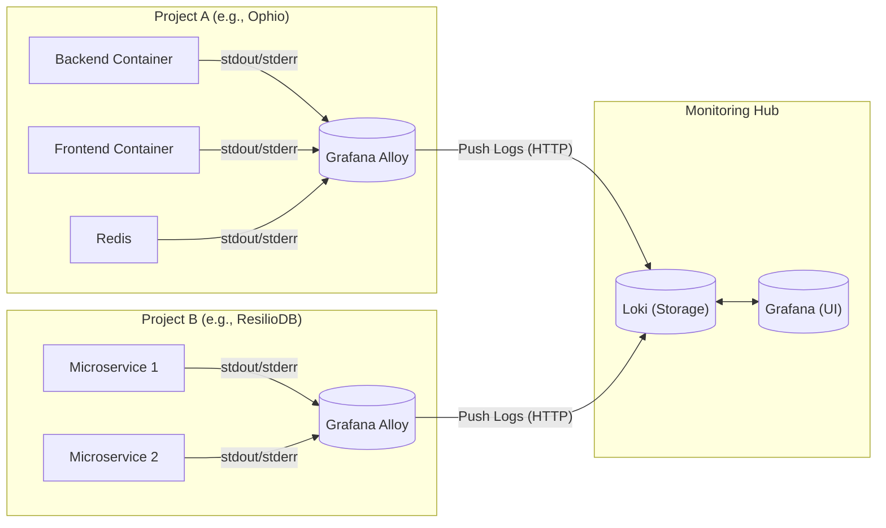

At **Resilio**, we are growing. We have multiple applications, microservices scattered across different environments, and a team that needs to move fast.

But recently, we hit a wall. Our observability infrastructure hadn't kept up with our code.

We had a classic "Black Box" problem. Logs were trapped inside Docker containers on remote nodes. If a bug happened in Staging, a developer had to:
1.  Access the concerned VPS using SSH.
2.  Grep through raw text streams in a terminal.
3.  Or worse, ask a developer who had access to check for them.

It was slow, frustrating, and killed autonomy. We needed a way to democratize access to our data without giving everyone root access to our servers.

Here is how I architected a centralized logging solution using the **PLG Stack** (Promtail, Loki, Grafana), and why I decided to ditch the standard Promtail for **Grafana Alloy**.

## The Architecture: Hub & Spoke

We didn't need the complexity and efficiency of the ELK stack (Elasticsearch, Logstash, Kibana). We needed something lightweight that respected our privacy (self-hosted) and could handle multiple projects.

I designed a **Hub & Spoke** architecture:
*   **The Spokes (Our Apps):** Every application server runs a lightweight collector agent.
*   **The Hub (Monitoring):** A central server that stores the logs (Loki) and visualizes them (Grafana).



## The Tool Choice: Why Alloy?

If you look up "Loki tutorials," most of them tell you to use **Promtail**. It’s the default log collector for the stack.

I chose **Grafana Alloy** instead. Here is why:

1.  **Promtail is effectively legacy.** Grafana is actively consolidating their agents. As per their [latest docs](https://grafana.com/docs/loki/latest/send-data/promtail/), Promtail is in maintenance mode and the end-of-life phase for Promtail will begin once LTS ends.
2.  **Programmability.** Alloy uses a **declarative, component-based configuration language** that allows you to build modular, reusable data pipelines programmatically.
3.  **Future Proofing.** Right now, we just want logs. But in six months, when we want Traces or Metrics (Prometheus), Alloy can handle those too. One agent to rule them all.

## The Implementation: Local First

Before touching production, I built a POC locally. The goal was to spin up our app stack and have logs automatically appear in a local Grafana instance.

### 1. The Infrastructure (`docker-compose.yml`)

We use Docker profiles to keep our dev environment clean. The monitoring stack only spins up if you explicitly ask for it with `--profile monitoring`.

Here is the setup. Note that we mount `/var/run/docker.sock` to Alloy. This allows it to auto-discover other containers.

```yaml
services:
  # ... your standard app services ...

  loki:
    profiles: ["monitoring"]
    image: grafana/loki:3.0.0
    ports:
      - "3100:3100"
    command: -config.file=/etc/loki/local-config.yaml
    volumes:
      - ./monitoring/loki/config.yaml:/etc/loki/local-config.yaml
    networks:
      - resilio_tech_network

  alloy:
    profiles: ["monitoring"]
    image: grafana/alloy:latest
    ports:
      - "12345:12345"
    volumes:
      - ./monitoring/alloy/config.alloy:/etc/alloy/config.alloy
      - /var/run/docker.sock:/var/run/docker.sock:ro # Critical for discovery
    command: run --server.http.listen-addr=0.0.0.0:12345 --storage.path=/var/lib/alloy/data /etc/alloy/config.alloy
    env_file:
      - envs/.alloy.env
    depends_on:
      - loki
    networks:
      - resilio_tech_network

  grafana:
    image: grafana/grafana
    profiles: ["monitoring"]
    ports:
      - "3000:3000"
    depends_on:
      - loki
    # ... volumes for datasources/dashboards ...
```

### 2. The Pipeline (`config.alloy`)

This is where the magic happens. We don't want to manually configure every container. We want Alloy to:
1.  **Discover** every running container.
2.  **Relabel** the metadata (turn Docker jargon into useful tags like `service` or `env`).
3.  **Push** to Loki.

We use environment variables to make this config reusable across Staging, Prod, and Local.

```hcl
// DISCOVERY: Find everything running on Docker
discovery.docker "containers" {
  host = "unix:///var/run/docker.sock"
}

// PROCESSING: Clean up the tags
discovery.relabel "containers" {
  targets = discovery.docker.containers.targets

  // Extract the service name from Docker Compose labels
  rule {
    source_labels = ["__meta_docker_container_label_com_docker_compose_service"]
    target_label  = "service"
  }

  // Inject 'env' label (e.g., "staging", "production")
  rule {
    action       = "replace"
    replacement  = sys.env("ENVIRONMENT")
    target_label = "env"
  }

  // Inject 'project' label (e.g., "ophio")
  rule {
    action       = "replace"
    replacement  = sys.env("PROJECT_NAME")
    target_label = "project"
  }
}

// SCRAPING: Read the logs
loki.source.docker "containers" {
  host       = "unix:///var/run/docker.sock"
  targets    = discovery.relabel.containers.output
  forward_to = [loki.write.remote_hub.receiver]
}

// OUTPUT: Send to the Hub
loki.write "remote_hub" {
  endpoint {
    url = sys.env("LOKI_URL")
  }
}
```

### 3. Environment Configuration

To make this work, we just need a simple `.env` file passed to the Alloy container. This allows us to deploy the exact same Alloy image to 10 different servers, just changing these three variables:

```bash
LOKI_URL=http://loki:3100/loki/api/v1/push
ENVIRONMENT=local
PROJECT_NAME=myapp
```

## The Result: Debugging with Context

Once we ran `docker-compose --profile monitoring up`, everything just worked. I can go into Grafana Explore and run a query like:

`{project="myapp", env="staging", service="backend"} |= "error"`


This solves our "Black Box" problem.
1.  **No SSH required:** Developers access logs via the web UI.
2.  **Cross-Service Context:** We can see logs from the Frontend and Backend side-by-side to trace a request.
3.  **Persistence:** If a container crashes and restarts, the logs aren't lost; they are safely stored in Loki.

We can also create dashboards, set up alerts, and build a culture of observability.


## What's Next?

Now that we have validated the stack locally, the path to production is straightforward.

We are provisioning a dedicated VPS to act as our **Monitoring Hub**, hosting the production instances of Grafana and Loki.

Because our Alloy configuration is driven by environment variables, scaling this out is trivial. We simply deploy the Alloy container to our existing application servers, update the `LOKI_URL` to point to our new Hub, and set the correct `PROJECT_NAME`. Instantly, logs from across our entire infrastructure will start flowing into one central, observable place.

## A Word on Security

The setup I showed you works perfectly for local development. But if you're deploying this Hub & Spoke architecture to production, **you need to lock things down**.

Here are the key points I had to deal with when moving from local to production:

**1. Loki Should NOT Be Public**

In the `docker-compose.yml` above, I exposed Loki on `3100:3100`. That's fine for `localhost`. In production, **do not map Loki's port publicly**.

Here are some options:
- **Private Network (LAN):** If your app servers and monitoring hub can communicate over a private network, configure Alloy to push to `http://<private-ip>:3100`. No public exposure needed.
- **Authentication Layer:** If you must expose Loki over the internet, put it behind a reverse proxy (Nginx, Traefik) with Basic Auth or use Loki's built-in multi-tenancy mode with tokens. Otherwise, anyone can read/push logs.

**2. Grafana Needs Credentials**

By default, Grafana's login is `admin:admin`. Change it.

Depending on your setup, you may also need to:
- Configure the `root_url` and `serve_from_sub_path` if you're hosting Grafana behind a reverse proxy or under a subpath (e.g., `monitoring.yourcompany.com/grafana`).
- Set up proper user roles. Not everyone needs Admin access. Grafana has Viewer, Editor, and Admin roles for a reason.

I'll probably write a dedicated post on hardening this stack for production, there are some non-obvious gotchas around this.