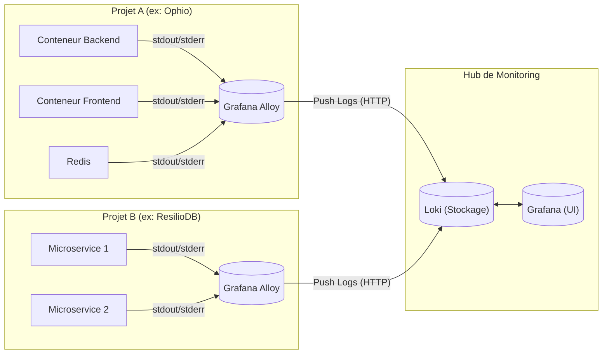
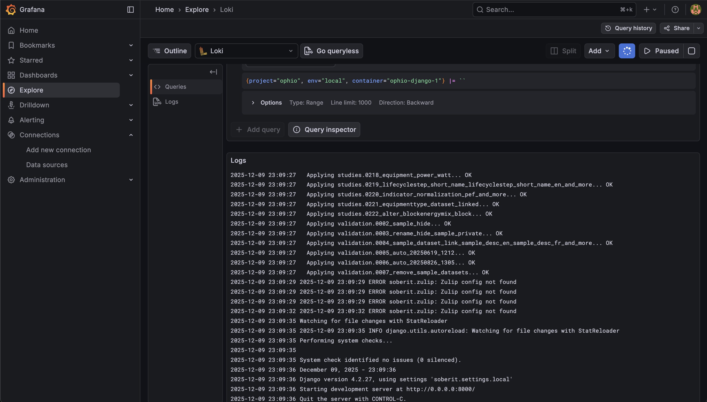
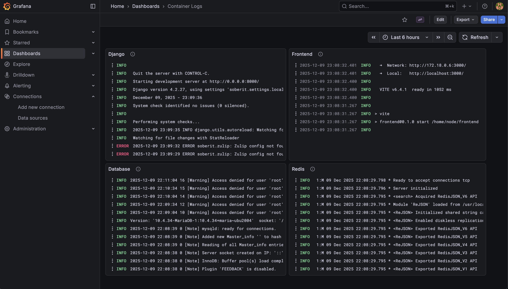

Chez **Resilio**, nous grandissons vite. Nous avons plusieurs applications, des microservices dispersés dans différents environnements, et une équipe qui doit avancer rapidement.

Mais récemment, nous avons heurté un mur. Notre infrastructure d'observabilité n'avait pas suivi l'évolution de notre code.

Nous avions un problème classique de "Black Box". Les logs étaient piégés dans des conteneurs Docker sur des nœuds distants. Si un bug survenait en Staging, un développeur devait :
1.  Accéder au VPS concerné via SSH.
2.  Observer un flux de texte brut dans un terminal.
3.  Ou encore, demander à un développeur ayant les accès de vérifier pour lui.

C'était lent, frustrant, et cela tuait notre autonomie. Nous avions besoin d'un moyen de démocratiser l'accès à nos données sans donner un accès root à tout le monde.

Voici comment j'ai architecturé une solution de logging centralisée utilisant la **Stack PLG** (Promtail, Loki, Grafana), et pourquoi j'ai décidé d'abandonner le standard Promtail au profit de **Grafana Alloy**.

## L'Architecture : Hub & Spoke

Nous n'avions pas besoin de la complexité et l'efficacité de la stack ELK (Elasticsearch, Logstash, Kibana). Nous avions besoin de quelque chose de léger, qui respecte notre confidentialité (self-hosted) et qui puisse gérer plusieurs projets.

J'ai conçu une architecture en **Hub & Spoke** :
*   **Les Spokes (Nos Apps) :** Chaque serveur d'application fait tourner un agent collecteur léger.
*   **Le Hub (Monitoring) :** Un serveur central qui stocke les logs (Loki) et les visualise (Grafana).



## Le Choix des Outils : Pourquoi Alloy ?

Si vous cherchez des tutoriels Loki, la plupart d'entre eux vous diront d'utiliser **Promtail**. C'est le collecteur de logs par défaut de la stack.

J'ai choisi **Grafana Alloy** à la place. Voici pourquoi :

1.  **Promtail est en fin de vie.** Grafana consolide activement ses agents. Selon leur [documentation récente](https://grafana.com/docs/loki/latest/send-data/promtail/), Promtail est en mode maintenance et sa fin de vie débutera à la fin de la phase LTS.
2.  **Programmabilité.** Alloy utilise un **langage de configuration déclaratif basé sur des composants** qui vous permet de créer des pipelines de données modulaires et réutilisables par programmation.
3.  **Futur-Proof.** Pour l'instant, nous voulons juste des logs. Mais dans six mois, quand nous voudrons des Traces ou des Métriques (Prometheus), Alloy pourra aussi les gérer. Un seul agent pour tout gouverner.

## L'Implémentation : Local First

Avant de toucher à la production, j'ai construit un POC en local. L'objectif était de lancer notre stack applicative et de voir les logs apparaître automatiquement dans une instance Grafana locale.

### 1. L'Infrastructure (`docker-compose.yml`)

Nous utilisons les profils Docker pour garder notre environnement de dev propre. La stack de monitoring ne se lance que si on le demande explicitement avec `--profile monitoring`.

Voici la configuration. Notez que nous montons `/var/run/docker.sock` dans Alloy. C'est ce qui lui permet de découvrir automatiquement les autres conteneurs.

```yaml
services:
  # ... vos services applicatifs standards ...

  loki:
    profiles: ["monitoring"]
    image: grafana/loki:3.0.0
    ports:
      - "3100:3100"
    command: -config.file=/etc/loki/local-config.yaml
    volumes:
      - ./monitoring/loki/config.yaml:/etc/loki/local-config.yaml
    networks:
      - resilio_tech_network

  alloy:
    profiles: ["monitoring"]
    image: grafana/alloy:latest
    ports:
      - "12345:12345"
    volumes:
      - ./monitoring/alloy/config.alloy:/etc/alloy/config.alloy
      - /var/run/docker.sock:/var/run/docker.sock:ro # Critique pour la découverte
    command: run --server.http.listen-addr=0.0.0.0:12345 --storage.path=/var/lib/alloy/data /etc/alloy/config.alloy
    env_file:
      - envs/.alloy.env
    depends_on:
      - loki
    networks:
      - resilio_tech_network

  grafana:
    image: grafana/grafana
    profiles: ["monitoring"]
    ports:
      - "3000:3000"
    depends_on:
      - loki
    # ... volumes pour datasources/dashboards ...
```

### 2. Le Pipeline (`config.alloy`)

C'est ici que la magie opère. Nous ne voulons pas configurer manuellement chaque conteneur. Nous voulons qu'Alloy :
1.  **Découvre** tout conteneur en cours d'exécution.
2.  **Relabel** les métadonnées (transformer le jargon Docker en tags utiles comme `service` ou `env`).
3.  **Push** vers Loki.

Nous utilisons des variables d'environnement pour rendre cette config réutilisable entre Staging, Prod et Local.

```hcl
// DÉCOUVERTE : Trouver tout ce qui tourne sur Docker
discovery.docker "containers" {
  host = "unix:///var/run/docker.sock"
}

// TRAITEMENT : Nettoyer les tags
discovery.relabel "containers" {
  targets = discovery.docker.containers.targets

  // Extraire le nom du service depuis les labels Docker Compose
  rule {
    source_labels = ["__meta_docker_container_label_com_docker_compose_service"]
    target_label  = "service"
  }

  // Injecter le label 'env' (ex: "staging", "production")
  rule {
    action       = "replace"
    replacement  = sys.env("ENVIRONMENT")
    target_label = "env"
  }

  // Injecter le label 'project' (ex: "ophio")
  rule {
    action       = "replace"
    replacement  = sys.env("PROJECT_NAME")
    target_label = "project"
  }
}

// SCRAPING : Lire les logs
loki.source.docker "containers" {
  host       = "unix:///var/run/docker.sock"
  targets    = discovery.relabel.containers.output
  forward_to = [loki.write.remote_hub.receiver]
}

// SORTIE : Envoyer vers le Hub
loki.write "remote_hub" {
  endpoint {
    url = sys.env("LOKI_URL")
  }
}
```

### 3. Configuration de l'Environnement

Pour que cela fonctionne, nous avons juste besoin d'un simple fichier `.env` passé au conteneur Alloy. Cela nous permet de déployer exactement la même image Alloy sur 10 serveurs différents, en changeant juste ces trois variables :

```bash
LOKI_URL=http://loki:3100/loki/api/v1/push
ENVIRONMENT=local
PROJECT_NAME=myapp
```

## Le Résultat : Déboguer avec du Contexte

Une fois que nous avons lancé `docker-compose --profile monitoring up`, ça a tout simplement fonctionné. Je peux aller dans Grafana Explore et lancer une requête comme :

`{project="myapp", env="staging", service="backend"} |= "error"`



Cela résout notre problème de "Boîte Noire".
1.  **Pas de SSH requis :** Les développeurs accèdent aux logs via l'interface Web.
2.  **Contexte Cross-Service :** Nous pouvons voir les logs du Frontend et du Backend côte à côte pour tracer une requête.
3.  **Persistance :** Si un conteneur crashe et redémarre, les logs ne sont pas perdus ; ils sont stockés en sécurité dans Loki.

Nous pouvons également configurer des dashboards Grafana pour surveiller les logs.



## Et la suite ?

Maintenant que nous avons validé la stack localement, le chemin vers la production est tracé.

Nous sommes en train de provisionner un VPS dédié pour agir comme notre **Hub de Monitoring**, hébergeant les instances de production de Grafana et Loki.

Comme notre configuration Alloy est pilotée par des variables d'environnement, le passage à l'échelle est trivial. Il nous suffit de déployer le conteneur Alloy sur nos serveurs applicatifs existants, de mettre à jour `LOKI_URL` pour pointer vers notre nouveau Hub, et de définir le bon `PROJECT_NAME`. Instantanément, les logs de toute notre infrastructure commenceront à affluer vers un endroit central et observable.

## Un Mot sur la Sécurité

Le setup que je vous ai montré fonctionne parfaitement pour le développement local. Mais si vous déployez cette architecture Hub & Spoke en production, **vous devez verrouiller les accès**.

Voici quelques points clés :

**1. Loki NE DOIT PAS Être Public**

Dans le `docker-compose.yml` ci-dessus, j'ai exposé Loki sur `3100:3100`. C'est correct pour `localhost`. En production, **ne mappez pas le port de Loki publiquement**.

Vous pouvez envisager les options suivantes :
- **Réseau Privé (LAN) :** Si vos serveurs d'application et votre hub de monitoring peuvent communiquer via un réseau privé, configurez Alloy pour pousser vers `http://<ip-privée>:3100`. Aucune exposition publique nécessaire.
- **Couche d'Authentification :** Si vous devez absolument exposer Loki sur internet, mettez-le derrière un reverse proxy (Nginx, Traefik) avec une Basic Auth ou utilisez le mode multi-tenancy de Loki avec des tokens. Sinon, n'importe qui peut lire/pousser des logs.

**2. Grafana a Besoin de Credentials**

Par défaut, le login de Grafana est `admin:admin`. Changez-le.

Selon votre setup, vous devrez peut-être aussi :
- Configurer le `root_url` et `serve_from_sub_path` si vous hébergez Grafana derrière un reverse proxy ou sous un sous-chemin (ex : `monitoring.votreentreprise.com/grafana`).
- Mettre en place des rôles utilisateurs appropriés. Tout le monde n'a pas besoin d'un accès Admin. Grafana a des rôles Viewer, Editor et Admin pour une bonne raison.

J'écrirai probablement un post dédié sur le passage de la stack en production, il y a quelques pièges non-évidents autour de ça.