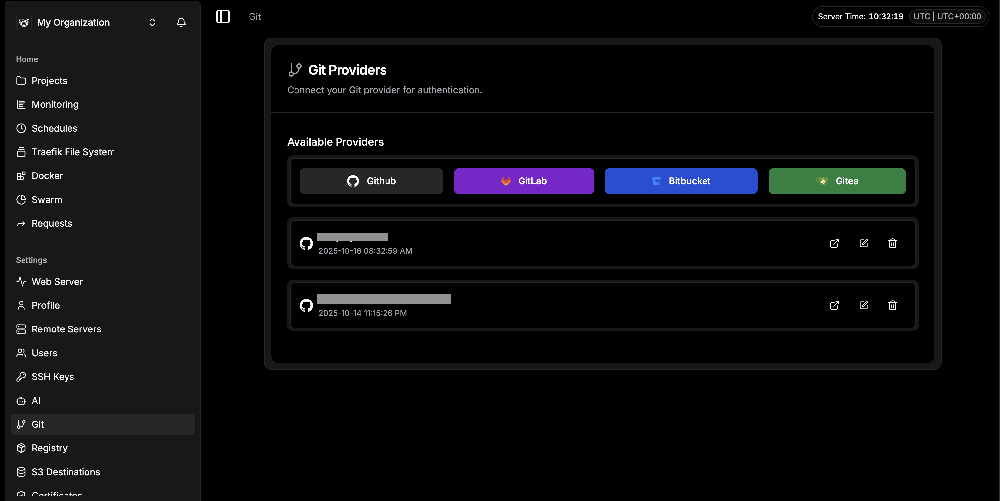
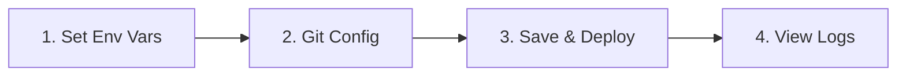

I have been using Dokploy for months now, and it has been a major discovery for me.

It is rare to find a tool that balances simplicity with power so well. Dokploy is free, open-source, and brings a top-tier UI/UX to self-hosting. It makes managing your own infrastructure feel as smooth as using a managed platform, but with full control. The community around the project is amazing, and it scales effortlessly from a single side project to a complex microservices architecture.

Here is how I set it up and deployed a full stack app using Docker Compose.

## 1. Installation: The One-Liner

Everything is well documented in their [official documentation](https://docs.dokploy.com/docs/core/installation), but the process is incredibly simple.

Get a fresh VPS (Ubuntu 22.04 or 24.04 recommended). SSH into your server and run this:

```bash
curl -sSL https://dokploy.com/install.sh | sh
```

That is it. The script installs Docker, configures the necessary networks, and spins up the Dokploy dashboard.

Once finished, open your browser and go to `http://<YOUR_VPS_IP>:3000`.

### Troubleshooting: "I can't access the panel"
If the page hangs, 99% of the time it is your VPS firewall. You need to allow traffic on port `3000`.

If you are using UFW on the server:
```bash
ufw allow 3000/tcp
```
If you are on AWS/Hetzner/DigitalOcean, check their "Security Groups" or "Firewall" tab in their UI and open TCP port 3000.

## 2. Configuration & Security

Create your admin account.

**Do not skip this step:** Go immediately to **Settings** and enable **2FA**. You are hosting this on the public internet; a password is not enough.

## 3. Deploying a Compose Application

This is where Dokploy shines. The UI is intuitive.

First, go to the **Git** tab in the sidebar and connect your provider (GitHub/GitLab). It takes two clicks.



Now, let's deploy a real project. If you don't have one, you can use my [SaaS Boilerplate](https://github.com/Bima42/saas-boilerplate) to test this flow.

1.  Go to **Projects** (top sidebar) and create a new project (e.g., "my-saas").
2.  Click **Create Service** and select **Compose**.

### The Deployment Flow

Before clicking "Deploy", we need to follow a specific order to avoid build failures.



**Step 1: Environment Variables**
Go to the **Environment** tab. Copy-paste your `.env` content here. If your compose file relies on env variables, they must be defined here.

**Step 2: Git Configuration**
Go back to the **General** tab:
*   **Provider:** GitHub
*   **Repository:** `Bima42/saas-boilerplate` (or yours)
*   **Branch:** `main`
*   **Build Path:** `/` (usually root)

You can toggle **Auto Deploy** if you want new commits to trigger builds automatically.

**Step 3: Deploy**
Click **Save**, then click **Deploy**.

Switch to the **Deployments** tab. You will see the logs streaming in real-time. It will pull your repo, build the images defined in your `docker-compose.yml`, and start the stack.


## 4. Setting up the Domain (The App)

Your app is running, but it is stuck inside the container. We need to expose it to the world. There is detailed documentation on domains [here](https://docs.dokploy.com/docs/core/domains), but here is the short version.

Go to your DNS Provider (Cloudflare, Namecheap, etc.) and create two records pointing to your VPS IP:

| Type | Name | Content |
| :--- | :--- | :--- |
| A | `app.yourdomain.com` | `<YOUR_IPV4>` |
| AAAA | `app.yourdomain.com` | `<YOUR_IPV6>` |

*Note: The AAAA record is optional but recommended if your VPS supports IPv6.*

Now, back in Dokploy inside your Service:
1.  Find the **Domains** section.
2.  **Service:** Select the specific service from your compose file you want to expose (e.g., `web` or `nextjs`).
3.  **Host:** `app.yourdomain.com`
4.  **Port:** The internal port your app listens on (e.g., `3000` for Next.js, `8000` for FastAPI).
5.  **Certificate:** Select "LetsEncrypt".
6.  Click **Create**.

Dokploy will handle the reverse proxy (Traefik) configuration and SSL generation automatically.

## 5. Securing the Admin Panel

Right now, you are accessing Dokploy via `http://IP:3000`. This is not ideal. Let's put the dashboard behind a proper domain and SSL.

1.  Go to the **Webserver** tab in the main sidebar.
2.  Look for the **Server Domain** section.
3.  Enter your desired domain (e.g., `panel.yourdomain.com`).
4.  Enter your email (for SSL alerts).
5.  Select **LetsEncrypt** and click **Save**.

Once this is active, you can (and should) close port 3000 on your firewall to ensure access is only possible via HTTPS. You can find more info on securing your installation [here](https://docs.dokploy.com/docs/core/installation#disable-access-via-ipport-optional-but-recommended).

## What's Next?

This is just the basics. Dokploy also handles so much more (databases, caching, workers, cron jobs, etc.) all through the same UI.

I highly recommend testing this flow with a robust starter kit. You can clone my [SaaS Boilerplate](https://github.com/Bima42/saas-boilerplate) to see how a production-ready Docker Compose setup interacts with Dokploy.

It's open source, so if you find a bug or want a feature, go contribute.