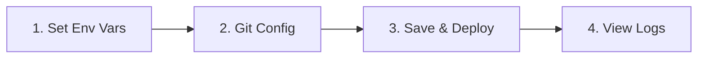

J'utilise Dokploy depuis des mois maintenant, et c'est une découverte majeure pour moi.

C'est rare de trouver un outil qui équilibre aussi bien simplicité et puissance. Dokploy est gratuit, open-source, et apporte une UI/UX de haut niveau au self-hosting. Ça rend la gestion d'infrastructure aussi fluide que sur une plateforme managée, mais avec un contrôle total. La communauté autour du projet est incroyable, et l'outil scale sans effort, du petit side project à une architecture microservices complexe.

Voici comment je l'installe et déploie une stack complète via Docker Compose.

## 1. Installation : Le One-Liner

Tout est très bien documenté dans leur [documentation officielle](https://docs.dokploy.com/docs/core/installation), mais le processus est incroyablement simple.

Prenez un VPS frais (Ubuntu 22.04 ou 24.04 recommandé). Connectez-vous en SSH et lancez ça :

```bash
curl -sSL https://dokploy.com/install.sh | sh
```

C'est tout. Le script installe Docker, configure les réseaux nécessaires et lance le dashboard Dokploy.

Une fois terminé, ouvrez votre navigateur sur `http://<IP_DE_VOTRE_VPS>:3000`.

### Troubleshooting : "Le panel ne répond pas"
Si la page charge dans le vide, c'est à 99% le firewall de votre VPS. Vous devez autoriser le trafic sur le port `3000`.

Si vous utilisez UFW sur le serveur :
```bash
ufw allow 3000/tcp
```
Si vous êtes chez AWS/Hetzner/DigitalOcean, vérifiez l'onglet "Security Groups" ou "Firewall" dans leur interface et ouvrez le port TCP 3000.

## 2. Configuration & Sécurité

Créez votre compte admin.

**Ne sautez pas cette étape :** Allez immédiatement dans **Settings** et activez le **2FA**. Vous hébergez ça publiquement, prenez les précautions nécessaires.

## 3. Déployer une application Compose

C'est là que Dokploy brille. L'UI est intuitive.

D'abord, allez dans l'onglet **Git** dans la sidebar et connectez votre provider (GitHub/GitLab). C'est fait en deux clics.


Maintenant, déployons un vrai projet. Si vous n'en avez pas, vous pouvez utiliser mon [SaaS Boilerplate](https://github.com/Bima42/saas-boilerplate) pour tester ce flow.

1.  Allez dans **Projects** (sidebar du haut) et créez un projet (ex: "my-saas").
2.  Cliquez sur **Create Service** et choisissez **Compose**.

### Le Flow de Déploiement

Avant de cliquer sur "Deploy", je vous recommande de suivre cet ordre pour vous éviter des erreurs de build.



**Étape 1 : Variables d'Environnement**
Allez dans l'onglet **Environment**. Copiez-collez le contenu de votre `.env`. Si votre compose file dépend de variables d'environnement, elles doivent être définies ici.

**Étape 2 : Configuration Git**
Revenez à l'onglet **General** :
*   **Provider:** GitHub
*   **Repository:** `Bima42/saas-boilerplate` (ou le vôtre)
*   **Branch:** `main`
*   **Build Path:** `/` (généralement la racine)

Vous pouvez activer **Auto Deploy** si vous voulez que chaque commit déclenche un build.

**Étape 3 : Deploy**
Cliquez sur **Save**, puis **Deploy**.

Passez sur l'onglet **Deployments**. Vous verrez les logs défiler en temps réel. Il va pull votre repo, build les images définies dans votre `docker-compose.yml`, et lancer la stack.


## 4. Configurer le Domaine

Votre app tourne, mais elle est coincée dans son conteneur. Il faut l'exposer au monde. Il y a une documentation détaillée sur les domaines [ici](https://docs.dokploy.com/docs/core/domains), mais voici la version courte.

Allez chez votre gestionnaire DNS (Cloudflare, Namecheap, etc.) et créez deux records pointant vers l'IP de votre VPS :

| Type | Name | Content |
| :--- | :--- | :--- |
| A | `app.votre-domaine.com` | `<VOTRE_IPV4>` |
| AAAA | `app.votre-domaine.com` | `<VOTRE_IPV6>` |

*Note : Le record AAAA est optionnel mais recommandé si votre VPS supporte l'IPv6.*

De retour dans Dokploy dans votre Service :
1.  Trouvez la section **Domains**.
2.  **Service :** Sélectionnez le service spécifique de votre compose que vous voulez exposer (ex: `web` ou `nextjs`).
3.  **Host :** `app.votre-domaine.com`
4.  **Port :** Le port interne sur lequel votre app écoute (ex: `3000` pour Next.js).
5.  **Certificate :** Choisissez "LetsEncrypt".
6.  Cliquez sur **Create**.

Dokploy va gérer la configuration du reverse proxy (Traefik) et la génération SSL automatiquement.

## 5. Sécuriser le Panel Admin

Pour l'instant, vous accédez à Dokploy via `http://IP:3000`. Ce n'est pas idéal. Mettons le dashboard derrière un vrai domaine et un SSL.

1.  Allez dans l'onglet **Webserver** dans la sidebar principale.
2.  Cherchez la section **Server Domain**.
3.  Entrez le domaine souhaité (ex: `panel.votre-domaine.com`).
4.  Entrez votre mail (pour les alertes SSL).
5.  Sélectionnez **LetsEncrypt** et cliquez sur **Save**.

Une fois actif, vous pouvez (et devriez) fermer le port 3000 sur votre firewall pour garantir que l'accès ne se fait que via HTTPS. Vous trouverez plus d'infos sur la sécurisation de l'installation [ici](https://docs.dokploy.com/docs/core/installation#disable-access-via-ipport-optional-but-recommended).

## Et la suite ?

Ce ne sont que les bases. Dokploy gère tellement plus de choses (buckets, bases de données, backups, monitoring, etc.). Explorez la documentation pour découvrir tout ce qu'il peut faire.

Je recommande vivement de tester ce flow avec un starter kit robuste. Vous pouvez cloner mon [SaaS Boilerplate](https://github.com/Bima42/saas-boilerplate) pour voir comment un setup Docker Compose "production-ready" interagit avec Dokploy.

C'est open source, donc si vous trouvez un bug ou voulez une feature, n'hésitez pas à contribuer.
