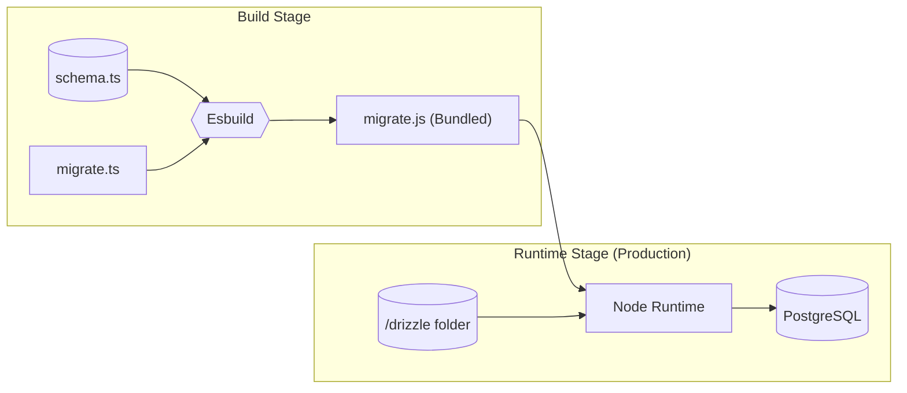

I loved the speed of Drizzle ORM. Running `drizzle-kit push` in development feels like magic: you change a TypeScript schema, hit save, and your database updates instantly.

But "magic" is dangerous in production. When I first started using Drizzle, I had trouble setting up migrations correctly in production.

Here is how I solved this by bundling the migration logic directly into the container using `esbuild`.

## The Strategy: Isolate and Bundle

The goal is simple: **The container should manage its own database state.**

When a new version of the app deploys, it should automatically check if the database schema matches the code. If not, it migrates. If the migration fails, the app shouldn't start.

To achieve this without bloating our production image, we treat the migration script as a separate build artifact.



## The Implementation

### 1. The Migration Script (`migrate.ts`)

First, we need a script that runs the migrations. We cannot use the standard `drizzle-kit` CLI in production because we won't have the CLI installed in our runner image.

Instead, we use the `postgres` driver directly. This script connects to the DB, reads the SQL files from the `./drizzle` folder, and executes them.

```ts src/server/db/migrate.ts
import { drizzle } from 'drizzle-orm/postgres-js';
import { migrate } from 'drizzle-orm/postgres-js/migrator';
import postgres from 'postgres';
import { env } from '@/config/env';

async function runMigrations() {
    const databaseUrl = env.DATABASE_URL;

    console.log('Connecting to database...');
    // We use max: 1 because this is a short-lived connection just for migration
    const connection = postgres(databaseUrl, { max: 1 });
    const db = drizzle(connection);

    console.log('Running migrations...');

    // This will look for the 'drizzle' folder in the same directory as the script
    await migrate(db, { migrationsFolder: './drizzle' });

    console.log('Migrations complete!');
    await connection.end();
}

runMigrations()
    .then(() => {
        console.log('Migration process finished successfully');
        process.exit(0);
    })
    .catch((err) => {
        console.error('Migration failed:', err);
        process.exit(1);
    });
```

### 2. The Build Trick (`Dockerfile`)

This is the most important part. In a standard multi-stage Dockerfile, you usually discard the build tools to keep the final image light.

I added a specific step in the **Builder** stage to compile `migrate.ts` into a standalone `migrate.js` file using `esbuild`. This removes the need for TypeScript or `ts-node` in the final image.

```dockerfile docker/next/prod/Dockerfile
FROM node:20-slim AS base

# ---- Builder Stage ----
FROM base AS builder
WORKDIR /app

COPY ./app/package*.json ./
RUN npm ci

COPY ./app ./

# We need these args to build, even if we skip validation (see below)
ARG NEXT_PUBLIC_APP_URL
ARG NEXT_PUBLIC_STRIPE_PUBLISHABLE_KEY

ENV SKIP_ENV_VALIDATION=1
ENV NODE_ENV=production

RUN npm run build

# ---------------------------------------------------------
# THE MAGIC SAUCE: Bundle the migration script
# ---------------------------------------------------------
RUN npx esbuild src/server/db/migrate.ts \
    --bundle \
    --platform=node \
    --outfile=migrate.js

# ---- Runner Stage ----
FROM base AS runner
WORKDIR /app

ENV NODE_ENV=production

# ... (Standard Next.js user setup) ...

# Copy the standalone Next.js build
COPY --from=builder --chown=nextjs:nodejs /app/.next/standalone ./
COPY --from=builder --chown=nextjs:nodejs /app/.next/static ./.next/static

# ---------------------------------------------------------
# Copy the migration artifacts
# ---------------------------------------------------------
# 1. The SQL files generated by Drizzle
COPY --from=builder --chown=nextjs:nodejs /app/drizzle ./drizzle
# 2. The bundled JS script we created above
COPY --from=builder --chown=nextjs:nodejs /app/migrate.js ./migrate.js

COPY --chown=nextjs:nodejs ./docker/next/prod/entrypoint.sh /entrypoint.sh
RUN chmod +x /entrypoint.sh

ENTRYPOINT ["/entrypoint.sh"]
```

### 3. The Entrypoint (`entrypoint.sh`)

Finally, we need to ensure this script runs *before* the server starts. I use a shell script as the Docker entrypoint.

This creates a "fail-fast" mechanism. If the migration fails (e.g., database is down, or schema conflict), the container crashes immediately. This is much better than starting the app with a broken database state.

```bash docker/next/prod/entrypoint.sh
#!/bin/sh
set -e

echo "Running database migrations..."
# Run the bundled script using standard Node
node migrate.js

echo "Starting Next.js server..."
exec node server.js
```

## Handling Environment Variables

There is a common catch when building Next.js apps in Docker. If you use a library like `@t3-oss/env-nextjs` to validate your environment variables, your build will fail if you don't provide the secrets (like `DATABASE_URL`) during the `docker build` phase.

But you shouldn't bake secrets into your image.

The solution is the `SKIP_ENV_VALIDATION` flag.

```ts src/config/env.ts
import { createEnv } from '@t3-oss/env-nextjs';

export const env = createEnv({
    // ... your schema ...
    skipValidation: !!process.env.SKIP_ENV_VALIDATION,
    emptyStringAsUndefined: true
});
```

In the Dockerfile I showed above, I set `ENV SKIP_ENV_VALIDATION=1` in the builder stage. This allows Next.js to compile the code without checking if `DATABASE_URL` is valid. The validation will happen again at **runtime** when the container starts, ensuring we still have type safety in production.

## Deployment: Railway, Dokploy, and Beyond

The beauty of this setup is that it makes your application **platform-agnostic**.

I mainly use **Dokploy** (a self-hosted PaaS) for my personal projects and **Railway** sometimes for clients. In both cases, the deployment configuration is trivial.

You just point the platform to your Dockerfile.

1.  **Railway/Dokploy** pulls the repo.
2.  It builds the image (compiling `migrate.js` inside).
3.  It starts the container.
4.  The `ENTRYPOINT` triggers.
5.  Migrations run.
6.  The server starts.

If you need to roll back, you revert the git commit. The previous Docker image (with the previous migration logic) deploys, and your code stays in sync with your schema.

## What's Next?

This setup covers the happy path. However, database migrations at scale can get tricky.

But for 99% of projects, this "bundled" approach provides the perfect balance of safety, simplicity, and developer experience.