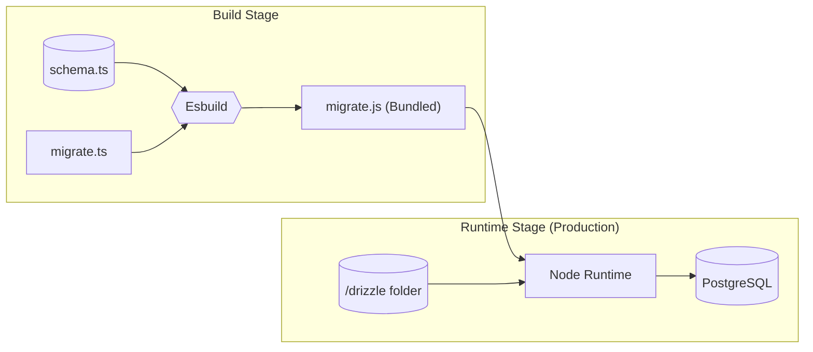

J'ai adoré la vitesse de Drizzle ORM. `drizzle-kit` en développement, c'est presque magique : on modifie un schéma TypeScript, on sauvegarde, et la base de données se met à jour instantanément.

Mais cette magie, c'est dangereux en production. Quand j'ai commencé à utiliser Drizzle, j'ai galéré à mettre en place un système de migration propre pour la prod.

Voici comment j'ai résolu ça en bundlant la logique de migration directement dans le conteneur avec `esbuild`.

## La Stratégie : Isoler et Bundler

L'objectif est simple : **Le conteneur doit gérer son propre état de base de données.**

Quand une nouvelle version de l'app est déployée, elle doit automatiquement vérifier si le schéma de la DB correspond au code. Si non, elle migre. Si la migration échoue, l'app ne doit pas démarrer.

Pour faire ça sans alourdir notre image de production, on traite le script de migration comme un artefact de build séparé.



## L'Implémentation

### 1. Le Script de Migration (`migrate.ts`)

D'abord, il nous faut un script qui exécute les migrations. On ne peut pas utiliser le CLI standard `drizzle-kit` en production car on n'aura pas le CLI installé dans notre image finale (runner).

À la place, on utilise directement le driver `postgres`. Ce script se connecte à la DB, lit les fichiers SQL du dossier `./drizzle`, et les exécute.

```ts src/server/db/migrate.ts
import { drizzle } from 'drizzle-orm/postgres-js';
import { migrate } from 'drizzle-orm/postgres-js/migrator';
import postgres from 'postgres';
import { env } from '@/config/env';

async function runMigrations() {
    const databaseUrl = env.DATABASE_URL;

    console.log('Connecting to database...');
    // On utilise max: 1 car c'est une connexion éphémère juste pour la migration
    const connection = postgres(databaseUrl, { max: 1 });
    const db = drizzle(connection);

    console.log('Running migrations...');

    // Cela va chercher le dossier 'drizzle' dans le même répertoire que le script
    await migrate(db, { migrationsFolder: './drizzle' });

    console.log('Migrations complete!');
    await connection.end();
}

runMigrations()
    .then(() => {
        console.log('Migration process finished successfully');
        process.exit(0);
    })
    .catch((err) => {
        console.error('Migration failed:', err);
        process.exit(1);
    });
```

### 2. Le "Build Trick" (`Dockerfile`)

C'est la partie la plus importante. Dans un Dockerfile multi-stage standard, on jette généralement les outils de build pour garder l'image finale légère.

J'ai ajouté une étape spécifique dans le stage **Builder** pour compiler `migrate.ts` en un fichier `migrate.js` autonome via `esbuild`. Cela supprime le besoin d'avoir TypeScript ou `ts-node` dans l'image finale.

```dockerfile docker/next/prod/Dockerfile
FROM node:20-slim AS base

# ---- Builder Stage ----
FROM base AS builder
WORKDIR /app

COPY ./app/package*.json ./
RUN npm ci

COPY ./app ./

# On a besoin de ces args pour le build, même si on skip la validation (voir plus bas)
ARG NEXT_PUBLIC_APP_URL
ARG NEXT_PUBLIC_STRIPE_PUBLISHABLE_KEY

ENV SKIP_ENV_VALIDATION=1
ENV NODE_ENV=production

RUN npm run build

# ---------------------------------------------------------
# THE MAGIC SAUCE: Bundle du script de migration
# ---------------------------------------------------------
RUN npx esbuild src/server/db/migrate.ts \
    --bundle \
    --platform=node \
    --outfile=migrate.js

# ---- Runner Stage ----
FROM base AS runner
WORKDIR /app

ENV NODE_ENV=production

# ... (Setup utilisateur Next.js standard) ...

# Copie du build Next.js standalone
COPY --from=builder --chown=nextjs:nodejs /app/.next/standalone ./
COPY --from=builder --chown=nextjs:nodejs /app/.next/static ./.next/static

# ---------------------------------------------------------
# Copie des artefacts de migration
# ---------------------------------------------------------
# 1. Les fichiers SQL générés par Drizzle
COPY --from=builder --chown=nextjs:nodejs /app/drizzle ./drizzle
# 2. Le script JS bundlé qu'on a créé au-dessus
COPY --from=builder --chown=nextjs:nodejs /app/migrate.js ./migrate.js

COPY --chown=nextjs:nodejs ./docker/next/prod/entrypoint.sh /entrypoint.sh
RUN chmod +x /entrypoint.sh

ENTRYPOINT ["/entrypoint.sh"]
```

### 3. L'Entrypoint (`entrypoint.sh`)

Enfin, on doit s'assurer que ce script tourne *avant* que le serveur ne démarre. J'utilise un script shell comme entrypoint Docker.

Cela crée un mécanisme de "fail-fast". Si la migration échoue (ex: base de données down, ou conflit de schéma), le conteneur crash immédiatement. C'est bien mieux que de démarrer l'app avec un état de base de données cassé.

```bash docker/next/prod/entrypoint.sh
#!/bin/sh
set -e

echo "Running database migrations..."
# Lancer le script bundlé avec le Node standard
node migrate.js

echo "Starting Next.js server..."
exec node server.js
```

## Gérer les Variables d'Environnement

Il y a un piège classique quand on build du Next.js dans Docker. Si vous utilisez une librairie comme `@t3-oss/env-nextjs` pour valider vos variables d'environnement, votre build va échouer si vous ne fournissez pas les secrets (comme `DATABASE_URL`) pendant la phase `docker build`.

Mais vous ne devriez jamais "bake" (inscrire en dur) des secrets dans votre image.

La solution est le flag `SKIP_ENV_VALIDATION`.

```ts src/config/env.ts
import { createEnv } from '@t3-oss/env-nextjs';

export const env = createEnv({
    // ... votre schéma ...
    skipValidation: !!process.env.SKIP_ENV_VALIDATION,
    emptyStringAsUndefined: true
});
```

Dans le Dockerfile que j'ai montré plus haut, je définis `ENV SKIP_ENV_VALIDATION=1` dans le stage builder. Cela permet à Next.js de compiler le code sans vérifier si `DATABASE_URL` est valide. La validation se fera à nouveau au **runtime** quand le conteneur démarrera, nous assurant qu'on garde la sécurité du typage en production.

## Déploiement : Railway, Dokploy, et les autres

La beauté de ce setup, c'est qu'il rend votre application **agnostique de la plateforme**.

J'utilise principalement **Dokploy** (un PaaS self-hosted) pour mes projets persos et parfois **Railway** pour des clients. Dans les deux cas, la configuration de déploiement est triviale.

Il suffit de pointer la plateforme vers votre Dockerfile.

1.  **Railway/Dokploy** pull le repo.
2.  Il build l'image (en compilant `migrate.js` à l'intérieur).
3.  Il démarre le conteneur.
4.  L'`ENTRYPOINT` se déclenche.
5.  Les migrations s'exécutent.
6.  Le serveur démarre.

Si vous avez besoin de rollback, vous revenez au commit git précédent. L'image Docker précédente (avec la logique de migration précédente) se redéploie, et votre code reste synchronisé avec votre schéma.

## Et la suite ?

Ce setup couvre le "happy path". Évidemment, les migrations de base de données à grande échelle peuvent devenir plus complexes.

Mais pour 99% des projets, cette approche "bundled" offre l'équilibre parfait entre sécurité, simplicité et expérience développeur.
