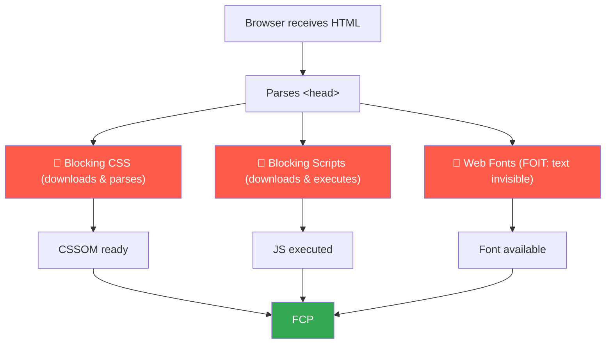

This is part 2 of the Lighthouse Performance series. If you haven't read
[part 1](./what-is-lighthouse-performance), it covers the scoring system and the 5 metrics.

FCP is 10% of your Lighthouse score. That is the smallest weight. And yet, it is the first
thing your user sees, or does not see. If FCP is slow, the page is blank. A blank page
bounces users before anything else has a chance to load.

That is why we start here.

## FCP vs LCP: a quick clarification

These two metrics get confused often. They measure different moments.

|                      | FCP                               | LCP                                           |
| :------------------- | :-------------------------------- | :-------------------------------------------- |
| **What it measures** | Time until _any_ content appears  | Time until the _main_ content appears         |
| **Triggered by**     | First text, image, canvas element | Largest visible element (hero image, heading) |
| **Good threshold**   | ≤ 1.8s                            | ≤ 2.5s                                        |
| **Weight in score**  | 10%                               | 25%                                           |

FCP fires early. It tells you the page is alive. LCP tells you the page is useful. Both matter,
but they have different causes and different fixes.

## What blocks FCP: the critical rendering path

Before the browser can paint anything, it follows a strict sequence. The HTML arrives, the browser
starts parsing it, then encounters resources in the `<head>`. If any of those resources are
render-blocking, the browser stops and waits.



Every red box in that diagram is a potential delay on FCP. The goal is to remove blocking
resources from the critical path, or at least make them faster.

The fixes below address each one of these boxes.

## Fix 1: Fonts with next/font

Fonts are the most common FCP killer I encounter. By default, when a browser encounters a `@font-face`
declaration and the font is not yet loaded, it makes text invisible while it waits. This is called
**FOIT** (Flash of Invisible Text). The user sees a blank layout. FCP does not fire until text
becomes visible.

The standard fix is `font-display: swap`, which tells the browser to render text with a fallback
font immediately and swap it when the custom font loads. Next.js handles this automatically through
`next/font`.

```tsx
import { Inter } from 'next/font/google';

const inter = Inter({
    subsets: ['latin'],
    display: 'swap', // default in next/font, shown here for clarity
});

export default function RootLayout({
    children,
}: {
    children: React.ReactNode;
}) {
    return (
        <html lang="en" className={inter.className}>
            <body>{children}</body>
        </html>
    );
}
```

Beyond `font-display: swap`, `next/font` also:

- Self-hosts the font files so there is no external network request to Google Fonts
- Adds the `preload` hint automatically so the font starts downloading early
- Generates a CSS variable you can use anywhere in your project

If you are loading fonts manually with a `<link>` tag, you are likely blocking FCP on every page.
Switching to `next/font` is usually the fastest single improvement you can make.

## Fix 2: Third-party scripts with next/script

Any `<script>` tag placed in the `<head>` without `async` or `defer` is render-blocking. The
browser stops, downloads the script, executes it, then continues. This delays everything,
including FCP.

According to Google's documentation, a script is render-blocking when it:

- Is located in the `<head>` of the document
- Does not have a `defer` attribute
- Does not have an `async` attribute

Third-party scripts are the usual suspect: analytics, chat widgets, A/B testing tools, tag managers.

`next/script` exposes a `strategy` prop that controls when a script loads:

| Strategy            | When it loads            | Use for                                  |
| :------------------ | :----------------------- | :--------------------------------------- |
| `beforeInteractive` | Before page hydration    | Critical scripts only (rare)             |
| `afterInteractive`  | After hydration          | Analytics, tag managers                  |
| `lazyOnload`        | During browser idle time | Chat widgets, non-critical third-parties |

```tsx
import Script from 'next/script';

export default function RootLayout({
    children,
}: {
    children: React.ReactNode;
}) {
    return (
        <html lang="en">
            <body>
                {children}

                {/* Loads after the page is interactive, does not block FCP */}
                <Script
                    src="https://www.googletagmanager.com/gtm.js?id=GTM-XXXXXXX"
                    strategy="afterInteractive"
                />

                {/* Loads during idle time, lowest priority */}
                <Script
                    src="https://widget.intercom.io/widget/xxxxx"
                    strategy="lazyOnload"
                />
            </body>
        </html>
    );
}
```

If you have scripts in your `<head>` right now without `async` or `defer`, this is likely
contributing to a slow FCP. Check the Coverage tab in Chrome DevTools to see which scripts
are executing before first paint.

## Fix 3: Reduce your TTFB

TTFB (Time to First Byte) is the time between the browser sending a request and receiving the
first byte of the server response. It is not an FCP metric directly, but it is a prerequisite
for it. A slow TTFB means the HTML arrives late, and everything else shifts later too.

As Google's documentation states: TTFB is the sum of redirect time, DNS lookup, connection and
TLS negotiation, and the request itself until the first byte arrives. A good TTFB is
**0.8 seconds or less**.

The three most common TTFB problems and their Next.js fixes:

**Redirects:** Every redirect adds a full network round-trip. A chain of two redirects before
your page loads can add 300-600ms before the browser even starts downloading HTML. Audit your
redirects in `next.config.js` and remove any that are not strictly necessary.

**Slow server response:** If your page fetches data before responding, that time is included in
TTFB. Use static generation or ISR (Incremental Static Regeneration) when possible.

```tsx
// Option 1: fully static (TTFB will be near-instant, served from CDN edge)
export const dynamic = 'force-static';

// Option 2: ISR — regenerates the page at most every hour
export const revalidate = 3600;

export default async function BlogPost({
    params,
}: {
    params: { slug: string };
}) {
    // This fetch is cached and reused across requests during the revalidation window
    const post = await fetch(`https://api.example.com/posts/${params.slug}`, {
        next: { revalidate: 3600 },
    }).then(r => r.json());

    return <article>{post.content}</article>;
}
```

**Compression:** Your server should compress HTML responses with gzip or brotli. Next.js enables
gzip by default in production. If you are behind a reverse proxy (Nginx, Cloudflare), make sure
brotli is enabled there as well. You can verify this in DevTools: open the Network tab, click
on the HTML request, and check the `Content-Encoding` response header.

## Fix 4: Cut unused JavaScript with dynamic()

Unused JavaScript harms FCP in two ways. If it is render-blocking, it delays paint directly. Even
if it is async, it competes for bandwidth during the critical load window.

In Next.js, any component marked with `"use client"` gets bundled into the client-side JavaScript.
If that component is heavy and not needed for the initial paint, it is still downloaded and parsed
before the user can see anything.

`next/dynamic` lets you split that code out and load it only when needed:

```tsx
import dynamic from 'next/dynamic';

// This component and its dependencies are NOT included in the initial bundle.
// They are downloaded only when this part of the page renders.
const HeavyChartComponent = dynamic(
    () => import('@/components/analytics/HeavyChart'),
    {
        loading: () => (
            <div className="h-64 animate-pulse bg-muted rounded-lg" />
        ),
        ssr: false, // use this if the component uses browser-only APIs
    }
);

export default function Dashboard() {
    return (
        <main>
            <h1>Dashboard</h1>
            {/* Initial page load does not include HeavyChart JS */}
            <HeavyChartComponent />
        </main>
    );
}
```

The `loading` fallback is important here: it reserves space for the component while it loads,
which also prevents layout shifts (a CLS problem we will cover in a later article).

To identify what is in your initial bundle, use the Next.js bundle analyzer:

```bash
# Install once
npm install @next/bundle-analyzer

# Run the analysis
ANALYZE=true next build
```

Then set it up in your config:

```ts
// next.config.ts
import withBundleAnalyzer from '@next/bundle-analyzer';

const bundleAnalyzer = withBundleAnalyzer({
    enabled: process.env.ANALYZE === 'true',
});

export default bundleAnalyzer({
    // your existing Next.js config
});
```

Look for large chunks that appear in the initial load. Those are the candidates for `dynamic()`.

## Measuring FCP in Next.js

Next.js has a built-in hook for reporting Web Vitals. You can use it to log FCP (and other
metrics) to your analytics platform.

```tsx
// src/app/web-vitals.tsx
'use client';

import { useReportWebVitals } from 'next/web-vitals';

export function WebVitals() {
    useReportWebVitals(metric => {
        if (metric.name === 'FCP') {
            // Replace with your actual analytics call
            console.log(`FCP: ${metric.value}ms`);
        }
    });

    return null;
}
```

```tsx
import { WebVitals } from './web-vitals';

export default function RootLayout({
    children,
}: {
    children: React.ReactNode;
}) {
    return (
        <html lang="en">
            <body>
                <WebVitals />
                {children}
            </body>
        </html>
    );
}
```

If you prefer using the `web-vitals` library directly, without the Next.js wrapper:

```ts
// src/lib/vitals.ts
import { onFCP } from 'web-vitals';

onFCP(metric => {
    console.log(`FCP: ${metric.value}ms`);
});
```

In both cases, you get the value as your real users experience it, not as a lab measurement.
Lighthouse gives you a synthetic result. This gives you field data.

## What's coming next

FCP is your entry metric. It tells you the page started. LCP tells you the page is ready.

LCP carries 25% of the Lighthouse score and is directly influenced by your hero image, your
server response time, and how you handle resource prioritization. It is where most sites lose the
most points, and where the most concrete optimizations live.

The next article covers LCP in depth.
