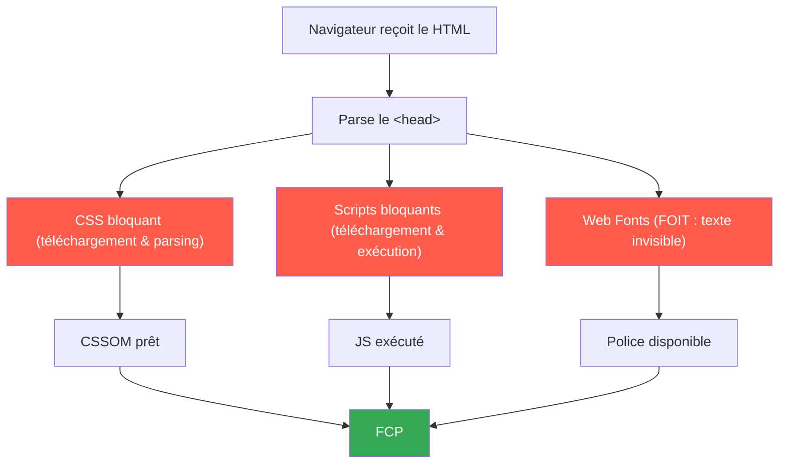

Cet article fait partie de la série Lighthouse Performance. Si vous n'avez pas lu
[la partie 1](./what-is-lighthouse-performance), elle couvre le système de score et les 5 métriques.

Le FCP représente 10% du score Lighthouse. C'est le poids le plus faible. Et pourtant, c'est la
première chose que vos utilisateurs voient, ou ne voient pas. Si le FCP est lent, la page est
blanche. Une page blanche fait rebondir les utilisateurs avant que quoi que ce soit d'autre ait
eu une chance de charger.

C'est pour ça qu'on commence par là.

## FCP vs LCP : une clarification rapide

Ces deux métriques sont souvent confondues. Elles mesurent des moments différents.

|                         | FCP                                    | LCP                                               |
| :---------------------- | :------------------------------------- | :------------------------------------------------ |
| **Ce qu'elle mesure**   | Temps avant qu'_un_ contenu apparaisse | Temps avant que le contenu _principal_ apparaisse |
| **Déclenché par**       | Premier texte, image, élément canvas   | Le plus grand élément visible (image hero, titre) |
| **Seuil "Good"**        | ≤ 1.8s                                 | ≤ 2.5s                                            |
| **Poids dans le score** | 10%                                    | 25%                                               |

Le FCP se déclenche tôt. Il indique que la page est vivante. Le LCP indique que la page est
utile. Les deux comptent, mais ils ont des causes différentes et des corrections différentes.

## Ce qui bloque le FCP : le chemin de rendu critique

Avant que le navigateur puisse afficher quoi que ce soit, il suit une séquence stricte. Le HTML
arrive, le navigateur commence à l'analyser, puis rencontre des ressources dans le `<head>`. Si
l'une de ces ressources bloque le rendu, le navigateur s'arrête et attend.



Chaque case rouge dans ce diagramme est un délai potentiel sur le FCP. L'objectif est de
supprimer les ressources bloquantes du chemin critique, ou au moins de les rendre plus rapides.

Les corrections ci-dessous adressent chacune de ces cases.

## Correction 1 : Les polices avec next/font

Les polices sont la cause la plus fréquente de FCP lent que je rencontre. Par défaut, quand un
navigateur rencontre une déclaration `@font-face` et que la police n'est pas encore chargée, il
rend le texte invisible pendant qu'il attend. C'est ce qu'on appelle le **FOIT** (Flash of
Invisible Text). L'utilisateur voit une mise en page vide. Le FCP ne se déclenche pas tant que
le texte n'est pas visible.

La correction standard est `font-display: swap`, qui indique au navigateur de rendre le texte
avec une police de secours immédiatement, et de la remplacer quand la police custom est chargée.
Next.js gère ça automatiquement via `next/font`.

```tsx
import { Inter } from 'next/font/google';

const inter = Inter({
    subsets: ['latin'],
    display: 'swap', // défaut dans next/font, montré ici pour la clarté
});

export default function RootLayout({
    children,
}: {
    children: React.ReactNode;
}) {
    return (
        <html lang="fr" className={inter.className}>
            <body>{children}</body>
        </html>
    );
}
```

Au-delà du `font-display: swap`, `next/font` :

- Auto-héberge les fichiers de police, donc plus de requête réseau externe vers Google Fonts
- Ajoute automatiquement l'indice `preload` pour que la police commence à se télécharger tôt
- Génère une variable CSS réutilisable partout dans votre projet

Si vous chargez des polices manuellement avec une balise `<link>`, vous bloquez probablement le
FCP sur chaque page. Passer à `next/font` est généralement l'amélioration la plus rapide à faire.

## Correction 2 : Les scripts tiers avec next/script

Toute balise `<script>` placée dans le `<head>` sans `async` ni `defer` bloque le rendu. Le
navigateur s'arrête, télécharge le script, l'exécute, puis continue. Ça retarde tout, y compris
le FCP.

Selon la documentation de Google, un script bloque le rendu quand il :

- Est situé dans le `<head>` du document
- N'a pas d'attribut `defer`
- N'a pas d'attribut `async`

Les scripts tiers sont les suspects habituels : analytics, widgets de chat, outils de tests A/B,
tag managers.

`next/script` expose une prop `strategy` qui contrôle quand un script se charge :

| Strategy            | Quand il se charge                    | Pour quoi                            |
| :------------------ | :------------------------------------ | :----------------------------------- |
| `beforeInteractive` | Avant l'hydratation                   | Scripts critiques uniquement (rare)  |
| `afterInteractive`  | Après l'hydratation                   | Analytics, tag managers              |
| `lazyOnload`        | Pendant les temps morts du navigateur | Widgets de chat, tiers non critiques |

```tsx
import Script from 'next/script';

export default function RootLayout({
    children,
}: {
    children: React.ReactNode;
}) {
    return (
        <html lang="fr">
            <body>
                {children}

                {/* Se charge après que la page est interactive, ne bloque pas le FCP */}
                <Script
                    src="https://www.googletagmanager.com/gtm.js?id=GTM-XXXXXXX"
                    strategy="afterInteractive"
                />

                {/* Se charge pendant les temps morts, priorité la plus basse */}
                <Script
                    src="https://widget.intercom.io/widget/xxxxx"
                    strategy="lazyOnload"
                />
            </body>
        </html>
    );
}
```

Si vous avez des scripts dans votre `<head>` sans `async` ni `defer`, ils contribuent probablement
à un FCP lent. Vérifiez l'onglet Coverage dans Chrome DevTools pour voir quels scripts s'exécutent
avant le premier affichage.

## Correction 3 : Réduire votre TTFB

Le TTFB (Time to First Byte) est le temps entre l'envoi d'une requête par le navigateur et la
réception du premier octet de la réponse serveur. Ce n'est pas une métrique FCP directement, mais
c'en est un prérequis. Un TTFB lent signifie que le HTML arrive en retard, et tout le reste se
décale aussi.

Comme l'indique la documentation de Google : le TTFB est la somme du temps de redirection, de la
recherche DNS, de la connexion et de la négociation TLS, et de la requête elle-même jusqu'à
l'arrivée du premier octet. Un bon TTFB est de **0,8 seconde ou moins**.

Les trois problèmes TTFB les plus courants et leurs corrections Next.js :

**Les redirections :** Chaque redirection ajoute un aller-retour réseau complet. Une chaîne de
deux redirections avant votre page peut ajouter 300 à 600ms avant même que le navigateur commence
à télécharger le HTML. Auditez vos redirections dans `next.config.js` et supprimez celles qui ne
sont pas strictement nécessaires.

**La réponse serveur lente :** Si votre page récupère des données avant de répondre, ce temps est
inclus dans le TTFB. Utilisez la génération statique ou l'ISR (Incremental Static Regeneration)
quand c'est possible.

```tsx
// Option 1 : entièrement statique (TTFB quasi-instantané, servi depuis le CDN edge)
export const dynamic = 'force-static';

// Option 2 : ISR — regénère la page au maximum toutes les heures
export const revalidate = 3600;

export default async function BlogPost({
    params,
}: {
    params: { slug: string };
}) {
    // Ce fetch est mis en cache et réutilisé entre les requêtes pendant la fenêtre de revalidation
    const post = await fetch(`https://api.example.com/posts/${params.slug}`, {
        next: { revalidate: 3600 },
    }).then(r => r.json());

    return <article>{post.content}</article>;
}
```

**La compression :** Votre serveur devrait compresser les réponses HTML avec gzip ou brotli.
Next.js active gzip par défaut en production. Si vous êtes derrière un reverse proxy (Nginx,
Cloudflare), vérifiez que brotli y est activé aussi. Vous pouvez le vérifier dans DevTools :
ouvrez l'onglet Network, cliquez sur la requête HTML et regardez l'en-tête de réponse
`Content-Encoding`.

## Correction 4 : Réduire le JavaScript inutilisé avec dynamic()

Le JavaScript inutilisé nuit au FCP de deux façons. S'il bloque le rendu, il retarde directement
l'affichage. Même s'il est async, il entre en concurrence avec la bande passante pendant la
fenêtre de chargement critique.

avec Next.js, tout composant marqué `"use client"` est inclus dans le bundle JavaScript côté client.
Si ce composant est lourd et pas nécessaire pour l'affichage initial, il est quand même téléchargé
et parsé avant que l'utilisateur puisse voir quelque chose.

`next/dynamic` permet de découper ce code et de le charger seulement quand nécessaire :

```tsx
import dynamic from 'next/dynamic';

// Ce composant et ses dépendances ne sont PAS inclus dans le bundle initial.
// Ils sont téléchargés uniquement quand cette partie de la page s'affiche.
const HeavyChartComponent = dynamic(
    () => import('@/components/analytics/HeavyChart'),
    {
        loading: () => (
            <div className="h-64 animate-pulse bg-muted rounded-lg" />
        ),
        ssr: false, // à utiliser si le composant utilise des APIs uniquement disponibles dans le navigateur
    }
);

export default function Dashboard() {
    return (
        <main>
            <h1>Dashboard</h1>
            {/* Le chargement initial de la page n'inclut pas le JS de HeavyChart */}
            <HeavyChartComponent />
        </main>
    );
}
```

Le fallback `loading` est important ici : il réserve l'espace pour le composant pendant qu'il se
charge, ce qui évite aussi les décalages de mise en page (un problème de CLS qu'on couvrira dans
un prochain article).

Pour identifier ce qui est dans votre bundle initial, utilisez le bundle analyzer Next.js :

```bash
# Installation
npm install @next/bundle-analyzer

# Lancement de l'analyse
ANALYZE=true next build
```

Avec la configuration dans `next.config.ts` :

```ts
// next.config.ts
import withBundleAnalyzer from '@next/bundle-analyzer';

const bundleAnalyzer = withBundleAnalyzer({
    enabled: process.env.ANALYZE === 'true',
});

export default bundleAnalyzer({
    // votre configuration Next.js existante
});
```

Repérez les gros chunks qui apparaissent dans le chargement initial. Ce sont les candidats pour
`dynamic()`.

## Mesurer le FCP avec Next.js

Next.js dispose d'un hook intégré pour reporter les Web Vitals. Vous pouvez l'utiliser pour
envoyer le FCP (et les autres métriques) vers votre plateforme d'analytics.

```tsx
// src/app/web-vitals.tsx
'use client';

import { useReportWebVitals } from 'next/web-vitals';

export function WebVitals() {
    useReportWebVitals(metric => {
        if (metric.name === 'FCP') {
            // Remplacez par votre appel analytics réel
            console.log(`FCP: ${metric.value}ms`);
        }
    });

    return null;
}
```

```tsx
import { WebVitals } from './web-vitals';

export default function RootLayout({
    children,
}: {
    children: React.ReactNode;
}) {
    return (
        <html lang="fr">
            <body>
                <WebVitals />
                {children}
            </body>
        </html>
    );
}
```

Si vous préférez utiliser la librairie `web-vitals` directement, sans le wrapper Next.js :

```ts
// src/lib/vitals.ts
import { onFCP } from 'web-vitals';

onFCP(metric => {
    console.log(`FCP: ${metric.value}ms`);
});
```

Dans les deux cas, vous obtenez la valeur telle que vos utilisateurs réels la vivent, pas comme
une mesure de laboratoire. Lighthouse vous donne un résultat synthétique. Ça, c'est de la donnée
terrain.

## La suite

Le FCP est votre métrique d'entrée. Il indique que la page a démarré. Le LCP, lui, indique que la page
est prête.

Il pèse 25% du score Lighthouse et est directement influencé par votre image hero, votre
temps de réponse serveur et la façon dont vous gérez la priorisation des ressources. C'est là que
la plupart des sites perdent le plus de points, et là où les optimisations les plus concrètes se
trouvent.

Le prochain article va couvrir le LCP en profondeur.
