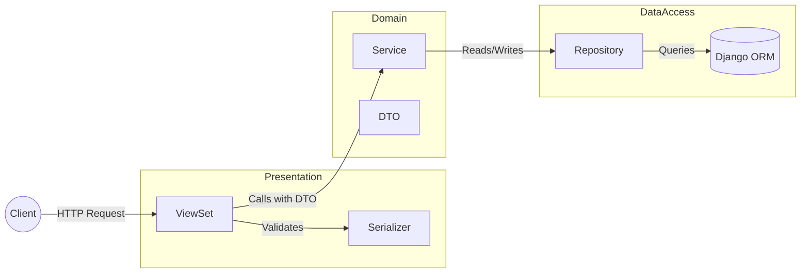

I work on a platform that has an interesting history. It started as a project within an EPFL association in Lausanne, built by environmental engineers. They chose a stack that was trendy at the time: React, Django, and GraphQL (via Graphene).

GraphQL is a powerful tool. It solves the over-fetching problem elegantly and gives the frontend immense flexibility. But power comes with a cost.

As the team grew, we noticed a pattern. Onboarding new developers (even experienced ones) was painful. Most engineers know REST. They understand endpoints, HTTP verbs, and status codes. But Graphene requires a specific mental model. We found ourselves spending more time debugging the graph resolution or explaining how Graphene abstractions work than actually shipping features.

After two years, we made a pragmatic decision. We decided to migrate to a REST architecture using Django Rest Framework (DRF).

We didn't want to go back to a complicated mess. We wanted structure. We wanted maintainability. Here is how we designed a layered architecture to solve our scaling problems.

## The Problem with "Standard" Django

In many Django tutorials, you see logic scattered in two places:
1.  **Fat Models:** `model.save()` methods that send emails, calculate stats, and update external APIs.
2.  **Fat Views:** API views that handle validation, business logic, and database queries all in one 50-line function.

When your business logic is tied to your HTTP layer (Views) or your Database layer (Models), testing becomes a nightmare. You can't test a business rule without mocking a request or spinning up a test database.

## The Solution: A Layered Architecture

We wanted to approach the issue with a DDD perspective. We enforce a strict separation of concerns.

Here is the data flow we implemented:



Let's break down each layer.

### 1. The Presentation Layer (ViewSets)

The ViewSet has one job: **Speak HTTP**.

It handles authentication, permissions, and status codes. It does *not* know how to calculate a carbon footprint or create a study. It simply delegates that work.

We also use `drf-spectacular` for documentation. Instead of cluttering the ViewSet with schema configs, we use a decorator pattern (`@StudyDocs`) to keep the code readable.

```python title="studies/rest/viewsets/study_viewset.py"
class StudyViewSet(viewsets.ViewSet):
    def __init__(self, **kwargs):
        # Dependency Injection: We inject the Service
        self.service = StudyService(repo=StudyRepository())

    @StudyDocs.create()
    def create(self, request):
        # 1. Validation (HTTP/JSON layer)
        input_serializer = CreateUpdateStudyInput(data=request.data)
        input_serializer.is_valid(raise_exception=True)

        # 2. Convert to DTO and call Service
        # We don't pass 'request' or 'serializer' to the service.
        # We pass a strict Python object (DTO).
        study = self.service.create_study(
            input_dto=CreateStudyDTO(**input_serializer.validated_data)
        )

        # 3. Response
        response_serializer = StudyResponse(study)
        return Response(response_serializer.data, status=status.HTTP_201_CREATED)
```

### 2. The Contract (DTOs)

We use **Data Transfer Objects (DTOs)**. These are simple Python `dataclasses` that define exactly what data is needed to perform an action.

```python title="studies/rest/dto/study_dto.py"
@dataclass(frozen=True)
class CreateStudyDTO:
    name: str
    year: int
    functional_unit: FunctionalUnit
    company: Company
    checklist: str = ""
    users: tuple[User, ...] = field(default_factory=tuple)
```

Why is this important?
1.  **Type Safety:** IDE knows exactly what fields exist.
2.  **Decoupling:** The Service doesn't care if the data came from a REST API, a CLI command, or a background task. It just needs a `CreateStudyDTO`.

### 3. The Domain Layer (Services)

This is the heart of the application. The Service contains the **Business Logic**.

It orchestrates the flow. It checks domain-specific permissions (e.g., "Is this user can edit this study?"), calls the repository to save data, and triggers side effects.

```python title="studies/rest/services/study_service.py"
class StudyService:
    def __init__(self, repo: StudyRepository):
        self.repo = repo

    def create_study(self, input_dto: CreateStudyDTO) -> Study:
        # Business Rule: Check user permissions
        self._check_user_permissions(input_dto.users)

        # Persistence: Delegate to Repository
        return self.repo.create(input_dto=input_dto)

    def _check_user_permissions(self, users: list(User)):
        for user in users:
            if not user.has_perm("user.can_manage_study"):
                raise ApiException(key="user.notAllowed")
```

### 4. The Data Access Layer (Repositories)

The Repository is the **only** place where `Model.objects...` is allowed.

This abstracts the database from the rest of the app. If we want to change how we query `Studies` (e.g., adding a default `prefetch_related`), we change it in one place.

I also think it can help beginners with Django to use and understand optimal uses of the ORM, avoiding misuse.

```python title="studies/rest/repositories/study_repository.py"
class StudyRepository:
    def get_accessible_studies(self, user: User) -> QuerySet[Study]:
        # Complex query logic lives here, not in the View
        return (
            user.access_studies.all()
            .prefetch_related("...")
            .order_by("-year")
        )

    def create(self, input_dto: CreateStudyDTO) -> Study:
        study = Study.objects.create(
            name=input_dto.name,
            year=input_dto.year,
            # ...
        )
        if input_dto.users:
            study.users.set(input_dto.users)
        return study
```

## Why this improves Testing

The biggest benefit of this architecture is how it simplifies our testing strategy. We can test layers in isolation.

### Unit Testing the ViewSet
We don't need a database. We just mock the Service. We verify that:
1.  The ViewSet parses the JSON correctly.
2.  It calls `service.create_study` with the right DTO.
3.  It returns the right HTTP code.

```python
def test_create_view(self):
    # Setup
    mock_service = MagicMock()
    view = StudyViewSet()
    view.service = mock_service

    # Action
    view.create(mock_request)

    # Assert
    mock_service.create_study.assert_called_once()
```

### Unit Testing the Service
Again, no database needed. We mock the Repository. We verify business rules (e.g., "Does it throw an error if the consultant is invalid?").

### Integration Testing the Repository
Here, and only here, we use `@pytest.mark.django_db`. We test that the actual SQL queries work, that Foreign Keys are respected, and that data is saved.

## The Impact

Migrating from Graphene to this layered REST architecture wasn't just about changing libraries. It was about changing how we think about code.

1.  **Onboarding is faster:** A new junior dev looks at the folder structure (`services/`, `repositories/`, `viewsets/`) and knows exactly where to put code.
2.  **Code is readable:** No more 500-line mutations file.
3.  **Refactoring is safer:** Because of the strict boundaries (DTOs), I can change the internal implementation of a Service without breaking the API contract.

This is not “pure DDD” in the academic sense of the term. We continue to use Django models as domain objects, and not everything is refactored at once.
We try to iterate and integrate these refactors into our workflow.
We aim to gradually integrate these tasks upstream of features, minimizing side effects as much as possible.

I will probably write an article later on the old GraphQL architecture and everything that led us to these decisions.