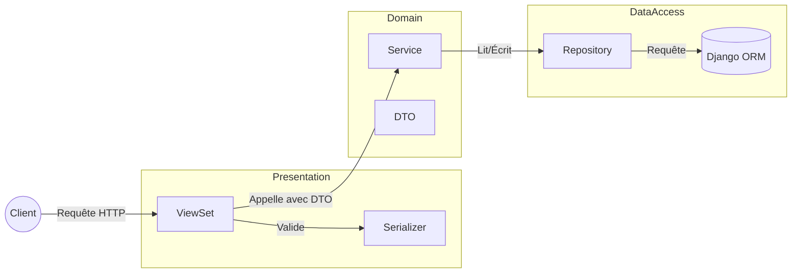

Je travaille sur une plateforme qui, à la base, était un projet au sein d'une association de l'EPFL à Lausanne, monté par des ingénieurs en environnement. Ils avaient choisi une stack très "tendance" à l'époque : React, Django et GraphQL (via Graphene).

GraphQL est un outil puissant. Il résout élégamment le problème de l'over-fetching et offre une flexibilité énorme au frontend. Mais cette puissance a un coût.

À mesure que l'équipe grandissait, on a remarqué un pattern. L'onboarding des nouveaux développeurs (même expérimentés) était douloureux. La plupart des ingénieurs connaissent REST. Ils comprennent les endpoints, les verbes HTTP et les codes de statut. Mais Graphene impose un modèle mental spécifique. On se retrouvait à passer plus de temps à débugger la résolution du graphe ou à expliquer les abstractions de Graphene qu'à shipper des fonctionnalités.

Après deux ans, on a pris une décision pragmatique. On a décidé de migrer vers une architecture REST utilisant Django Rest Framework (DRF).

On ne voulait pas revenir à une usine à gaz. On voulait de la structure. De la maintenabilité. Et donc, voici comment nous avons conçu une architecture en couches pour résoudre nos problèmes de scaling.

## Le problème du Django "Standard"

Dans beaucoup de tutoriels Django, on voit la logique éparpillée à deux endroits :
1.  **Fat Models :** Des méthodes `model.save()` qui envoient des emails, calculent des stats et mettent à jour des API externes.
2.  **Fat Views :** Des vues API qui gèrent la validation, la logique métier et les requêtes base de données, le tout dans une fonction de 50 lignes.

Quand votre logique métier est couplée à votre couche HTTP (View) ou à votre couche de Données (Modèles), les tests deviennent un enfer. Impossible de tester une règle métier sans mocker une requête ou monter une base de test.

## La Solution : Une Architecture en Couches

On voulait aborder le problème avec une perspective DDD. On impose une séparation stricte des responsabilités.

Voici le flux de données que nous avons implémenté :



Détaillons chaque couche.

### 1. La Couche Présentation (ViewSets)

Le ViewSet a un seul job : **Parler HTTP**.

Il gère l'authentification, les permissions et les codes de statut. Il ne *sait pas* comment calculer une empreinte carbone ou créer une étude. Il délègue simplement ce travail.

Nous utilisons aussi `drf-spectacular` pour la documentation. Au lieu d'encombrer le ViewSet avec des configs de schéma, on utilise un pattern de décorateur (`@StudyDocs`) pour garder le code lisible.

```python title="studies/rest/viewsets/study_viewset.py"
class StudyViewSet(viewsets.ViewSet):
    def __init__(self, **kwargs):
        # Injection de dépendance : On injecte le Service
        self.service = StudyService(repo=StudyRepository())

    @StudyDocs.create()
    def create(self, request):
        # 1. Validation (Couche HTTP/JSON)
        input_serializer = CreateUpdateStudyInput(data=request.data)
        input_serializer.is_valid(raise_exception=True)

        # 2. Conversion en DTO et appel du Service
        # On ne passe pas 'request' ou 'serializer' au service.
        # On passe un objet Python strict (DTO).
        study = self.service.create_study(
            input_dto=CreateStudyDTO(**input_serializer.validated_data)
        )

        # 3. Réponse
        response_serializer = StudyResponse(study)
        return Response(response_serializer.data, status=status.HTTP_201_CREATED)
```

### 2. Le Contrat (DTOs)

Nous utilisons des **Data Transfer Objects (DTOs)**. Ce sont de simples `dataclasses` Python qui définissent exactement quelles données sont nécessaires pour effectuer une action.

```python title="studies/rest/dto/study_dto.py"
@dataclass(frozen=True)
class CreateStudyDTO:
    name: str
    year: int
    functional_unit: FunctionalUnit
    company: Company
    checklist: str = ""
    users: tuple[User, ...] = field(default_factory=tuple)
```

Pourquoi est-ce important ?
1.  **Type Safety :** L'IDE sait exactement quels champs existent.
2.  **Découplage :** Le Service se fiche de savoir si la donnée vient d'une API REST, d'une commande CLI ou d'une tâche d'arrière-plan. Il a juste besoin d'un `CreateStudyDTO`.

### 3. La Couche Domaine (Services)

C'est le cœur de l'application. Le Service contient la **Logique Métier**.

Il orchestre le flux. Il vérifie les permissions spécifiques au domaine (ex: "Est-ce que cet utilisateur peut modifier cette étude ?"), appelle le repository pour sauvegarder les données, et déclenche les effets de bord.

```python title="studies/rest/services/study_service.py"
class StudyService:
    def __init__(self, repo: StudyRepository):
        self.repo = repo

    def create_study(self, input_dto: CreateStudyDTO) -> Study:
        # Règle métier : Vérifier les permissions utilisateur
        self._check_user_permissions(input_dto.users)

        # Persistance : Délégation au Repository
        return self.repo.create(input_dto=input_dto)

    def _check_user_permissions(self, users: list(User)):
        for user in users:
            if not user.has_perm("user.can_manage_study"):
                raise ApiException(key="user.notAllowed")
```

### 4. La Couche d'Accès aux Données (Repositories)

Le Repository est le **seul** endroit où `Model.objects...` est autorisé.

Cela abstrait la base de données du reste de l'app. Si on veut changer la façon dont on requête les `Studies` (ex: ajouter un `prefetch_related` par défaut), on le change à un seul endroit.

Je pense aussi que ça aide les débutants sur Django à utiliser et comprendre les usages optimaux de l'ORM, en évitant les mauvaises pratiques.

```python title="studies/rest/repositories/study_repository.py"
class StudyRepository:
    def get_accessible_studies(self, user: User) -> QuerySet[Study]:
        # La logique de requête complexe vit ici, pas dans la Vue
        return (
            user.access_studies.all()
            .prefetch_related("...")
            .order_by("-year")
        )

    def create(self, input_dto: CreateStudyDTO) -> Study:
        study = Study.objects.create(
            name=input_dto.name,
            year=input_dto.year,
            # ...
        )
        if input_dto.users:
            study.users.set(input_dto.users)
        return study
```

## Pourquoi ça améliore les Tests

Le plus gros avantage de cette architecture est la simplification de notre stratégie de test. On peut tester les couches de manière isolée.

### Tests Unitaires du ViewSet
Pas besoin de base de données. On mock juste le Service. On vérifie que :
1.  Le ViewSet parse le JSON correctement.
2.  Il appelle `service.create_study` avec le bon DTO.
3.  Il renvoie le bon code HTTP.

```python
def test_create_view(self):
    # Setup
    mock_service = MagicMock()
    view = StudyViewSet()
    view.service = mock_service

    # Action
    view.create(mock_request)

    # Assert
    mock_service.create_study.assert_called_once()
```

### Tests Unitaires du Service
Là encore, pas de DB. On mock le Repository. On vérifie les règles métier (ex: "Est-ce que ça lève une erreur si le consultant est invalide ?").

### Tests d'Intégration du Repository
Ici, et seulement ici, on utilise `@pytest.mark.django_db`. On teste que les requêtes SQL fonctionnent, que les Clés Étrangères sont respectées et que la donnée est sauvegardée.

## L'Impact

Migrer de Graphene vers cette architecture REST en couches n'était pas juste un changement de librairies. C'était un changement de mentalité.

1.  **L'onboarding est plus rapide :** Un nouveau dev junior regarde la structure des dossiers (`services/`, `repositories/`, `viewsets/`) et sait exactement où mettre son code.
2.  **Le code est lisible :** Fini les fichiers de mutations de 500 lignes.
3.  **Le refactoring est plus sûr :** Grâce aux frontières strictes (DTOs), je peux changer l'implémentation interne d'un Service sans casser le contrat d'API.

Ce n'est pas du "DDD pur" au sens académique du terme. Nous continuons d'utiliser les modèles Django comme objets du domaine, et tout n'est pas refactorisé d'un coup.
Nous essayons d'itérer et d'intégrer ces refontes dans notre workflow.
Nous visons à intégrer ces tâches en amont des fonctionnalités, en minimisant autant que possible les effets de bord.

J'écrirai probablement un article plus tard sur l'ancienne architecture GraphQL et tout ce qui nous a menés à ces décisions.