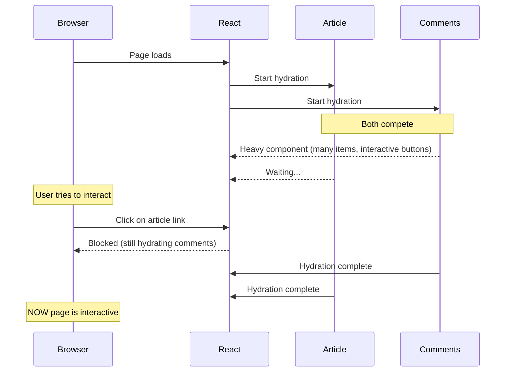
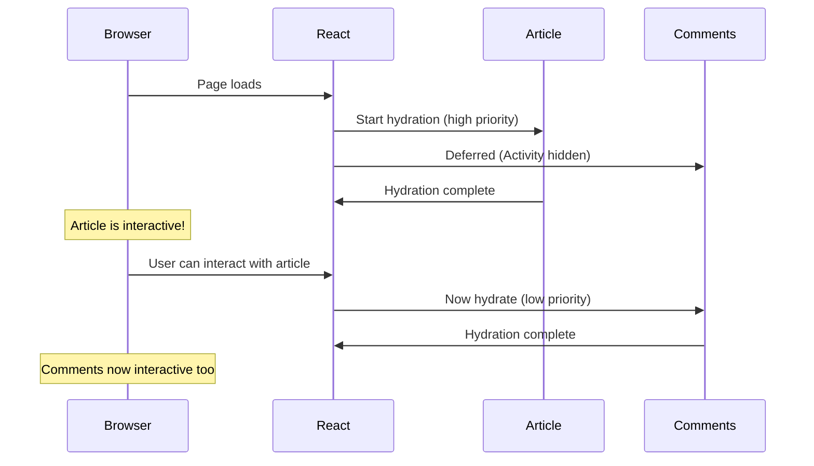

Every React developer has faced the situation where you have a page with important content and less important content. A blog post with comments. A dashboard with a sidebar.

The problem is that React treats all of them equally. When your page renders, everything competes for the same resources. That heavy comments section blocks your blog post from becoming interactive.

React 19.2 introduces the `<Activity>` component to fix this. It lets you tell React: "This part is secondary. Don't let it block the important stuff."

## What is the Activity component?

`<Activity>` is the stable version of what was previously called `<Offscreen>` in React's experimental builds. It only has the `mode` prop.

```tsx
<Activity mode="visible">
  <MyComponent />
</Activity>

<Activity mode="hidden">
  <MyComponent />
</Activity>
```

| Mode | Behavior |
|------|----------|
| `"visible"` | Normal rendering. Component is shown and interactive. |
| `"hidden"` | Component is rendered but hidden. React deprioritizes updates to it. State is preserved. |

The key insight is that **hidden doesn't just mean invisible. It means lower priority.**

When a component is wrapped in `<Activity mode="hidden">`:
1. React still renders it (so state is preserved)
2. But React deprioritizes it compared to visible content
3. It won't block more important parts of your UI from becoming interactive

This unlocks two powerful patterns.

## Use Case 1: Preserving state in a mail app

Let's say you're building an email client. Users can browse their inbox and open a compose panel to write a new email.

### The Problem: Conditional rendering destroys state

Here's the classic approach most of us would write:

```tsx title="app/mail/page.tsx"
'use client';

import { useState } from 'react';

export default function MailPage() {
  const [showCompose, setShowCompose] = useState(false);

  return (
    <div className="mail-container">
      <header>
        <button onClick={() => setShowCompose(!showCompose)}>
          {showCompose ? 'Back to Inbox' : 'Compose'}
        </button>
      </header>

      {showCompose ? (
        <ComposePanel />
      ) : (
        <Inbox />
      )}
    </div>
  );
}

function ComposePanel() {
  const [to, setTo] = useState('');
  const [subject, setSubject] = useState('');
  const [body, setBody] = useState('');

  return (
    <form className="compose-panel">
      <input
        type="email"
        placeholder="To"
        value={to}
        onChange={(e) => setTo(e.target.value)}
      />
      <input
        type="text"
        placeholder="Subject"
        value={subject}
        onChange={(e) => setSubject(e.target.value)}
      />
      <textarea
        placeholder="Write your message..."
        value={body}
        onChange={(e) => setBody(e.target.value)}
      />
      <button type="submit">Send</button>
    </form>
  );
}

function Inbox() {
  return (
    <ul className="inbox">
      <li>Meeting notes from John</li>
      <li>Your invoice is ready</li>
      <li>Welcome to the team!</li>
    </ul>
  );
}
```

This works, but there's a better way to do now.

Imagine a user starts writing an email. They type a recipient, a subject, half of their message. Then they click "Back to Inbox" to check something. When they click "Compose" again, their draft is gone. The component unmounted, state was destroyed.

You could lift the state up to the parent, or use a global store, or save to localStorage. But all of these are workarounds for a fundamental problem: **conditional rendering unmounts components**.

### The Solution: Activity keeps state alive

With `<Activity>`, we can keep both components mounted, but only show one at a time:

```tsx title="app/mail/page.tsx"
'use client';

import { useState, Activity } from 'react';

export default function MailPage() {
  const [showCompose, setShowCompose] = useState(false);

  return (
    <div className="mail-container">
      <header>
        <button onClick={() => setShowCompose(!showCompose)}>
          {showCompose ? 'Back to Inbox' : 'Compose'}
        </button>
      </header>

      <Activity mode={showCompose ? 'hidden' : 'visible'}>
        <Inbox />
      </Activity>

      <Activity mode={showCompose ? 'visible' : 'hidden'}>
        <ComposePanel />
      </Activity>
    </div>
  );
}

// ComposePanel and Inbox components stay the same
```

Now when the user switches between Inbox and Compose:
- The hidden component keeps its state
- No re-mounting, no lost data
- The user's draft survives navigation

This is the "preserve state" use case. But there's another pattern that's even more impactful for performance.

## Use Case 2: Faster Time-to-Interactive

Let's say you have a blog. Each post has the article content (what users came for) and a comments section (nice to have, but secondary).

### The Scenario

```tsx title="app/blog/[slug]/page.tsx"
import { getPost, getComments } from '@/lib/api';

export default async function BlogPost({ params }: { params: { slug: string } }) {
  const post = await getPost(params.slug);

  return (
    <div className="blog-layout">
      <article>
        <h1>{post.title}</h1>
        <div dangerouslySetInnerHTML={{ __html: post.content }} />
      </article>

      <CommentsSection slug={params.slug} />
    </div>
  );
}

async function CommentsSection({ slug }: { slug: string }) {
  const comments = await getComments(slug);

  return (
    <section className="comments">
      <h2>Comments ({comments.length})</h2>
      {comments.map((comment) => (
        <div key={comment.id} className="comment">
          <strong>{comment.author}</strong>
          <p>{comment.text}</p>
          <LikeButton commentId={comment.id} />
        </div>
      ))}
      <AddCommentForm slug={slug} />
    </section>
  );
}
```

### The Problem: Comments block the blog

Here's what happens when React hydrates this page:



The comments section has a lot of components: each comment, like buttons, a form. All of this needs to hydrate. And while it hydrates, the main article (which the user actually wants to read) is also waiting.

This is the "everything competes for attention" problem.

### The Solution: Activity deprioritizes comments

Wrap the secondary content in `<Activity>`:

```tsx title="app/blog/[slug]/page.tsx"
import { Activity } from 'react';
import { getPost } from '@/lib/api';

export default async function BlogPost({ params }: { params: { slug: string } }) {
  const post = await getPost(params.slug);

  return (
    <div className="blog-layout">
      <article>
        <h1>{post.title}</h1>
        <div>{post.content}</div>
      </article>

      <Activity>
        <CommentsSection slug={params.slug} />
      </Activity>
    </div>
  );
}
```

Wrapping content in `<Activity>` signals to React that this subtree can be treated as a separate unit for scheduling purposes.

Now the hydration timeline looks different:



The article becomes interactive first. Comments load in the background without blocking the main content. Users can start reading (and interacting with the article) while the secondary content catches up.

## When should you use Activity?

| Use Case | Good Fit? | Why |
|----------|-----------|-----|
| Modals with forms | **YES** | Draft content survives close/reopen |
| Secondary page sections (comments, sidebars) | **YES** | Deprioritizes hydration |
| Content that should never render until needed | **NO** | Use lazy loading or conditional rendering instead |
| Animations or transitions | **NO** | Use CSS or animation libraries |

So you should use `<Activity>` when you want to **keep something alive but deprioritized**, not when you want to **avoid rendering entirely**.
