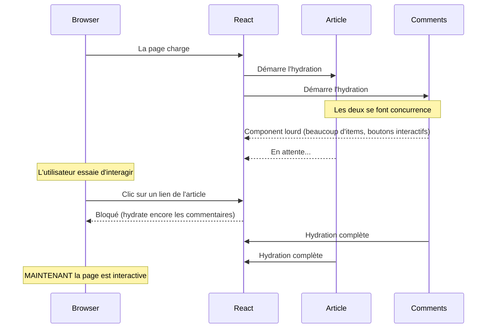
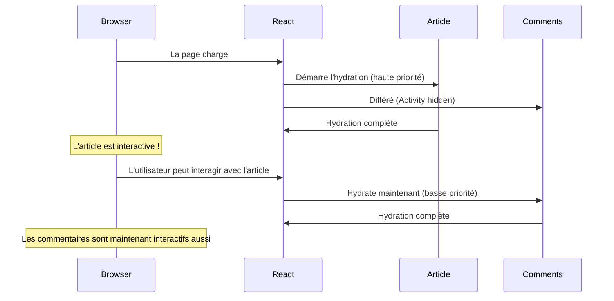

Tous les développeurs React ont déjà vécu cette situation : vous avez une page avec du contenu important et du contenu moins important. Un article de blog avec des commentaires.

Le problème, c'est que React les traite tous de la même façon. Quand votre page render, tout se bat pour les mêmes ressources. Cette lourde section de commentaires bloque votre article de blog et l'empêche de devenir interactive.

React 19.2 introduit le component `<Activity>` pour régler ce problème. Il vous permet de dire à React : "Cette partie est secondaire. Ne la laisse pas bloquer le contenu important."

## C'est quoi le Component Activity ?

`<Activity>` est la version stable de ce qui s'appelait `<Offscreen>` dans les builds expérimentaux de React. Il a seulement la prop `mode`.

```tsx
<Activity mode="visible">
  <MyComponent />
</Activity>

<Activity mode="hidden">
  <MyComponent />
</Activity>
```

| Mode | Comportement |
|------|----------|
| `"visible"` | Rendering normal. Le component est affiché et interactive. |
| `"hidden"` | Le component est rendu mais caché. React déprioritise ses updates. Le state est préservé. |

Le point clé à comprendre : **hidden ne veut pas juste dire invisible. Ça veut dire priorité plus basse.**

Quand un component est wrappé dans `<Activity mode="hidden">` :
1. React le render quand même (donc le state est préservé)
2. Mais React le déprioritise par rapport au contenu visible
3. Il ne bloquera pas les parties plus importantes de votre UI qui doivent devenir interactives

Ça débloque deux patterns puissants.

## Use Case 1 : Préserver le State dans une App Mail

Disons que vous développez un client email. Les utilisateurs peuvent parcourir leur inbox et ouvrir un panel de composition pour écrire un nouvel email.

### Le Problème : Le Conditional Rendering Détruit le State

Voici l'approche classique que la plupart d'entre nous écririons :

```tsx title="app/mail/page.tsx"
'use client';

import { useState } from 'react';

export default function MailPage() {
  const [showCompose, setShowCompose] = useState(false);

  return (
    <div className="mail-container">
      <header>
        <button onClick={() => setShowCompose(!showCompose)}>
          {showCompose ? 'Back to Inbox' : 'Compose'}
        </button>
      </header>

      {showCompose ? (
        <ComposePanel />
      ) : (
        <Inbox />
      )}
    </div>
  );
}

function ComposePanel() {
  const [to, setTo] = useState('');
  const [subject, setSubject] = useState('');
  const [body, setBody] = useState('');

  return (
    <form className="compose-panel">
      <input
        type="email"
        placeholder="To"
        value={to}
        onChange={(e) => setTo(e.target.value)}
      />
      <input
        type="text"
        placeholder="Subject"
        value={subject}
        onChange={(e) => setSubject(e.target.value)}
      />
      <textarea
        placeholder="Write your message..."
        value={body}
        onChange={(e) => setBody(e.target.value)}
      />
      <button type="submit">Send</button>
    </form>
  );
}

function Inbox() {
  return (
    <ul className="inbox">
      <li>Meeting notes from John</li>
      <li>Your invoice is ready</li>
      <li>Welcome to the team!</li>
    </ul>
  );
}
```

Ça marche, mais il y a mieux à faire.

Imaginez qu'un utilisateur commence à écrire un email. Il tape un destinataire, un sujet, la moitié de son message. Puis il clique sur "Back to Inbox" pour vérifier quelque chose. Quand il clique sur "Compose" à nouveau, son brouillon a disparu. Le component s'est unmonté, le state a été détruit.

Vous pourriez remonter le state au parent, ou utiliser un store global, ou sauvegarder dans le localStorage. Mais tout ça ce sont des contournements d'un problème fondamental : **le conditional rendering unmount les components**.

### La Solution : Activity Garde le State Vivant

Avec `<Activity>`, on peut garder les deux components montés, mais en afficher un seul à la fois :

```tsx title="app/mail/page.tsx"
'use client';

import { useState, Activity } from 'react';

export default function MailPage() {
  const [showCompose, setShowCompose] = useState(false);

  return (
    <div className="mail-container">
      <header>
        <button onClick={() => setShowCompose(!showCompose)}>
          {showCompose ? 'Back to Inbox' : 'Compose'}
        </button>
      </header>

      <Activity mode={showCompose ? 'hidden' : 'visible'}>
        <Inbox />
      </Activity>

      <Activity mode={showCompose ? 'visible' : 'hidden'}>
        <ComposePanel />
      </Activity>
    </div>
  );
}

// Les components ComposePanel et Inbox restent identiques
```

Maintenant quand l'utilisateur switch entre Inbox et Compose :
- Le component caché garde son state
- Pas de re-mounting, pas de données perdues
- Le brouillon de l'utilisateur survit à la navigation

C'est le use case "préserver le state". Mais il y a un autre pattern encore plus impactant pour la performance.

## Use Case 2 : Un Time-to-Interactive Plus Rapide

Disons que vous avez un blog. Chaque article a le contenu de l'article (ce pour quoi les utilisateurs sont venus) et une section commentaires (sympa à avoir, mais secondaire).

### Le Scénario

```tsx title="app/blog/[slug]/page.tsx"
import { getPost, getComments } from '@/lib/api';

export default async function BlogPost({ params }: { params: { slug: string } }) {
  const post = await getPost(params.slug);

  return (
    <div className="blog-layout">
      <article>
        <h1>{post.title}</h1>
        <div dangerouslySetInnerHTML={{ __html: post.content }} />
      </article>

      <CommentsSection slug={params.slug} />
    </div>
  );
}

async function CommentsSection({ slug }: { slug: string }) {
  const comments = await getComments(slug);

  return (
    <section className="comments">
      <h2>Comments ({comments.length})</h2>
      {comments.map((comment) => (
        <div key={comment.id} className="comment">
          <strong>{comment.author}</strong>
          <p>{comment.text}</p>
          <LikeButton commentId={comment.id} />
        </div>
      ))}
      <AddCommentForm slug={slug} />
    </section>
  );
}
```

### Le Problème : Les Commentaires Bloquent le Blog

Voici ce qui se passe quand React hydrate cette page :



La section commentaires a plein de components : chaque commentaire, les boutons like, un formulaire. Tout ça doit être hydraté. Et pendant que ça hydrate, l'article principal (que l'utilisateur veut vraiment lire) attend aussi.

C'est le problème du "tout se bat pour l'attention".

### La Solution : Activity Déprioritise les Commentaires

Wrappez le contenu secondaire dans `<Activity>` :

```tsx title="app/blog/[slug]/page.tsx"
import { Activity } from 'react';
import { getPost } from '@/lib/api';

export default async function BlogPost({ params }: { params: { slug: string } }) {
  const post = await getPost(params.slug);

  return (
    <div className="blog-layout">
      <article>
        <h1>{post.title}</h1>
        <div>{post.content}</div>
      </article>

      <Activity>
        <CommentsSection slug={params.slug} />
      </Activity>
    </div>
  );
}
```

Wrapper du contenu dans `<Activity>` signale à React que ce subtree peut être traité comme une unité séparée pour le scheduling.

Maintenant la timeline d'hydration est différente :



L'article devient interactive en premier. Les commentaires chargent en arrière-plan sans bloquer le contenu principal. Les utilisateurs peuvent commencer à lire (et interagir avec l'article) pendant que le contenu secondaire rattrape son retard.

## Quand Devriez-Vous Utiliser Activity ?

| Use Case | Bon Choix ? | Pourquoi |
|----------|-----------|-----|
| Modals avec des formulaires | **YES** | Le contenu brouillon survit au close/reopen |
| Sections secondaires de page (commentaires, sidebars) | **YES** | Déprioritise l'hydration |
| Contenu qui ne devrait jamais render avant d'être nécessaire | **NO** | Utilisez le lazy loading ou le conditional rendering à la place |
| Animations ou transitions | **NO** | Utilisez CSS ou des librairies d'animation |

Donc vous devriez utiliser `<Activity>` quand vous voulez **garder quelque chose vivant mais dépriorisé**, pas quand vous voulez **éviter complètement le rendering**.