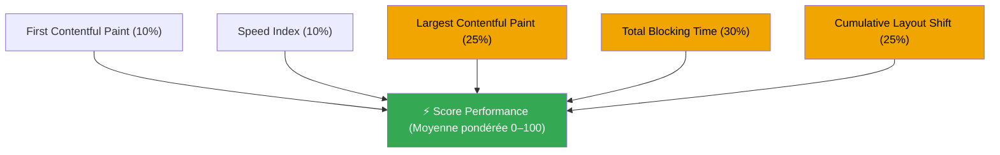

Tous les devs front-end ont déjà vu ça. Un chiffre entre 0 et 100, parfois vert, souvent rouge, après avoir lancé un audit sur une page qu'on pensait correcte. Et ensuite la question : je commence par quoi ?

Je lance Lighthouse sur quasiment tous mes projets. Et pendant longtemps, je traitais ce score comme une boîte noire. Je savais que c'était
mauvais, je savais que _quelque chose_ était lent, mais je ne comprenais pas vraiment ce qui était mesuré, ni quel problème traiter en premier.

Cet article ouvre la boîte noire. Pas pour tout couvrir, mais pour avoir un modèle mental clair avant d'aller plus loin dans les prochains articles de cette série.

## Le score est synthétique. C'est important.

C'est la chose la plus importante à comprendre avant tout : **le score Lighthouse Performance est
une donnée de laboratoire, pas une donnée utilisateur réel.**

Quand vous lancez Lighthouse, il simule un chargement de page dans un environnement contrôlé : des conditions réseau spécifiques,
un CPU bridé, pas de cache. Chaque run est reproductible par conception. Mais ça ne reflète pas ce
que vos utilisateurs réels vivent sur leurs appareils réels.

Ça ne rend pas le score inutile. Ça en fait un proxy utile. Un score bas indique qu'il y a de vrais
problèmes à régler. Un score élevé ne garantit pas une expérience parfaite pour tout le monde.

Google utilise lui-même un jeu de données séparé, appelé CrUX (Chrome User Experience Report),
pour mesurer les Core Web Vitals sur le terrain, côté utilisateurs réels. Lighthouse est
l'équivalent en laboratoire. Les deux sont utiles. Ce ne sont pas la même chose.

## Les 5 métriques derrière le score

Le score Lighthouse Performance est une **moyenne pondérée** de 5 métriques. Chaque métrique
mesure une partie spécifique de l'expérience utilisateur pendant le chargement.

| Métrique                           | Poids (Lighthouse 10) | Seuil "Good" | Ce qu'elle mesure                                                            |
| :--------------------------------- | :-------------------: | :----------: | :--------------------------------------------------------------------------- |
| **First Contentful Paint (FCP)**   |          10%          |    ≤ 1.8s    | Temps avant que le premier texte ou image apparaisse à l'écran               |
| **Speed Index (SI)**               |          10%          |    ≤ 3.4s    | Vitesse à laquelle le contenu est visuellement affiché pendant le chargement |
| **Largest Contentful Paint (LCP)** |          25%          |    ≤ 2.5s    | Temps avant que l'élément de contenu principal soit visible                  |
| **Total Blocking Time (TBT)**      |          30%          |   ≤ 200ms    | Durée pendant laquelle le thread principal a été bloqué après le FCP         |
| **Cumulative Layout Shift (CLS)**  |          25%          |    ≤ 0.1     | Quantité de déplacements inattendus d'éléments pendant le chargement         |

Trois de ces métriques (LCP, TBT, CLS) font partie de ce que Google appelle les **Core Web Vitals** :
les métriques officielles utilisées pour évaluer l'expérience de page dans le classement Search.
Elles représentent aussi 80% de votre score Lighthouse. C'est là que se trouve le levier.

Voici un modèle mental en une ligne pour chacune.

### First Contentful Paint (FCP)

Le FCP marque le moment où l'utilisateur voit _quelque chose_ à l'écran, n'importe quoi : un nœud
de texte, une image, un élément canvas. Selon Google, les bons sites visent **1,8 seconde ou
moins**.

Le mot clé c'est "first". Le FCP se déclenche tôt. Il ne dit pas si le contenu _important_ a
chargé, seulement que la page a arrêté d'être blanche.

### Speed Index (SI)

Le Speed Index mesure à quelle vitesse le contenu remplit progressivement l'écran pendant le
chargement. Une valeur basse signifie que le contenu apparaît de façon plus régulière et rapide
dans le viewport, plutôt qu'en un grand chargement tardif.

Il pèse 10% du score et c'est la métrique la plus difficile à actionner directement. La plupart
des améliorations sur le FCP, le LCP, ou les ressources bloquant le rendu l'amélioreront en
parallèle. On ne lui dédiera pas d'article complet dans cette série pour cette raison.

### Largest Contentful Paint (LCP)

Le LCP mesure le temps avant que **le plus grand élément visible** dans le viewport soit rendu.
C'est généralement l'image hero, un grand titre, ou une vidéo mise en avant. Google vise
**2,5 secondes ou moins**.

C'est la métrique que les utilisateurs _ressentent_ vraiment. Quand le LCP est lent, la page
_semble_ lente, même si tout le reste va bien. Elle pèse 25% du score.

### Total Blocking Time (TBT)

Le TBT additionne tout le temps pendant lequel le thread principal a été bloqué plus de 50ms
entre le FCP et le Time to Interactive (TTI). Un thread principal bloqué signifie que le
navigateur ne peut pas répondre aux interactions : clics, taps, événements clavier. La cible est
**200 millisecondes ou moins** sur hardware mobile moyen.

C'est la métrique la plus lourde avec **30% du score**. Des bundles JavaScript trop importants
en sont presque toujours la cause.

### Cumulative Layout Shift (CLS)

Le CLS mesure l'instabilité visuelle. Chaque fois qu'un élément se déplace de façon inattendue
pendant le chargement (une image pousse le texte vers le bas, une pub décale un bouton que vous
alliez cliquer), ça contribue au score CLS. Google vise un score de **0,1 ou moins**.

Le CLS est la métrique qui génère de la vraie frustration côté utilisateurs. Vous allez cliquer
sur quelque chose, une bannière se charge, le bouton bouge, vous cliquez à côté. C'est un problème
de CLS.

## Comment le score est réellement calculé

Les cinq valeurs de métriques sont chacune converties en un score entre 0 et 100 via une
**distribution log-normale** calibrée sur des données réelles issues de HTTP Archive. Ça signifie
que la courbe n'est pas linéaire : passer d'un score de 50 à 70 est beaucoup plus facile que
passer de 90 à 95.

Ensuite, chaque score de métrique est multiplié par son poids, et les résultats sont additionnés.

Le code couleur compte : LCP, TBT et CLS représentent ensemble **80% de votre score**. Corrigez
ces trois-là et vous bougez vraiment l'aiguille. Les deux autres (FCP, SI) s'amélioreront souvent
en parallèle.

Google décrit les plages de score comme suit :

- **0 à 49** (rouge) : Mauvais
- **50 à 89** (orange) : À améliorer
- **90 à 100** (vert) : Bon

Atteindre 90 est réaliste pour la plupart des projets avec un travail sérieux. Atteindre 100 est
plus difficile et ce n'est pas l'objectif. Comme Google le note dans sa propre documentation,
passer de 99 à 100 demande autant d'effort que passer de 90 à 94. Ne courez pas après la
perfection, courez après le vert à 90+.

## Les trois premières choses à vérifier en Next.js

Avant de plonger dans chaque métrique, il y a quelques problèmes qui reviennent constamment sur
les projets que j'audite. Ce ne sont pas les corrections complètes, mais ce sont les gains les
moins coûteux.

**1. Vous utilisez `next/image` ?**

Si votre page a des images (et presque toutes en ont), le composant `Image` de Next.js gère
automatiquement l'optimisation du format, le lazy loading et les size hints. Ne pas l'utiliser
se voit presque toujours dans le score LCP.

**2. Vous utilisez `next/font` ?**

Les polices custom qui chargent sans stratégie `font-display` bloquent le rendu. Le composant
`Font` de Next.js gère ça par défaut et élimine les layout shifts causés par le swap de polices.

**3. Vous chargez des librairies lourdes côté client alors qu'elles pourraient rester serveur ?**

Avec l'App Router Next.js, chaque composant est un Server Component par défaut. Si vous ajoutez
`"use client"` sans réfléchir, vous envoyez du JavaScript au navigateur qui pourrait rester sur
le serveur. Ce JavaScript bloque le thread principal et impacte directement le TBT.

Ces trois vérifications seules font souvent passer un score du rouge à l'orange. Mais c'est
seulement le début.

## La suite de cette série

Les prochains articles examineront de plus près chaque domaine à travailler, avec des exemples
concrets en Next.js.

Si vous voulez suivre la progression, lancez Lighthouse sur une de vos pages maintenant (Chrome
DevTools, Cmd+Shift+P, puis "Generate Lighthouse report"). Regardez lequel de LCP, TBT ou CLS est
signalé en rouge ou orange. C'est votre point de départ.
